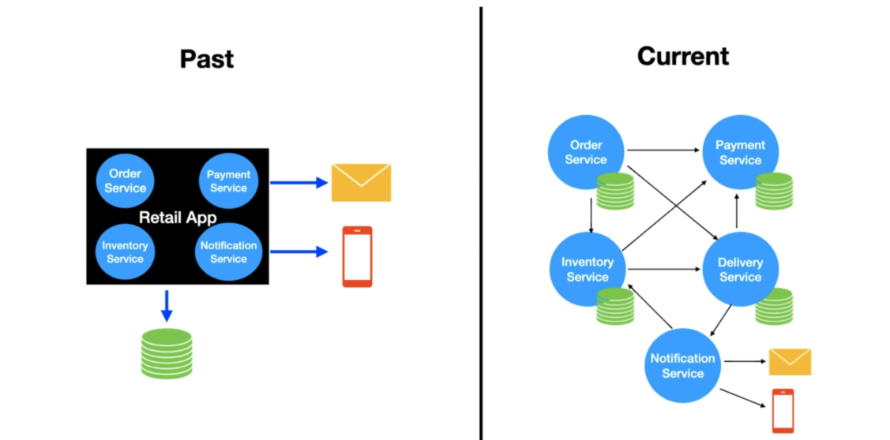

# Microservice Architecture

- [Microservice Architecture](#microservice-architecture)
  - [Overview](#overview)
  - [Properties](#properties)
    - [Overall Characteristics](#overall-characteristics)
      - [Independent Deployability](#independent-deployability)
      - [Service Granularity](#service-granularity)

## Overview 

Microservice architecture is a *type of the service-oriented architecture (SOA)*, it arranges an application as a **collection of loosely-coupled services**.

> A *microservice* is an independently deployable self-contained service modeled around a business domain that encapsulate data storage and retrieval, exposing data, via well-defined interfaces.

Microservice architecture try to improve some of the disadvantages and restrictions of monolith applications caused by lack of modularity. *Modularity* supports reuse of parts of the application logic and also facilitates maintenance by allowing repair or replacement of parts of the application without requiring wholesale replacement.

## Properties

### Overall Characteristics

There is no single definition for microservices. A consensus view has evolved over time in the industry. Some of the defining characteristics that are frequently cited include:

* Services in a microservice architecture (MSA) are often processes that communicate over a network to fulfil a goal using technology-agnostic protocols such as HTTP.

* Services are organized around business capabilities.

* Services can be implemented using different programming languages, databases, hardware and software environment, depending on what fits best.

* Services are small in size, messaging-enabled, bounded by contexts, autonomously developed, independently deployable, decentralized and built and released with automated processes.

*Martin Fowler* describes a microservices-based architecture as having following properties:

* Lends itself to a continuous delivery software development process. A change to a small part of the application only requires rebuilding and redeploying only one or a small number of services.

* Adheres to principles such as fine-grained interfaces (to independently deployable services), business-driven development (e.g. *domain-driven design*).

#### Independent Deployability

*Independent deployability* is the idea that we can make a change to a microservice and deploy it into a production environment without having to utilize any other services.

> It's not just that we *can* do this; it's that this is *actually* how you manage deployments in your system.

To guarantee independent deployability, we need *loosely coupled* services. This means we need explicit, well-defined, and stable contracts between services.

#### Service Granularity

A key step in defining a microservice architecture is figuring out how big an individual microservice has to be**. There is no consensus for this, as the right answer depends on the business and organizational context. We want to find ways of ensuring we **make cross-service changes as infrequently as possible**.

> For instance, Amazon famously uses a SOA where a service often maps 1:1 with a team of 3 to 10 engineers.

If *Domain Driven Design* is employed, then a microservice could be as small as an *Aggregate* or as large as a *Bounded Context*.
