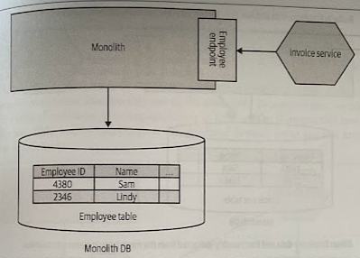

# Monolith as Data Access Layer

- [Monolith as Data Access Layer](#monolith-as-data-access-layer)
  - [Overview](#overview)
  - [Where to Use It](#where-to-use-it)

## Overview

Rather than accessing the data from the monolith directly, we can just move to a model in which we create an API in the monolith itself. We don't have to tackle data decomposition *yet* but get to *hide information*, making it easier to keep our new service isolated from the monolith.

> Susanne Kaiser from *JustSocial* shared this pattern as the company had used successfully as part of its microservices migration.

This pattern can work as a way of *identifying other candidate services*.

> Using the Employee API to identify the boundary of an Employee service to be split from the monolith.

## Where to Use It

This pattern works best when the code managing this data is still in the monolith. If the state transitions of this data are still provided in the monolith, it follows that the microservice that wants to access (or change) that state needs to go via the state transitions in the monolith.

(!) If the data you're trying to access in the monolith's database should really be "owned" by the microservice instead, you may want to skip this pattern and instead look to split the data out.
