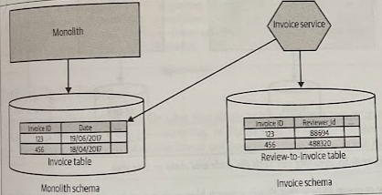

# Multischema Storage

- [Multischema Storage](#multischema-storage)
  - [Overview](#overview)
  - [Where to Use It](#where-to-use-it)

## Overview

If you are still making direct use of the data in a database, it doesn't mean that *new* data stored by a microservice should go in there too.

We have to consider what happens when a foreign-key relationship effectively spans a schema boundary.

Pulling out the data from a monolithic database will take time, and may not be something you can do in one step. You should therefore feel quite happy to have your microservice access data in the monolithic DB while also managing its own local storage.

## Where to Use It

* Works well when adding brand-new functionality to your microservice that requires the storage of new data. It's clearly not data the monolith needs, so keep it separate from the beginning.

* Makes sense as you start moving data out of the monolith into your own schema, a process that may take some time.

* You are accessing data in the monolith's schema that you never planned to move into your schema. You can use this pattern in conjunction with the *monolith as data access layer* pattern.
