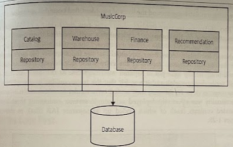

# Repository per Bounded Context

- [Repository per Bounded Context](#repository-per-bounded-context)
  - [Overview](#overview)
  - [Where to Use It](#where-to-use-it)

## Overview

A common practice is to have a *repository layer* to bind your code to the database, making it easy to map objects or data structures to and from the database. Rather than having a single repository layer for all our data access concerns, there is value in *breaking down* these repositories along the lines of bounded contexts.

Having the database mapping code colocated inside the application for a given context can help us understand what parts of the database are used by what parts of the application. We can see, therefore, which bounded contexts access which tables in our schema.

This doesn't give us the whole story, however. It might not be clear that the database *enforces a foreign-key relationship*. To see these database-level constraints, we need to use another tool to visualize the data.

All this help you understand the coupling between tables that may span that will eventually become service boundaries.

## Where to Use It

* Any situation where you are looking to rework the monolith in order to better understand how to split it apart.

* You are looking to understand where seams for microservices may exist not only in your database, but also in the code itself.
