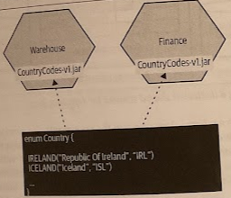

# Shared Static Data

- [Shared Static Data](#shared-static-data)
  - [Overview](#overview)

## Overview

*Static reference data* (which changes infrequently, yet is typically critical) can create some interesting challenges.

## Patterns

If we assume that we don't need to ensure that the data is consistent across all services at all times, the suggestion is to keep this information in a *shared library*. For more complex reference data or for larger volumes, this might be a good reason to put this into the *local database for each service*.

If the data needs to be consistent between services, the suggestion is to create a *dedicated service* or perhaps serve up this data as part of a larger-scoped static reference service. You can resort to having a *dedicated schema* for this sort of data only if it was difficult to justify the work to create a new service.

### Duplicate Static Reference Data

Each service has its *own copy* of the data.

Concerns around duplication of data tend to come down to two things:

1. Each time I need to change the data, I have to do so in multiple places. But in this situation, how often does the data change? (e.g., the last time a country was created and officially recognized was in 2011, with the creation of South Sudan).
2. What happens if the data is inconsistent? It is an issue that comes down to how the data is used. When the data is used only locally within each service, the inconsistency is not usually a problem. If, on the other hand, the data is part of the communication between these services, then we have different concerns.

We could also consider keeping these copies in sync using some sort of background process, of course, but we'd be unlikely to guarantee that all copies will be consistent.

> Sometimes duplication is the lesser of two evils. Accepting some duplication in data may be a sensible trade-off if it means we avoid introducing coupling.

#### Where to Use It

* It's not essential for all services to see the exact set of data (e.g., postal code files in the UK).

### Dedicated Reference Data Schema

You could relocate this data to a dedicated schema as a single source of truth. We do have to consider all the challenges of a shared database.

#### Where to Use It

* For large volumes of data.
* When you want the option of cross-schema joins.
* (!) Any changes to the schema format will likely cause significant impact across multiple services.

### Static Reference Data Library

When you are dealing with relatively small volumes of data, sometimes they would fit nicely in code, perhaps as a simple static enumerated type. You can consider *placing this data into a library* that can be statically linked by any services that want this data.

> Randy Shoup, who was VP of engineering at Stich Fix, said the *sweet spot* for this technique was for types of data that were small in volume and that changed infrequently or not at all (and if it did change, you had a lot of up-front warning about the change).

Obviously, if we have a mix of technology stacks, we may not be able to share a single shared library. Also, we need to ensure that our microservices are independently deployable, but if we needed to update our contry codes library, and have all services pick up the new data immediately, we'd need to redeploy all services at once (i.e., classical *lock-step release* that we're trying to avid with microservice architectures).

In practice, if we need the same data to be available everywhere, then *sufficient notice of the change may help*.

> If your microservices use shared libraries, remember that you have to accept that you might have different versions of the library deployed in production.

In a simple variation of this pattern, the data in question is held in a *configuration file*, perhaps a standard properties file or, if required, in a more structured *JSON* format.

#### Where to Use It

* For small volumes of data.
* Where you can be relaxed about different services seeing different versions of this data.

### Static Reference Data Service

You can consider creating a *dedicated service* just for your data (e.g., country codes).

In organizations where deploying new software requires lots of manual work, approvals, and perhaps even the need to procure and configure new hardware, the inherent cost of creating services is significant.

Another concern is that we'd be adding yet another networked dependency that could impact *latency*. But this approach is no worse, and may be faster, than having a dedicated database for this information, as the service could easily *hold this in memory* and serve it up directly.

This data can, of course, also be *aggressively cached at the client side*. When the data changes, interested consumers can be alerted via events and use this to update their local caches.

#### Where to Use It

* If you are managing the life cycle of this data itself in code.
* If you want to emit events when this data changes.
* When you want to provide a more convenient contact against which to stub for testing purposes.
* (!) The major issue seems to come down to the cost of creating yet another microservices in some cases.
