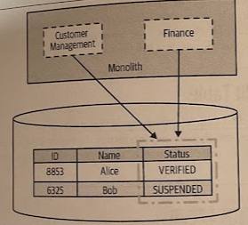
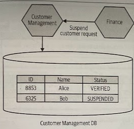

# Split Table

- [Split Table](#split-table)
  - [Overview](#overview)
  - [Where to Use It](#where-to-use-it)

## Overview

Sometimes you'll find data in a single table that needs to be *split across two or more service boundaries*.

> A single table that bridges two bounded contexts being split. We want to split out *Catalog* and *Warehouse* as new services, but the data for both is mixed into this single table.

In the spirit of *incremental migration*, sometimes it makes sense to split the tables apart in the exiting schema, before separating the schemas.

> Both *Customer Management* and *Finance* code can change the status in the *Customer* table. The column is updated during the customer sign-up process to indicate that a given person has (or hasn't) verified their email, with the value going from `NOT_VERIFIED` to `VERIFIED`. Once a customer is `VERIFIED`, they are able to shop. Our finance code handles suspending customers if their bills are unpaid, so they will on ocassion change the status of a customer to `SUSPENDED`. In instance, a customer's status still feels like it should be part of the customer domain model, and as such it should be managed by the soon-to-be-created *Customer* service.

What happens when multiple pieces of code update the same column? We want, where possible, to keep state machines for our domain entities inside a *single service boundary*, and updating a Status certainly feels like part of the state machine for a customer. This means that when the service split has been made, our new *Finance* service will need to make a *service call* to update this status.

A big problem with splitting tables like this is that we *lose the safety* given to us by *database transactions*.

## Where to Use It

* When a table is owned by two or more bounded contexts in your current monolith.

* (!) If you find specific columns in that table that seem to be updated by multiple parts of your codebase, you need to make a judgment call as to who should "own" that data.
