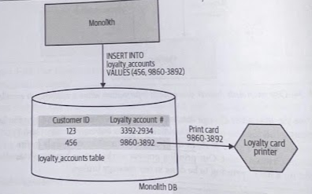

# Change Data Capture

## Overview

With *chnage data capture*, rather than trying to intercept and act on calls made into the monolith (i.e., *decorating collaborator*), we react to changes made in a datastore.

For change data capture to work, the underlying capture system *has to* be coupled to the monolith's datastore.

We detect insertions into a given table, and on insertion, we make a call to our new service.

## Where To Use It

* General purpose pattern, especially useful if you need to replicate data.
* For microservice migration, the sweet spot is where you need to react to a change in data in your monolith, but are unable to intercept this either at the perimeter of the system using a *strangler* or *decorator*, and cannot change the underlying codebase.

## Implementation

There are various techniques, all of which have different trade-offs in terms of complexity, reliability, and timelines.

### Database Triggers

Most relational databases allow you to trigger custom behavior when data is changed. Use them *very* sparingly

Triggers need to be installed into the database itself, just like any other stored procedure. The more of them you have, the harder it can be to understand how your system ac tually works.

### Transaction Log Pollers

*Transaction log* is normally a file, into which is written a record of all the changes that have been made. You can have a system running in a separate process which only interaction with the existing database is via this transaction log (i.e., only committed transactions).

These tools will require an understanding of the underlying transaction log format, and this typically varies across different types of databases.

Restrictions aside, in many ways this is the neatest solution for implementing *change data capture*. The transaction log itself shows only changes to the underlying data, so you aren't worried about working out what has changed. The tooling runs outside the database itself, and can run off a replica of the transaction log, so you have *fewer concerns regarding coupling or contention*.

### Batch Delta Copier

Probably the *most simplistic* approach is to write a program that on a regular schedule scans the database in question for what data has changed, and copies this data to the destination (e.g., *cron* or similar batxch scheduling tools).

The main problem is working out what data has actually changed since the batch copier last run. The schema design might make this obvious, or may not.
