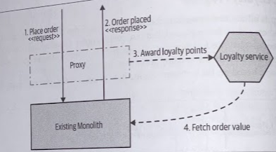

# Decorating Collaborator

- [Decorating Collaborator](#decorating-collaborator)
  - [Overview](#overview)
  - [Where To Use It](#where-to-use-it)

## Overview

We are going to use the *decorator pattern* to make it appear that our monolith is making calls to our service directly, even though we haven't actually changed the underlying monolith.

Rather than intercepting these calls before they reach the monolith, we allow the call to go ahead as normal. Then, based on the result of this call, we can call out to our external microservices through whatever collaboration mechanism we choose.

Our proxy is having to embody some "smart" logic. It needs to make its own calls out to the new microservice and tunnel responses back to the customer. You need to keep an eye on complexity that sits in the proxy. The more code you start adding here, the more it ends up becoming a microservice in its own right, albeit a technical one.

A potential challenge is that we need enough information from the inbound request to be able to make the call to the microservice. We might need to call back into the monolith to extract required information.

## Where To Use It

* You want to trigger some behavior based on something happening inside the monolith, but you are unable to change the monolith itself.

* Works best where the required information can be extracted from the inbound request, or the response back from the monolith. Where more information is needed, the more complex and tangled this implementation ends up being.
