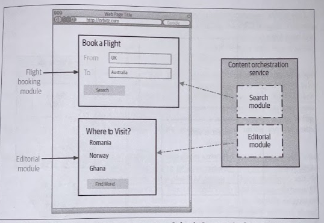

# UI Composition

- [UI Composition](#ui-composition)
  - [How It Works](#how-it-works)
    - [Page Composition](#page-composition)
    - [Widget Decomposition](#widget-decomposition)
      - [Web Applications](#web-applications)
      - [Mobile Applications](#mobile-applications)
    - [Micro Frontends](#micro-frontends)
  - [Where to Use It](#where-to-use-it)

## How It Works

The user interface presents us with some useful opportunities to splice together functionality.

### Page Composition

Page-based migration done on vertical-by-vertical basis.

* *The Guardian* example: Visitors to a website during this transition time would have been presented with a different look and feel when they went to the new parts of the site.
* *REA Group* example: it has different teams responsible for different pages, so then each team can own the whole end-to-end experience. Also, there are subtly different branding for the different channels.

### Widget Decomposition

#### Web Applications

Rather than go live with a whole page of the website, you can replace single widgets spliced into the current pages. This is a great way to get something live, learn from that experience, but also make sure that if something did go wrong, then it wouldn't affect the prime parts of the site.

> For example, you can make use of a technique called *Edge-Side Includes* (ESI) using Apache. With ESI, you define a template in your web page, and a web server splices in this content. Nowadays, browser-based technologies allow for more composition to be done in the browser itself.

This means for wiget-based web UIs, the browser itself is often making multiple calls to load various widgets using a multitude of techniques. This has the further benfit that if one widhet fails to load, the other widgets can still be rendered, allowing for only a partial degradation of service.

> *Orbitz* (now part of *Expedia*) created dedicated services just to serve up a single widget. Prior to its move to microservices, the Orbitz website was already broken into separate UI "modules" that were initially served directly from the Content Orchestation service. See ["Enabling Microservices at Orbitz"](https://www.youtube.com/watch?v=gY7JSjWDFJc).

#### Mobile Applications

Both Android and iOS, for example, provide the ability to componentize parts of their user interfaces, making it easier for these parts of the UI to be worked on in isolation, or recombined in different ways.

On of the challenges with deploying changes with native mobile applications is that both the Apple App Store and Google Play store require applications to be submitted and vetted prior to new versions beinh made available.

**The app itself is also at this point a monolith**: if you want to change one single part of a native mobile application, the whole application still needs to be deployed. You also have to consider the fact that users have to download the new app to see the new features.

Many organizations have dealt with this by allowing to make dynamic changes to an existing native mobile application without having to resort to deploying a new version of a native application. By **deploying changes on the server side**, client devices can immediately see the functionality without necessarily having to deploy a new version of the native mobile application. This can be achieved simply using things like **embedded web views**, although some companies use more sophisticated techniques.

> Spotify's UI across all platforms is heavily component-oriented, including its iOS and Android applications. Pretty much everything you see is a separate component, from as imple text header, to album network, or a playlist. Some of these modules are, in turn, backed by one or more microservices. The configuration and layout of these UI components is defined in a declarative fashion on the server side; Spotify engineers are able to change the views that users see and roll that change quickly, without needing to submit new versions of their application to the app store. - [Building Component-Driven UIs at Spotify](https://www.youtube.com/watch?v=vuCfKjOwZdU)

### Micro Frontends

By delivering an entire interface in a single page, we obviously can't consider page-based composition, so we have to consider some form of widget-based composition.

At first glance, *Micro Frotends* really are just about breaking down a user interface into different components that can be worked on independently (in that sense, they are nothing new, component-based software has several years of history). What is more intersting is that people are working out how to make web browsers, SPA SDKs, and componentization work together.

## Where to Use It

UI composition allows for whole vertical slices of functionality to be migrated. For it to work though, you need to have the ability to change the existing user interface to allow for new functionality to be safely inserted.
