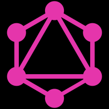

# [GraphQL](https://en.wikipedia.org/wiki/GraphQL)

- [GraphQL](#graphql)
  - [Overview](#overview)
  - [Characteristics](#characteristics)

## Overview

*GraphQL* is an open-source data query language for APIs, and a runtime for fulfilling queries with existing data.

> GraphQL was developed internally by Facebook in 2012 before being publicly released in 2015. On November 2018, the GraphQL project was moved from Facebook to the newly established GraphQL Foundation, hosted by the non-profit Linux Foundation.

GraphQL consists of a type system, query language and execeution semantics, static validation, and type introspection. It supports reading, writing (mutating), and subscribing to changes to data (realtime updates — most commonly implemented using WebSockets).

> On February 2018, the *GraphQL Schema Definition Language (SDL)* became part of the [GraphQL specification](https://github.com/graphql/graphql-spec).

## Characteristics

It allows *clients to define the structure of the data required*, and the same structure of the data is returned from the server, therefore preventing excessively large amounts of data from being returned, but this has implications for how effective *web caching* of query results can be.

The *flexibility* and *richness* also *adds complexity* that may not be worthwhile for simple APIs.

> Despite the name, GraphQL does not provide the richness of graph operations that one might find in a full-fledged graph database such as [Neo4j] or even in dialects of SQL that support *transitive closure*.
