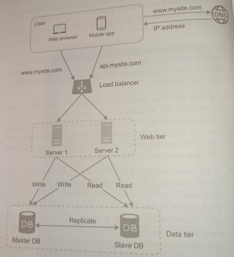
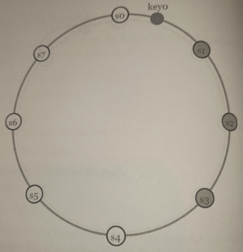

# Replication

* Overview
* Disadvantages
* Strategies
  * Master-slave
  * Master-master
  * Multi master
  * Consistent Hash Ring

## Overview

Replication involves **sharing information** so as to **ensure consistency between redundant resources**, to improve **reliability**, **fault-tolerance**, or **availability**. It can also provide better performance (e.g., allowing parallel queries).

> To achieve high availability and reliability, data must be replicated asynchronously over *N* servers, where *N* is a configurable parameter.

Replication is one of the many techniques to **scale a database**. Database replication becomes more complex when it scales-up horizontally and vertically. Horizontal scale-up has more data replicas while vertical scale-up has data replicas located at greater physical distances.

> Problems raised by horizontal scale-up can be alleviated by a multi-layer, multi-view access protocol. The early problems of vertical scale-up have largely been addressed by improving Internet reliability and performance.

## Disadvantages

Replication presents some **disadvantages**:

* There is a potential for loss of data if a *master* fails before any newly written data can be replicated to other nodes.

* Writes are replayed to the read replicas. If there are a lot of writes, the read replicas can get bogged down with replaying writes and can't do as many reads.

* The more read *slaves*, the more you have to replicate, which leads to greater replication lag.

* On some systems, writing to the *master* can spawn multiple thread to write in parallel, whereas read replicas only support writting with a single thread.

* Replication adds more hardware and additonal complexity.

## Strategies

### Master-Slave

> This is the most commonly used strategy.

The *master* serves reads and writes, replicating writes to one or more *slaves*, which serve only reads. *Slaves* can also replicate to additional slaves in a tree-like fashion.

If the *master* goes offline, the system can continue to operate in read-only mode until a *slave* is promoted to a *master* or a new *master* is provisioned.

The **disadvantage** of *Master-Slave* is that it requires logic is needed to promote a *slave* to a *master*.

### Master-Master

Both *masters* serve reads and writes and coordinate with each other on writes. if either *master* goes down, the system can continue to operate with both reads and writes.

The **disadvantages** with *Master-Master* are:

* You'll need a *load balancer* or to make changes to your application logic to determine where to write.

* Most *master-master* systems are either loosely consistent (violating ACID) or have increased write latency due to synchronization.

* Conflict resolution comes more into play as more write nodes are added and as latency increases.

### Multi-Master

Updates can be submitted to any database node, and then ripple through to other servers.

> This introduces substantially increased costs and complexity which may make it impractical in some situations.

The most common challenge is **transactional conflict prevention** or **resolution**. Most *synchronous* (**eager**) replication solutions perform conflict prevention, while *asynchronous* (**lazy**) solutons have to perform conflict resolution. The resolution of such a conflict may be based on a timestamp of the transaction, on the hierarchy of the origin nodes, or on so much more complex logic, which decides consistently across all nodes.

> For instance, if the same record is changed on two nodes simultaneously, an *eager replication* system would detect the conflict before confirming the commit and abort one of the transactions. A *lazy replication* system would allow both transactions to commit and run a conflict resolution during re-synchronization.

### Consistent Hash Ring

We choose *N* servers for asynchronous replication. These *N* servers are choosing using the following logic:

After a key is mapped to a position in the hash ring, walk clockwise from that position and choose the first *N* servers on the ring to store data copies.

> Given $N = 3$, *key0* is replicated at *s1*, *s3*, and *s3*.

With virtual nodes, the first *N* nodes on the ring may be owned by fewer than *N* physical servers. To avoid this issue, we **only choose unique servers** while performing the clockwise walk logic.

Nodes in the same data center often fail at the same time due to power outages, network issues, natural disasters, etc. For better reliability, replicas are placed in distinct data centers, and data centers are connected through high-speed networks.
