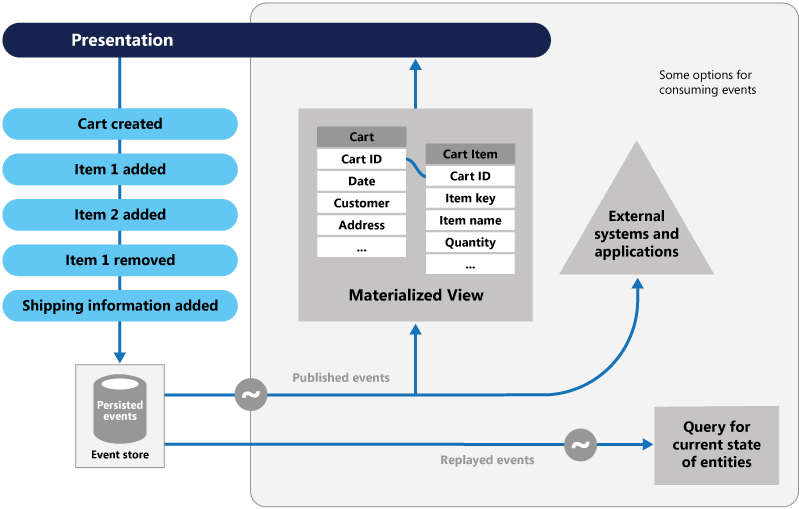

# Event Sourcing

- [Event Sourcing](#event-sourcing)
  - [Overview](#overview)
  - [Context & Problem](#context--problem)
  - [Solution](#solution)
  - [Usage](#usage)
  - [Advantages](#advantages)
  - [Issues and considerations](#issues-and-considerations)
    - [Eventual consistency](#eventual-consistency)
    - [Idempotence](#idempotence)
    - [Changing events](#changing-events)
    - [Querying](#querying)
  - [When to use](#when-to-use)
  - [When not to use](#when-not-to-use)
  - [Example](#example)

## Overview

Instead of storing just the current state of the data in a domain, use an _append-only store_ to record the full series of actions taken on that data.

The store acts as the system of record and can be used to materialize the domain objects. This can simplify tasks in complex domains, by avoiding the need to synchronize the data model and the business domain, while improving performance, scalability, and responsiveness.

It can also provide consistency for transactional data, and maintain full audit trails and history that can enable compensating actions.

## Context & Problem

The typical approach is for the application to maintain the current state of the data by updating it as users work with it, often by using transactions that lock the data.

The CRUD approach has some limitations:

- CRUD systems perform update operations drectly against a data store, which can slow down performance and responsiveness, and limit scalability, due to the processing overhead it requires.
- In a collaborative domain with many concurrent users, data update conflicts are more likely because the update operations take place on a single item of data.
- Unless there's an additional auditing mechanism that records the details of each operation in a separate log, history is lost.

## Solution

The Event Sourcing pattern defines an approach to handling operations on data that's driven by a sequence of events, each of which is recorded in an append-only store. Application code sends a __series of events that imperatively describe each action__ that has ocurred on the to the event store, where they're persisted.

> Each event represents a set of changes to the data.

The events are persisted in an event store that acts as the system of record about the current state of the data (i.e., _the authorirative data source_). The event store typically publishes these events so that consumers can be notified and can handle them if needed.

> The application code that generates the events is decoupled from the system that subscribe to the events.

## Usage

Typical uses of the events published by the store are to __maintain materialized views__ of entities as actions in the application change them, and for integration with external systems.

In addition, at any point it's possible for applications to read the history of events, and use it to materialize the ucrrent state of an entity by playing back and consuming all the events related to that entity. This can occur on demand to materialize a domain object when handling a request, or through a scheduled task so that the state of the entity can be stored as a materialized view to support the presentation layer.

> Event sourcing is commonly combined with the [CQRS pattern](./cqrs.md) by performing the data management tasks in response to the events, and by materializing views from the stored events.

## Advantages

- __Scalability__: Events are immutable and can be stored using an append-only operation. Tasks that handle the events can run in the background and there's __no contention__ during the processing of transactions.
- __Simplicity__: Events are simple objects that describe some action that occurred and are simply recorded for handling at the appropriate time. This simplifies implementation and management.
- __Domain expertise__: Events typically have meaning for a domain expert, whereas object-relational impedance mismatch can make complex database tables hard to understand. Tables are artificial constructs that represent the current state of the system, not the events that occurred.
- __Consistency__: Prevent concurrent updates from causing conflicts because it avoids the requirement to directly update objects in the data store. However, the domain model must still be designed to protect itself from requests that might result in an inconsistent state.
- __Audit trail__: The append-only storage can be used to monitor actions taken against a data store, regenerate the current state as materialized views or projections by replaying the events at any time, and assist in testing and debugging the system. It addition, the requirement to use compensating events to cancel changes provides a history of changes that were reversed. The list of events can also be used to analyze application performance and detect user behavior trends.
- __Extensibility__ The decoupling of the tasks from the events provides flexibility. Tasks know about the type of event and the event data, but not about the operation that triggered the event. In addition, multiple tasks can handle each event. This enables easy integration with other services and systems that only listen for new events raised by the event store.

## Issues and considerations

### Eventual consistency

The system will only be _eventually consistent_ when creating materialized views or generating projections of data by replaying events. There's some delay between an application adding events to the event store, the events being published, and consumers of the events handling them. During this perior, new events that describe further changes to entities might have arrived at the event store.

Multi-threaded applications might be storing events. The consistency of events is vital, as is the _order of events_ that affect a specific entity. Adding a timestamp to every event can help to avoid issues. Another common practice is to annotate each event with an incremental identifier and if two actions attempt to add events for the same entity at the same time, the event store can reject an event.

Even though event sourcing minimizes the chance of _conflicting updates_ to the data, the application must still be able to deal with inconsistencies that result from eventual consistency and the __lack of transactions__.

> For example, an event that indicates a reduction in stock inventory might arrive in the data store while an order for that item is being place, resulting in a requirement to reconcile the two operations either by advising the customer or creating a back order.

### Idempotence

Event publication might be _at least once_, and so consumers of the events must be idempotent.

They __must not reapply__ the update described in an event if the event is handled more than once.

For example, if multiple instances of a consumer maintain and aggregate an entity's property, such as the total number of orders placed, only one must succeed in incrementing the aggregate when an order placed event occurs.

### Changing events

The event store is the permanent source of information, and so the event data should never be updated. The only way to update an entity to undo a change is to add a _compensating event_.

If the format of the persisteds events needs to change, perhaps during a migration, it can be difficult to combine existing events in the store with the new version. It might be necessary to iterate through all the events making changes so they're compliant with the new format, or add new evens that use the new format.

Consider using a version stamp on each version of the event schema to maintain both the old and the new formats.

### Querying

There's no standard approach for reading the events to obtain information. The only data that can be extracted is a _stream of events_ using an event identifier as the criteria, which typically maps to individual identities.

> The current state of an entity can be determined only by replaying all of the events that relate to it against the original state of that entity.

The length of each event stream affects managing and updating the system. If the streams are large, consider creating _snapshots_ at specific intervals such as a specified number of events. The current state of the entity can be obtained from the snapshot and by replaying any events that ocurred after that point in time.

> See [Master-Subordinate Snapshot Replication](https://docs.microsoft.com/en-us/previous-versions/msp-n-p/ff650012(v=pandp.10))

## When to use

- When you want to capture intent, purpose, or reason in the data.
- When it's vital to minimize or completely avoid the occurrence of conflicting updates to data.
- When you want to record events that occur, and be able to replay them to restore the state of a system, roll back changes, or keep a history and audit log.
- When using events is a natural feature of the operation of the application, and requires little additional development effort.
- When you need to decouple the process of inputting or updating data from the tasks required to apply these actions.
- When you want flexibility to be able to change the format of materialized models and entity data.
- When used in conjuction with CQRS, and eventual consistency is acceptable while a read model is updated, or the performance impact of rehydrating entities and data from an event stream is acceptable.

## When not to use

- Small or simple domains, systems that have little or no business logic, or nondomain systems that naturally work well with traditional CRUD mechanisms.
- Systems where consistency and real-time updates to the views of the data are required.
- Systems where audit trails, history, and capabilities to roll back and replay actions are not required.
- Systems where there's only a very low occurrence of conflicting updates to the underlying data (i.e., systems that predominantly add data rather than upating it).

## Example

A conference management system needs to track the number of completed bookings for a conference so that it can check whether there are seats still available. There are at least two ways:

- Store information about the total number of bookings as a separate entity in a database that holds booking information. As bookings are made or canceled, the system could increment or decrement this number as appropriate. This approach is simple in theory, but can cause scalability issues if a large number of attendees are attempting to book seats during a short period of time.
- Store information about bookings and cancellations as events held in an event store. It could then calculate the number of seats available by replaying these events. This can be more scalable due to the immutability of events, the system only needs to be able to read or append data, no updates.

> Some optimizations to consider are using _snapshots_ so that you don't need to query and replay the full list of events to obtain the current state of the aggregate, and maintaining a cached copy of the aggregate in memory.
