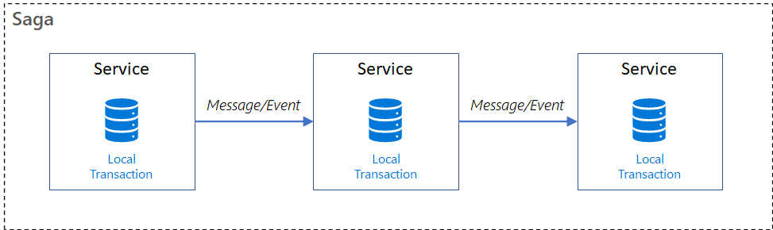
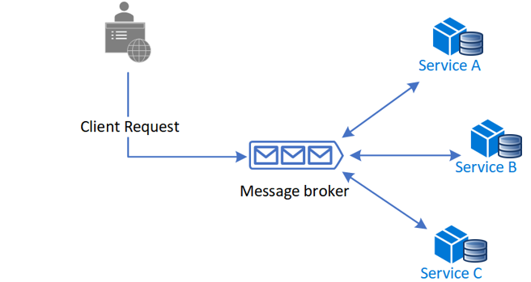

# Saga distributed transaction pattern

- [Saga distributed transaction pattern](#saga-distributed-transaction-pattern)
  - [Overview](#overview)
  - [Context and problem](#context-and-problem)
    - [Database-per-microservice](#database-per-microservice)
      - [Two-phase commit (2PC)](#two-phase-commit-2pc)
      - [Interprocess communication (IPC)](#interprocess-communication-ipc)
  - [Solution](#solution)
  - [When to use](#when-to-use)
  - [Issues and considerations](#issues-and-considerations)
    - [Common concerns](#common-concerns)
    - [Anomalies](#anomalies)
    - [Countermeasures](#countermeasures)
  - [Transaction types](#transaction-types)
  - [Implementation](#implementation)
    - [Choreography](#choreography)
      - [Choreography - Benefits](#choreography---benefits)
      - [Choreography - Drawbacks](#choreography---drawbacks)
    - [Ochestration](#ochestration)
      - [Orchestration - Benefits](#orchestration---benefits)
      - [Orchestration - Drawbacks](#orchestration---drawbacks)

## Overview

The Saga design pattern is a way to __manage data consistency across microservices in distributed transaction scenarios__.

A saga is a sequence of transactions that updates each service and publishes a message or event to trigger the next transaction step. If a step fails, the saga executes compensating transactions that counteract the preceding transactions.

## Context and problem

Transactions must be _atomic, consistent, isolated, and durable_ (ACID). Cross-service data consistency requires a cross-service transaction management strategy.

In _multi-service architectures_:

- _Atomicity_ is an indivisble and irreducible set of operations that must all occur or none occur.
- _Consistency_ means that transaction brings the data only from one valid state to another valid state.
- _Isolation_ guarantees that concurrent transactions produce the same data state that sequentially executed transactions would have produced.
- _Durability_ ensures that the comitted transactions remain committed even in case of system failure.

### Database-per-microservice

A _database-per-microservice_ model provides many benefits for microservices architectures. Encapsulating domain data lets each service use its best data store type and schema, scale its own data store as necessary, and be insulated from other services' failures. However, ensuring data consistency across service-specific databases poses challenges.

#### Two-phase commit (2PC)

Distributed transactions like the _two-phase commit (2PC)_ protocol require all participants in a transaction to commit or roll back before the transaction can proceed. However, some participant implementations, such as NoSQL databases and message brokering, don't support this model.

#### Interprocess communication (IPC)

Operating system-provided IPC allows separate processes to share data but has limitations due to synchronicity and availability. For distributed transactions to commit, all participating services must be available, potentially reducing overall system availability.

## Solution

The Saga pattern provides transaction management using a sequence of _local transactions_.

A local transaction is the atomic work effort performed by a _saga participant_. Each local transaction updates the database and publishes a message or event to trigger the next local transaction in the saga. If a local transaction fails, the saga executes a series of _compensating transactions_ that undo the changes that were made by the preceding local transactions.

## When to use

Use the Saga pattern when you need to:

- Ensure data consistency in a distributed system without tight coupling.
- Roll back or compensate if one of the operations in the sequence fails.

The Saga pattern is less suitable for:

- Tightly coupled transactions.
- Compesanting transactions that occur in earlier participants.
- Cyclic dependencies.

## Issues and considerations

### Common concerns

Consider the following points when implementing the Saga pattern:

- It requires a __new way of thinking__ on how to coordinate a transaction and maintain data consistency for a business process spanning multiple microservices.
- It is particularly __hard to debug__ and the complexity grows as participants increase.
- Data __can't be rolled back__, because saga participants commit changes to their local databases.
- The implementation must be capable of handling a set of potential transient failures, and __provide idempotence__ for reducing side-effects and ensuring data consistency.
- It's best to implement _observability_ to monitor and track the saga workflow.
- The lack of participant data isolation imposes durability challenges. The saga implementation must include countermeasures to reduce _anomalies_.

### Anomalies

The following anomalies can appen without proper measures:

- __Lost updates__: When one saga writes without reading changes made by another saga.
- __Dirty reads__: When a transaction or a saga reads updates made by a saga that has not yet completed those updates.
- __Fuzzy/nonrepeatable reads__: When different saga steps read different data because a data update occurs between the reads.

### Countermeasures

Suggested countermeassures to reduce or prevent anomalies include:

- __Semantic lock__: An application-level lock where a saga's compensable transaction uses a semaphore to indicate an update is in progress.
- __Commutative updates__: They can be executed in any order and produce the same result.
- __Pessimistic view__: It's possible for one saga to read dirty data, while another saga is running a compensable transaction to roll back the operation. Pessimistic view _reorders_ the saga so the underlying data updates in a retryable transaction, which eliminates the possibility of a dirty read.
- __Reread value__: Verifies that data is unchanged, and then updates the record. If the record has changed, the steps abort and the saga may restart.
- __Version file__: Records the operations on a record as they arrive, and then executes them in the correct order.
- __By value__: Uses each request's business risk to dynamically select the concurrency mechanism. Low-risk requests favor sagas, while high-risk requests favor distributed transactions.

## Transaction types

In Saga patterns:

- _Compensable transactions_: Transactions that can potentially be reversed by processing another transaction with the opposite effect.
- _Pivot transactions_: The go/no-go point in a saga. If the pivot transaction commits, the saga runs until completion. It is neither compensable nor retryable, or it can be the last compensable transaction or the first retryable transaction in the saga.
- _Retryable transactions_: Transactions that follow the pivot transaction and are guaranteed to succeed.

## Implementation

There are two common saga implementation approaches, _choreography_ and _orchestration_. Each one has its own set of challenges and technologies to coordinate the workflow.

### Choreography

Choreography is a way to coordinate sagas where participants exchange events without a decentralized point of control.

With choreography, each local transaction publishes domain events that trigger local transactions in other services.

#### Choreography - Benefits

- Good for simple workflows that require few participants and don't need a coordination logic.
- Doesn't require additional service implementation and maintenance.
- Doesn't introduce a single point of failure, since the responsibilities are distributed across the saga participants.

#### Choreography - Drawbacks

- Workflow can become confusing when adding new steps, as it's difficult to track which saga participants listen to which commands.
- There's a risk of _cyclic dependency_ between saga participants.
- Integration testing is difficult because all services must be running to simulate a transaction.

### Ochestration

Orchestation is a way to coordinate sagas where a __centralized controller__ tells the saga participants what local transactions to execute. The saga orchestator handles all the transactions and tells the participants which operation to perform based on events.

The _orchestrator_ executes saga requests, stores, and interprets the states of each task, and handles failure recovery with compensating transactions.

#### Orchestration - Benefits

- Good for complex workflows involving many participants or new participants added over time.
- Suitable when there is control over every participant in the process, and control over the flow of activities.
- Doesn't introduce cyclical dependencies, because the orchestrator unilaterally depends on the saga participants.
- Clear _separation of concerns_ simplifies business logic. Saga participants don't need to know about commands for other participants.

#### Orchestration - Drawbacks

- Additional design complexity requires an implementation of a _coordination logic_.
- There's an _additional point of failure_ because the orchestrator manages the complete workflow.
