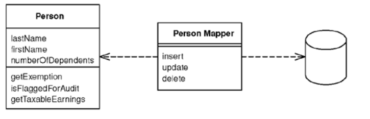
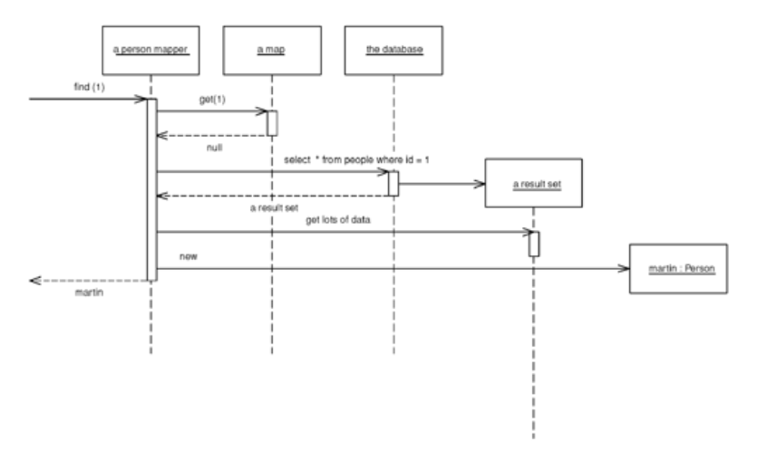

# Data Mapper

> A layer of *Mappers* that moves data between objects and a database while keeping them independent of each other and the mapper itself.

* Overview
* How It Works
* When To Use It

## Overview

__Objects and relational database have different mechanisms for structuring data__. Many parts of an object, such as collections and inheritance, aren't present in relational databases. When you build an object model with a lot of business logic it's valuable to use these mechanisms to bettter organize the data and the behavior that goes with it. __Doing so leads to variant schemas, that is, the object schema and the relational schema don't match up__. 

A *Data Mapper* is a _Data Access Layer_ that performs bidirectional transfer of data between a persistent data store and an in-memory data representation (_Domain Layer_) and isolates them from each other.

With *Data Mapper* the in-memory objects needn't know even that there's a database present; they need no SQL interface code, and certainly no knowledge of the database schema. Since it's a form of *Mapper*, *Data Mapper* itself is even unknown to the domain layer.

## How It Works

> *Data mappers* might have "find" or query functionality, but that is not really their main function. The more you find that you are using elaborate query logic in your *Data Mappers*, the more you want to start thinking about decoupling that query logic into a repository while leaving your DataMappers to serve their main function, mapping domain objects to the database and vice versa. [Stackoverflow 27996119](https://stackoverflow.com/questions/27996119/what-exactly-is-the-difference-between-a-data-mapper-and-a-repository)

A simple case would have a `Person` and `Person Mapper` class. To load a person from the database, a client would call a find method on the mapper. The mapper uses an *Identity Map* to see if the person is already lodaded; if not, it loads it.

The whole layer of *Data Mapper* can be substited, either for testing purposes or to allow a single domain layer to work with different databases.

When it comes to inserts and updates, it has to fit the whole workload into a transactional framework. The *Unit of Work* pattern is a good way to organize this.

The request from the client will usually lead to a graph of objects being load, with the mapper designer deciding exactly how much to pull back in one go. The point of this is to minimize database queries, so the finders typically need to know a fair bit about how the clients use the objects in order to make the best choices for pulling data back. It usually be faster to do a single query that joins multiple tables, and then use the result set to load all instances.

An application can have one *Data Mapper* or several. If you're usuing *Metadata Mapping* you can get away with a single mapper class but this limits your *find* methods.

As with any database *find* behavior, the finders need to use an *Identity Map* in order to maintain the identity of the objects read from the database. Either you can have a *Registry* of *Identity Maps*, or you can have each finder hold an *Identity Map*.

## When To Use It

When you want the database schema and the object model to evolve independently (most common case for this is with a *Domain Model*).

* Mappers do all the communication with the database.

* Domain objects can be understood without having to understand how they're stored in the database.

> "I wouldn't choose *Data Mapper* without *Domain Model*. (...) If the domain model is pretty simple, and the database is under the domain model developers' control, then it's reasonable for the domain objects to access the database directly with *Active Record*" - Martin Fowler

### Data Mapper Pros as ORM

* __Greater flexibility__. Application architecture don't necessarily have a final say on the database scheme. Where you've got a historical database, or a new database with an unfriendly gatekeeper, Data Mapper allows you to hide the ways in which your database isn't an ideal way to think about your domain. This allows for more complex models too.

* __Can be have greater performance__. Data Mapper can make more efficient use of the database than a naive Active Record implementation would allow.
