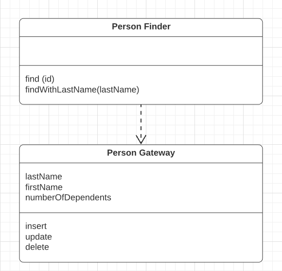

# Row Data Gateway

> *"An object that acts as a __Gateway__ to a single record in a data source. There is one instance per row."* - Martin Fowler



* Overview
* How It Works
* When to Use It
* Java Example

## Overview

Embedding database access code in in-memory objects can leave you with a few disadvantages:

* If your in-memory objects have business logic of their own, adding the database manipuation code increases complexity.

* Testing is awkward too since, in-memory objects are tied to a database, tests need database access too.

* You may have to access multiple databases with little variations on the SQL.

A *Row Data Gateway* gives you objects that look exactly like the record in your record structure but can be accessed with the regular mechanisms of your programming lanaguage. All **details of data source access are hidden behind this interface**.

## How It Works

A *Row Data Gateway* acts as an object that exactly mimics a single record, such as one database row. In it each column in the database becomes one field. It will usually do any type conversion from the data source types to the in-memory types.

This pattern holds the data about a row so that a client can then access the *Row Data Gateway* directly. The gateway acts as a good interface for each row of data. This approach works particularly well for *Transaction Scripts*.

It often makes sense to have separate finder objects so that each table in a relational database will have one finder class and one gateway class for the results.


> It's often hard to tell the difference between a *Row Data Gateway* and an *Active Record*. The crux of the matter is whether there's any domain logic present; if there is, you have an *Active Record*. A *Row Data Gateway* **should contain only database access logic and no domain logic**.

*Row Data Gateways* tend to be somewhat tedious to write, but they're a very good candidate for code generation based on a *Metadata Mapping*. This way all your database access code can be automatically built for you.

## When to Use It

First decide whether to use a gateway at all, and second whether to use *Row Data Gateway* or *Table Data Gateway*.

*Row Data Gateway* may work better with *Transaction Script*, it nicely factors out the database access code and allows it to be reused easily by different *Transaction Scripts*.

For *Domain Model*, if the mapping is simple, *Active Record* does the same job without an additional layer of code. If the mapping is complex, *Data Mapper* works better at decoupling the data structure from the domain objects. *Row Data Gateway* can be used very nicely with *Data Mapper*. Although this seems like extra work, it can be effective if the *Row Data Gateways* are automatically generated from metadata while the *Data Mappers* are done by hand.

If you use *Transaction Script* with *Row Data Gateway*, you may notice that you have business logic that's repeated across multiple scripts; logic that would make sense in the *Row Data Gateway*. Moving that logic will gradually turn your *Row Data Gateway* into an *Active Record*, which is often good as it reduces duplication in the business logic.

## Java Example

We'll use a simple person table:

```sql
CREATE TABLE people (ID int primary key, lastname varchar, firstname varchar, number_of_dependents int);
```

Then we create our *Row Data Gateway* which uses a *Registry* to hold *Identity Maps* for cache.

```java
// Gateway for the People table
class PersonGateway {
  // ...
  
  private String lastName;
  private String firstName;
  private int numberOfDependents;

  public String getLastName() {
    return lastName;
  }

  public String setLastName(String lastName) {
    this.lastName = lastName;
  }

  // Other accessors...

  // The gateway class itself can handle updates and inserts
  private static final String updateStatementString =
    "UPDATE people " +
    " set lastname = ?, firstname = ?, number_of_dependents = ? " +
    " where id = ?";
  
  public void update() {
    PreparedStatement updateStatement = null;

    try {
      updateStatement = DB.prepare(updateStatementString);
      updateStatement.setString(1, lastName);
      updateStatement.setString(2, firstName);
      updateStatement.setInt(3, numberOfDependents);
      updateStatement.setInt(4, getID().intValue());
      updateStatement.execute();
    } catch (Exception e) {
      throw new ApplicationException(e);
    } finally { DB.cleanUp(updateStatement); }
  }

  private static final String insertStatementString =
    "INSERT INTO people VALUES (?, ?, ?, ?)";

  public long insert() {
    PreparedStatement insertStatement = null;

    try {
      insertStatement = DB.prepare(insertStatementString);
      setID(findNextDatabaseId());
      insertStatement.setInt(1, getID().intValue());
      insertStatement.setString(2, lastName);
      insertStatement.setString(3, firstName);
      insertStatement.setInt(4, numberOfDependents);
      insertStatement.execute();

      Registry.addPerson(this);

      return getID();
    } catch (SQLException e) {
      throw new ApplicationException(e);
    } finally { DB.cleanUp(insertStatement); }
  }

  // Load objects finded by PersonFinder
  public static PersonGateway load(ResultSet rs) throws SQLException {
    Long id = new Long(rs.getLong(1));

    PersonGateway result = (PersonGateway) Registry.getPerson(id);
    if (result != null) return result;
  
    String lastNameArg = rs.getString(2);
    String firstNameArg = rs.getString(3);
    int numDependentsArg = rs.getInt(4);

    result = new PersonGateway(id, lastNameArg, firstNameArg, numDependentsArg);
    
    Registry.addPerson(result);

    return result;
  }
}
```

To pull people out of the database, we have a separate `PersonFinder`. This works with the gateway to create new gateway objects.

```java
class PersonFinder {
  // ...

  // Find by ID
  private final static String findStatementString =
    "SELECT id, lastname, firstname, number_of_dependents " +
    " from people " +
    " WHERE id = ?";
  
  public PersonGateway find(Long id) {
    PersonGateway result = (PersonGateway) Registry.getPerson(id);
    if (result != null) return result;

    PreparedStatement findStatement = null;
    ResultSet rs = null;
    
    try {
      findStatement = DB.prepare(findStatementString);
      findStatement.setLong(1, id.longValue());
      rs = findStatement.executeQuery();
      rs.next();
      result = PersonGateway.load(rs);
      return result;
    } catch (SQLException e) {
      throw new ApplicationException(e);
    } finally { DB.cleanUp(findStatement, rs); }
  }

  //To find more than one person according to some criteria...
  private static final String findResponsibleStatement =
    "SELECT id, lastname, firstname, number_of_dependents " +
    " from people " +
    " WHERE number_of_dependents > 0";

  public List findResponsibles() {
    List result = new ArrayList();
    PreparedStatement stmt = null;
    ResultSet rs = null;

    try {
      stmt = DB.prepare(findResponsibleStatement);
      rs = stmt.executeQuery();

      while (rs.next()) {
        result.add(PersonGateway.load(rs));
      }
      
      return result;
    } catch (SQLException e) {
      throw new ApplicationException(e);
    } finally { DB.cleanUp(stmt, rs); }
  }
}
```

We can now use the gateways from a *Transaction Script*:

```java
PersonFinder finder = new PersonFinder();
Iterator people = finder.findResponsibles().iterator();
StringBuffer result = new StringBuffer();

while (people.hasNext()) {
  PersonGateway each = (PersonGateway) people.next();

  result.append(each.getLastName());
  result.append("");
  result.append(each.getFirstName());
  result.append("");
  result.append(String.valueOf(each.getNumberOfDependents()));
  result.append("\n");
}

return result.toString();
```

And if we want a **Data Holder for a Domain Object** (usage with *Domain Model*), instead of copying the data to the domain object, we can use *Row Data Gateway* as a data holder for the domain object, so the domain object can use the gateway's getters to pull the data

```java
class Person {
  private PersonGateway data;

  public Person(PersonGateway data) {
    this.data = data;
  }

  public int getNumberOfDependents() {
    return data.getNumberOfDependents();
  }

  public Money getExemption() {
    Money baseExemption = Money.dollars(1500);
    Money dependentExemption = Money.dollars(750);
    return baseExemption.add(dependentExemption.multiply(this.getNumberOfDependents()));
  }
}
```
