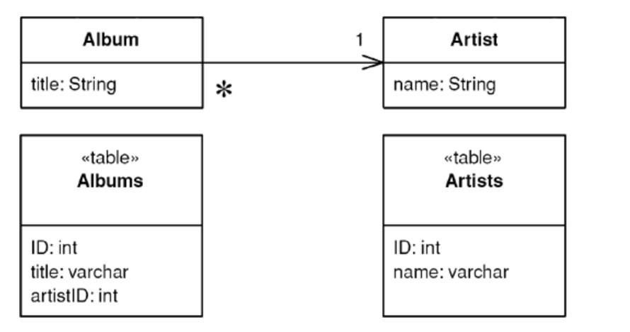
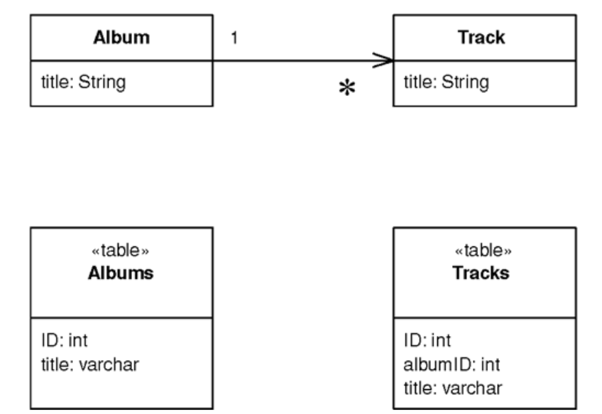

# Foreign Key Mapping

> Maps an association between objects to a foreign key reference between tables.

* Overview
* How It Works
* When to Use It

## Overview

Objects can refer to each other directly by object references. To save these objects to a database, we need to keep these referecens.

## How It Works

* Each object contains the database key from the appropriate database table (*Identity Field*).

* If two objects are linked together with an association, this can be replaced by a foreign key in the database.

* If you have a collectio nof objects, you have to reverse the direction of the reference.

* To avoid getting lost in cycles, you have two choices regarding how you create your objects.
  * Creation method includes data that will give you a fully formed object but you place *Lazy Load* at appropriate points to break the cycles.
  * Create empty objects and immediately put them in an *Identity Map*, so when you cycle bvack around, the object is already loaded and you'll end the cycle.

## When to Use It

A *Foreign Key Mapping* can be used for almost all associations between classes.

* The most common case where it isn't possible is with *many-to-many* associations. *Foreign keys* are single values, and first normal form means that you can't store multiple foreign keys in a single field. Instead, you need to use *Association Table Mapping*.

* If you have a collection field with no back pointer, you should consider whether the many side should be a *Dependent Mapping*, which can simplify your handling of the collection.

* If the related obejct is a *Value Object* thedn you should use *Embedded Value*.
