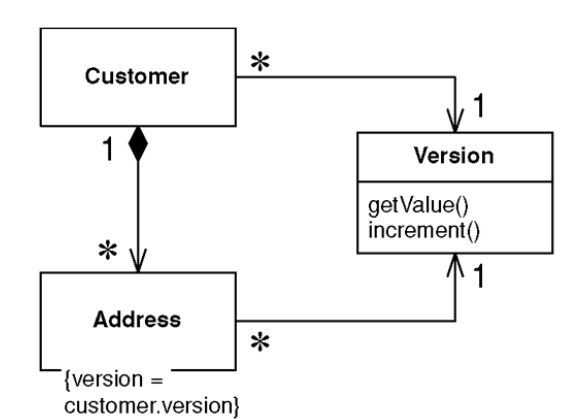
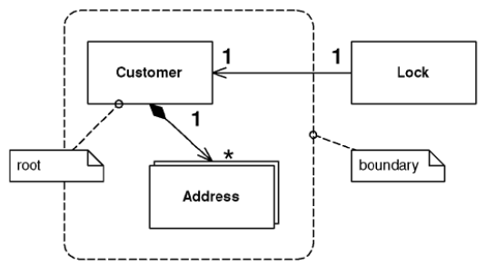

# Coarse Grained Lock

> Locks a set of related objects with a single lock.

* Overview
* How It Works
  * Shared Lock Implementation
  * Root Lock
* When to Use It

## Overview

Objects can often be edited as a group. If so, it makes sense to lock all of these items if you want to lock any one of them.

If your locking strategy requires that an object is loaded in order to be locked, such as with *Optimistic Offline Lock*, locking a large group affects performance. And with *Pessimistic Offline Lock* a large lock set is a management headache and increases lock table contention.

A *Coarse Grained Lock* is a **single lock that covers many objects**. It not only **simplifies the locking** action itself but also **frees you from having to load all the members of a group in order to lock them**.

## How It Works

Create a single point of contention for locking a group of objects. Then you provide the shortest path possible to finding that single lock point in order to minimize the group members that must be identified and possibly loaded into memory in the process of obtaining that lock.

### Shared Lock

* With *Optimistic Offline Lock*, having each item in a group share a version creates a single point of contention, which means sharing the *same* version, not an *equal* version. Incrementing this version will lock the entire group with a **shared lock**. Set up your model to point every member of the group at the shared version.

* With *Pessimistif Offline Lock*, you need that each member of the group shares some sort of lockable token, on which it must then be acquired. A shared version object makes an excellent candidate for the lockable token role.

### Root Lock

> An *aggregate* is defined as a cluster of associated objects that we treat as a unit for data changes. Each aggregate has a **root** that provides the only access point to members of the set and a **boundary** that defines what's included in the set.

* Locking an *aggregate* means locking its root, which means locking all members of the aggregate. The root gives us a single point of contention.

* It is necessary to implement navigation to the root in your object graph. This allows a locking mechanism, when asked to lock any object in the aggregate, to navigate to the root and lock it instead.

* You should use *Lazy Load* when loading the objects that make up the path to your root. This not only prevents objects from being loaded before they're needed but prevents an infinite mapping loop when you map a bidirectional relationship.

## When to Use It

* The most obvious reason is to **satisfy business requirements** by locking an *aggregate*.

* Acquiring and releasing lock is cheaper.
