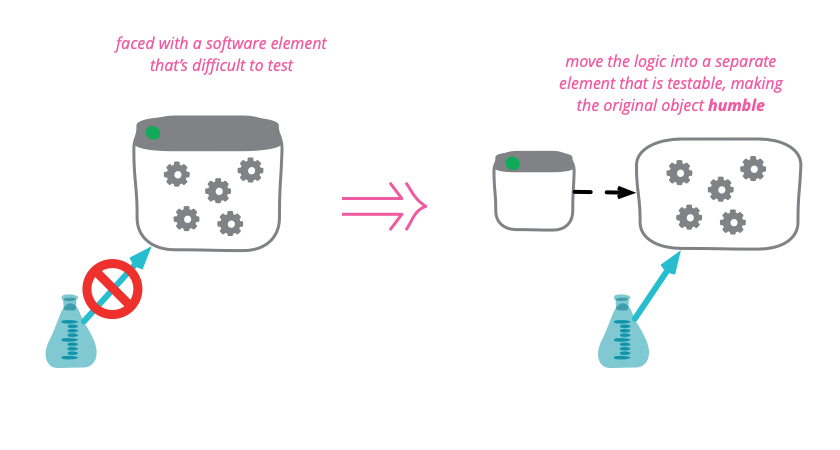

# Humble View

> This pattern is also known as *Passive View*. See [Martin Fowler's GUI Architectures post](https://www.martinfowler.com/eaaDev/uiArchs.html).

## Overview

This is a variation of the *Model View Presenter* pattern, in which you move all the way to **having the presenter do all the manipulation of the widgets**.

> When people talk about self-testing code user-interfaces quickly raise their head as a problem. Many people find that testing GUIs to be somewhere between tough and impossible. This is largely because UIs are tightly coupled into the overall UI environment and difficult to tease apart and test in pieces.

As a result, there's been a steady movement to design UIs in such a way that **minimizes the behavior in objects that are awkward to test**.

There are multiple approaches, but the key to all is that by testing the presenter or by testing the presentation model, **you test most of the risk of the UI without having to touch the hard-to-test widgets**.

### Humble Dialog Box

Michael Feathers crisply summed up this approach in [The Humble Dialog Box paper](https://www.researchgate.net/publication/228553237_The_humble_dialog_box). Gerard Meszaros generalized this notion to the idea of a [Humble Object](http://xunitpatterns.com/) - any object that is difficult to test should have *minimal behavior*. That way if we are unable to include it in the test suites we **minimize the chances of an undetected failure**.

The Humble Dialog Box paper uses a presenter, but in a much deeper way than the original MVP. Not just does **the presenter decide how to react to user events, it also handles the population of data in the UI widgets themselves**. As a result the *widgets* no longer have, nor need, visibility to the model; they form a *Passive View*, manipulated by the presenter.

### Presentation Model

This isn't the only way to make the UI humble. Another approach is to use *Presentation Model*, although then you do need a bit more behavior in the widgets, enough for the widgets to know how to map themselves to the Presentation Model.
