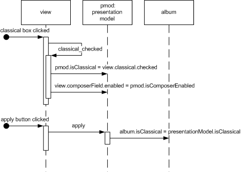

# Application/Presentation Model

> This is based on [Martin Fowler's Presentation Model post](https://martinfowler.com/eaaDev/PresentationModel.html).

- [Application/Presentation Model](#applicationpresentation-model)
  - [Overview](#overview)
  - [How It Works](#how-it-works)
    - [Who owns the synchronization?](#who-owns-the-synchronization)
      - [Presentation Model](#presentation-model)
      - [View](#view)
  - [When to Use It](#when-to-use-it)

## Overview

Represent the state and behavior of the presentation independently of the GUI controls used in the interface.

Leaving the state of the GUI in widgets makes it harder to get at this state, since that involves manipulating widget APIs, and also encourages putting presentation behavior in the view class.

Presentation Model *pulls* the state and behavior of the View out into a *model class* that is part of the presentation. The Presentation Model coordinates with the domain layer and provides an interface to the View that **minimizes decision making in the View**. The view either stores all its state in the Presentation Model or synchronizes its state with Presentation Model frequently.

Presentation Model may interact with several domain objects, but **Presentation Model is not a GUI friendly facade to a specific domain object**. Instead it is easier to consider Presentation Model as an *abstract of the view* that is not dependent on a specific GUI framework. While several views can utilize the same Presentation Model, each view should require only one Presentation Model.

## How It Works

Presentation Model is of a fully *self-contained* class that *represents* all the **data and behavior of the UI window**, but without any of the controls used to render that UI on the screen. 

To do this the Presentation Model will have data fields for all the dynamic information of the view. This won't just include the contents of controls, but also things like whether or not they are enabled.

> In general the Presentation Model does not need to hold all of this control state (which would be lot) but **any state that may change during the interaction of the user**. So if a field is always enabled, there won't be extra data for its state in the Presentation Model.

Since the Presentation Model contains data that the view needs to display the controls **you need to synchronize the Presentation Model with the view**.

> When someone clicks the classical check box the check box changes its state and then calls the appropriate event handler in the view. This event handler saves the state of the view to Presentation Model and then updates itself from the Presentation Model (**two-way data binding**).

### Who owns the synchronization?

An important implementation detail of Presentation Model is whether the View should reference the Presentation Model or the Presentation Model should reference the View. Both implementations provide pros and cons.

#### Presentation Model

A Presentation Model that references a view generally maintains the synchronization code in the Presentation Model. Therefore you add a dependency to the view in the Presentation Model which means **more coupling and stubbing**. The resulting view is very dumb. The view contains setters for any state that is dynamic and raises events in response to user actions. The views implement interfaces allowing for easy stubbing when testing the Presentation Model. The Presentation Model will observe the view and respond to events by changing any appropriate state and reloading the entire view. As a result the synchronization code can be easily tested without needing the actual UI class.

#### View

A Presentation Model that is referenced by a view generally maintains the synchronization code in the view. Because the synchronization code is generally easy to write and easy to spot errors it is recommended that the testing occurs only on the Presentation Model and not the View. If you are compelled to write tests for the view this should be a clue that the view contains code that should belong in the Presentation Model. If you prefer to test the synchronization, a Presentation Model that references a view implementation is recommended.

## When to Use It

Presentation Model is a pattern that pulls presentation behavior from a view. As such it's an alternative to to *Supervising Controller* and *Passive View*. It's useful for allowing you to test without the UI, support for some form of multiple view and a separation of concerns which may make it easier to develop the user interface.

Presentation Model allows you to write logic that is completely independent of the views used for display. You also do not need to rely on the view to store state. The downside is that you need a synchronization mechanism between the presentation model and the view. This synchronization can be very simple, but it is required.
