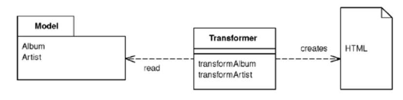

# Transform View

> A view that processes domain data element by element and transforms it into HTML.

* Overview
* How It Works
* When to Use It

## Overview

When you issue requests for data to the domain and data source layeres, you get back all the data you need to satisfy them, but without the formatting you need. Using *Transform View* means thinking of the *view* in *Model View Controller* as **a transformation where you have the model's data as input and its HTML as output**.

## How It Works

* A program that looks at domain-oriented data, recognizes each form of domain data, and writes out a particular piece of HTML for each of it.

* Compared to a *Template View* which is organized around the output, a *Transform View* is **organized around separate transforms for each kind of input element**.

* The current dominant choice is **XSLT** functional programming language. Rather than explicitly calling routines, XSLT recognizes elements in the domain data (e.g., some XML data) and then invokes the appropriate rendering transformations.

## When to Use It

* The choice between a *Transform View* and a *Template View* mostly comes down to which environment the team working on the *view* software prefers.

* There are more tools for working with *Template View* than *Transform View*. Also, tools for *Transform View* are much less sophisticated.

* One of the strengths of XSLT is its portability to almost any Web platform.

* It's often easier to use when building a *view* on an XML document.

* It avoids two of the biggest problems with *Template View*:
  
  * It's easier to **keep the transform focused only on rendering HTML**, thus avoiding having too much other logic in the view.
  
  * It's easy to run the *Transform View* and capture the output for testing.
