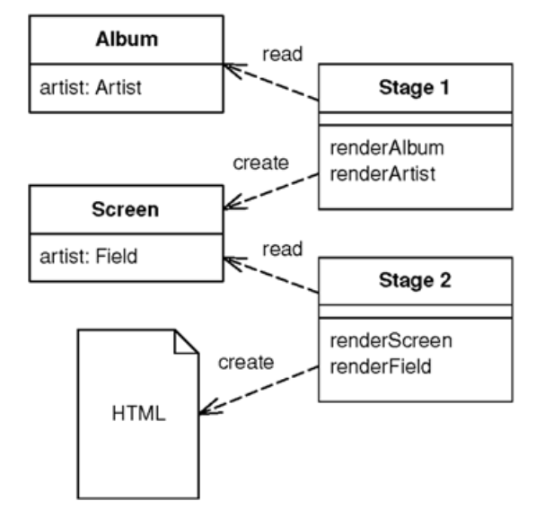
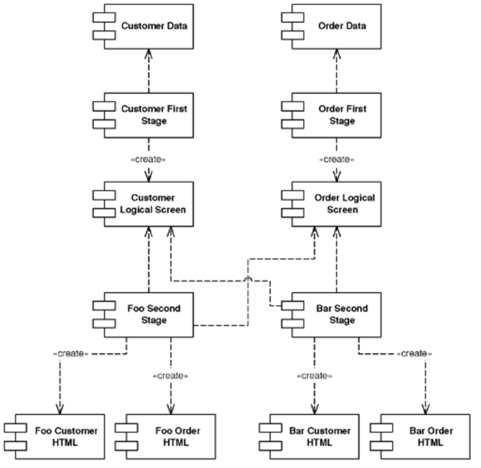

# Two Step View

> Turns domain data into HTML in two steps: first by forming some kind of logical page, then rendering the logical page into HTML.

* Overview
* How It Works
* When to Use It

## Overview

You often want a consistent look and organization to the site. You may also want to make global changes to the appearence of the site easily, but common approaches using *Template View* or *Transform View* make this difficult because presentation decisions are often duplicated across multiple pages or transform modules.

*Two Step View* deals with this problem by splitting the transformation into two stages:

1. Transform the model data into a logical presentation without any specific formatting.

2. Convert the logical presentation with the actual formatting needed.

This way **you can make a global change by altering the second stage**, or **you can support multiple output looks and feels with one second stage each**.

## How It Works

* The key to this pattern is in making the transformation to HTML a two-stage process.

  1. Assemble the information in a logical screen structure that is suggestive of the display elements yet contains no HTML.

  2. Transform the presntation-oriented structure and render it into HTML.

* The intermediate form is a kind of logical screen. Its element might include things like fields, headers, footers, tables, choices, and the like.

## When to Use It

* You want to make global changes to formatting easily.

* You want to support multiple formatting for your application (*multiappearance*) and have similar shared formatting.
  * A design-heavy site, where each page is supposed to look different, won't work well with *Two Step View* because it's hard to find enough commonality between the screens to get a simple enough presentation-oriented structure.

* Programmers have to be involved in any design change, and it's a harder programming model with more boilerplate than a single-staged view.
