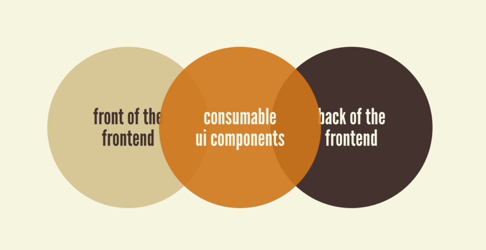

# Areas of frontend

- [Areas of frontend](#areas-of-frontend)
  - [Overview](#overview)
  - [Backbone of frontend (core team)](#backbone-of-frontend-core-team)
    - [Tooling and core infra](#tooling-and-core-infra)
    - [Principles](#principles)

## Overview

> [front-of-the-front-end and back-of-the-front-end web development](https://bradfrost.com/blog/post/front-of-the-front-end-and-back-of-the-front-end-web-development/) by Brad Frost.

1. __Front of frontend__: Building products, features, UI components, accessibility, micro-interactions, etc.
2. __Data of frontend__: Building and managing client data stores, state management, data transformation, interacting with APIs, etc.
3. __Backbone of frontend__: Setting up tools for building and deploying frontend applications. Includes configuring build setup for different environments, testing framework, code linting, and formatting setup, Typescript support, CI/CD pipelines, PR checks, etc.

## Backbone of frontend (core team)

A frontend core team lay the foundations for building frontend applications so that the developers can focus on shipping things faster without compromising on quality.

> See [razorpay case study](https://engineering.razorpay.com/laying-the-frontend-foundations-with-a-platform-team-62c21c37bf9c).

### Tooling and core infra

A swiss knife of tools, utilities and configurations governed by clear standards. They can be either used separatedly or be composed together to build or scale to any number of products through a common CLI.

- Common CLI.
- UI components library.
- Design system (e.g., reusable patterns, designer-developer workflow).
- CI/CD workflows (e.g., Github Actions, Spinnaker pipelines).
- Automated setup for Docker builds, K8s.
- PR checks (e.g., DangerJS).
- Automated versioning (e.g., changeset).
- SSR setup (e.g., code splitting, routing).
- Monitoring (e.g., SpeedCurve, Sentry).
- Linting (e.g., ESLint, Prettier, Stylelint).
- TypeScript setup.
- A/B testing SDK.
- Analytics SDK.
- Security mechanisms (e.g., secretlint).
- Common utilities (e.g., lodash, date functions, etc).

### Principles

- __Small and autonomous team__ with an ownership mindset.
- __Opinionated toolchain__ flexible enough to mold it as per product needs.
- __Lower barrier to entry__ by providing pluggable modules.
- __Platform as a product__ and __developers as customers__. Collect feedback often and iterate.
- Research thoroughly and get early feedback from engineers across teams before building big capabilities.
- __Evangelize as much as possible__. Spread awareness and conduct sessions for demoing the capabilities. Along with building tools, create __guidelines to spread awareness__.
- __Educate and empower teams__. Share learnings to get opinions, encourage contributions, write documentation with examples, FAQs, troublesohoting guides, etc.
- __Interact with other teams__ to understand their problems by collecting feedback, conducting internal sessions, open discussions, and consulting as part of office hours.
- __Identify early adopters__. Capture feedback from them and iterate upon the offerings.
- __Recognize and reward__ as much as possible. Celebrate adoption wins, contributors from teams outside the core, bring recognition and encourage more adopters and external contributors.
