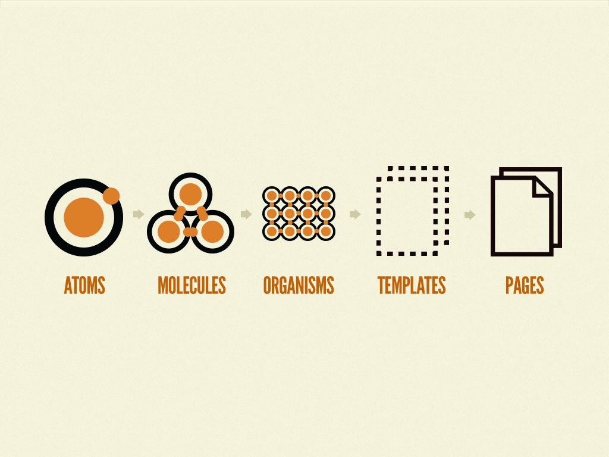
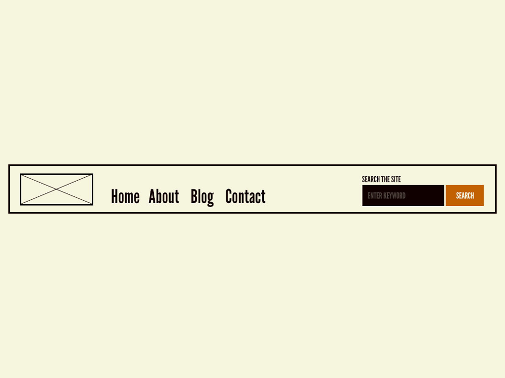
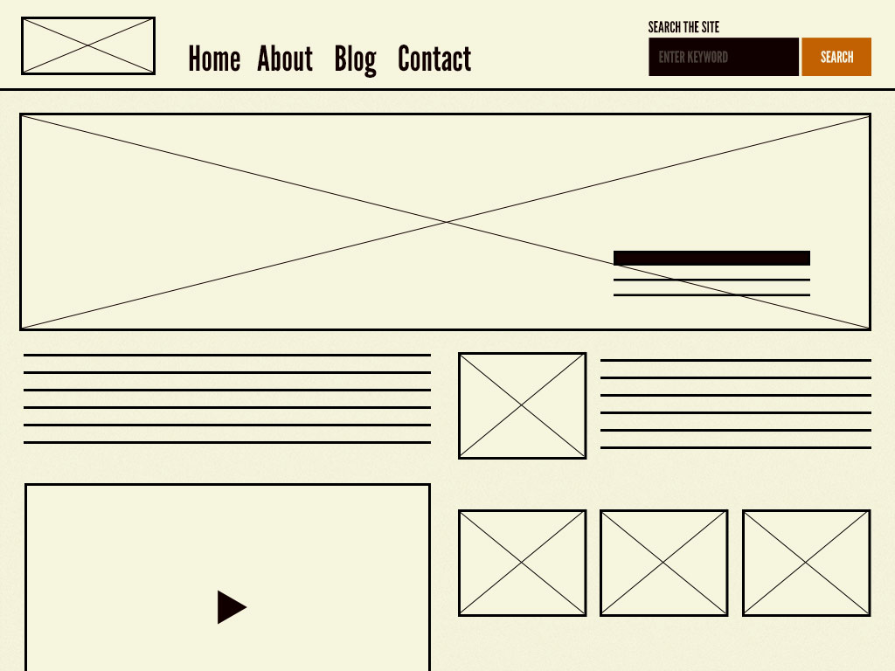

# Atomic Design

- [Atomic Design](#atomic-design)
  - [Atomic methodology](#atomic-methodology)
    - [1. Atoms](#1-atoms)
    - [2. Molecules](#2-molecules)
    - [3. Organisms](#3-organisms)
    - [4. Templates](#4-templates)
    - [5. Pages](#5-pages)
  - [Advantages](#advantages)
    - [The part and the whole](#the-part-and-the-whole)
    - [Clear separation between structure and content](#clear-separation-between-structure-and-content)
  - [Theory vs practice](#theory-vs-practice)

## Atomic methodology

> Atoms, molecules, organisms, templates, and pages. ([Reference](https://atomicdesign.bradfrost.com/chapter-2/))

Atomic design is a methodology composed of __five distinct stages__ working together to create interface design systems in a more deliberate and hierarchical manner.

1. __Atoms__: are UI elements that can't be broken down any further and serve as the elemental building blocks of an interface.
2. __Molecules__: are collections of atoms that form relatively simple UI components.
3. __Organisms__: are relatively complex components that form discrete sections of an interface.
4. __Templates__: place components within a layout and demonstrate the design's underlying content structure.
5. __Pages__: apply real content to templates and articulate variations to demonstrate the final UI and test the resilience of the design system.

It is __not a linear process__, but rather a mental model to build a cohesive set of user interfaces.

### 1. Atoms

Atoms serve as the __foundational building blocks__ that comprise all our user interfaces.

> They include basic HTML elements like form labels, inputs, buttons, and others that can’t be broken down any further without ceasing to be functional.

Each atom has its own unique properties, such as the dimensions of a hero image, or the font size of a primary heading. These innate properties influence how each atom should be applied to the broader user interface system.

In the context of a __pattern library__, atoms demonstrate all your __base styles__ at a glance.

Nevertheless, like atoms in the natural world, interface atoms __don't exist in isolation__ and only really come to life with application.

### 2. Molecules

Molecules are relatively __simple groups of UI elements__ functioning together as a __unit__.

Creating simple UI molecules makes testing easier, encourages reusability, and promotes consistency throughout the interface.

### 3. Organisms

Organisms are __relatively complex UI components__ composed of __groups of molecules__ and/or atoms and/or other organisms. They form distinct sections of an interface.

The header forms a __standalone section__ of an interface.

Building up from molecules to more elaborate organisms provides designers and developers with an important sense of context. Organisms demonstrate those smaller, simpler components in action and serve as distinct patterns that can be used again and again.

### 4. Templates

Templates are __page-level objects__ that place components into a layout and articulate the design's underlying content structure.

They focus on the __page's underlying content structure__, rather than the page's final content.

> You can create good experience without knowing the content. What you can't do is create good experiences without knowing your content structure. What is your content made from, not what your content is. - Mark Boulton

By defining a page's skeleton we're able to create a system that can account for a variety of dynamic content.

### 5. Pages

Pages are specific __instances of templates__ that show what a UI looks like with __real representative content__ in place.

This demonstrates the final interface your users will see and are essential for testing the effectiveness of the underlying design system.

Pages also provide a place to __articulate variations in templates__, which is crucial for robust and reliant design systems:

- A user has one item in their shopping cart and another user has 10 items in his.
- A web app's dashboard typically shows recent activity, but it is suppressed for first-time users.
- One article headline might be 40 characters long, while another might be 340 characters long.
- Users with administrative privileges might see additional buttons and options.

## Advantages

### The part and the whole

Provides the ability to quickly shift between abstract and concrete. We can simultaneously see our interfaces broken down to their atomic elements and also how those elements combine together to form our final experiences.

> The painter, when at a distance from the easel, can assess and analyze the whole of the work from this vantage. - Frank Chimero

Atomic design provides a mental model that allows us to concurrently create final UIs and their underlying design systems.

### Clear separation between structure and content

> Content needs to be structured and structuring alters your content, designing alters content. It's not 'content then design', or 'content or design'. It's __'content and design'__. - Mark Boulton

## Theory vs practice

Atomic design allows us to see our UIs broken down to their atomic elements, and also allows us to simultaneously step through how those elements join together to form our final UIs.

It facilitates communication with our colleagues, giving a helpful shorthand for discussing modularity and hierarchy.

Essentially, it's merely a __mental model__ for constructing a UI. Nevertheless, there are tools and processes to make your atomic designs come into practice.
