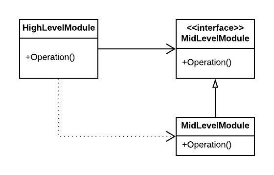

# The Power of Polymorphism

* Unix IO Example
* Dependency Inversion
* Architecture importance

> Polymorphism is an application of pointers to functions.

For example, in C++, every virtual function within a class has a pointer in a table called a `vtable`, and all calls to virtual functions go through that table. Constructors of derivatives simply load their versions of those functions into the `vtable` of the object being created.

> Programmers have been using pointers to functions to achieve polymorphic behavior since Von Neumann architectures were first invented in the late 1940s. In other words, OO has not provided polymorphism but it made it much safer and much more convenient.

## Unix IO Example

Why did the UNIX operating system make IO devices plugins? Because we learned, in the late 1950s, that our programs should be _device independent_. The Plugin architectuire was invented to support IO device independence, nad has been implemented in almost every operating system since its introduction.

> We wrote lots of programs that were device dependent, only to discover that we really wanted those programs to do the same job but use a different device.

Object-oriented programming allows the plugin architecture to be used anywhere, for anything.

## Dependency Inversion

Before a safe and convenient mechanism for polymorphism was available, in the typical calling tree, main functions called high-level funcitons, which called mid-level functions, which called low-level functions.

> In that calling tree, however, source code dependencies inexorably followed the flow of control. Every caller was forced to mention the name of the module that contained the callee.

> The flow of control was dictated by the behavior of the system, and the source code dependencies were dictacted by that flow of control.

`HighLevelModule` calls the `Operation()` function in `MidLevelModule`. The fact that it calls this function through an interface is a source code contrivance. At runtime, the interface doesn't exist. Note, however, that the source code dependency (the inheritance relationship) between `MidLevelModule` and `MidLevelModuleInterface` points in the opposite direction compared to the flow of control. This is called _dependency inversion_, and its implications for software architecture are profound.

> The fact that OO languages provide safe and convenient polymorphism means that __any source code dependencies can be inverted by inserting an interface between them__.

With this you can rearrange the source code dependencies so that the database and the user interface depend on the business rules, rather than the other way around. This means that the UI and the database can be plugins to the business rules, it means that the source code of the business rules never mentons the UI or the database.

Business rules can be _deployed independently_ of the UI and the database. Changes to the UI or the database need not have any effect on the business rules. Those components can be deployed separately and independently. This is _independent deployability_, when the source code in a component changes, only that component needs to be redeployed.

> If modules in your system are _independent deployable_, then they can be developed independently by different teams. That's _independent developability_.

## Architecture importance

OO is the ability, through the use of _polymorphism_, to gain absolute control over every source code dependency in the system.

It allows the architect to create a plugin architecture, in which modules that contain high-level policies are independent of modules that contain low-level details.

The low-level details are relegated to plugin modules that can be deployed and developed independently from the modules that contain high-level policies.
