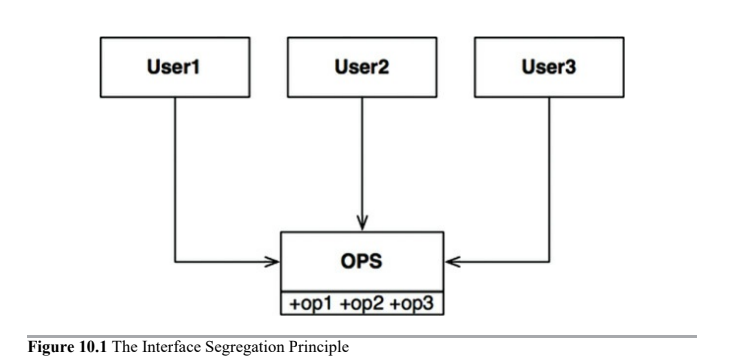

# Interface Segregation Principle

* Definition
* ISP and Language
* ISP and Architecture

## Definition

> Software designers should avoid depending on things that they don't use.

Let's assume that `User1` uses only `op1`, `User2` uses only `op2`, and `User3` uses only `op3`.

The source code of `User1` will inadvertently depend on `op2` and `op3`, even though it doesn't call them. This dependence means that a change to the source code of `op2` in `OPS` will force `User` to be recompiled and redeployed.

> This problem can be resolved by segregating the operations into interfaces.

> Depending on something that carries baggage that you don't need, can cause you troubles that you didn't expect.

## ISP and Language

Clearly this depends critically on language type.

Statically typed languages like Java force programmers to create declarations that users must import/include. Those declarations in source code create the dependencies that force recompilation and redeployment.

In dynamically typed languages, like Javascript, Python and Ruby, such declarations don't exist in soure code and instead are inferred at runtime. This is the primary reason that dynamically typed languages create systems that are more flexible and less tightly coupled than statically typed languages.

## ISP and Architecture

> __In general, it is harmful to depend on modules that contain more than you need__. This is also true at a higher, architectural level.

Consider, for example, an architect wants to include a certain framework, F, into the system, S. Now suppose F has bound a particular database, D. So S depends on F, which depends on D.

D contains features that F does not use and, therefore, S does not care about. Changes to those features within D may well force the redeployment of F, and therefore, the redeployment of S. Even worse, a failure of one of the features within D may cause failures in F and S.
