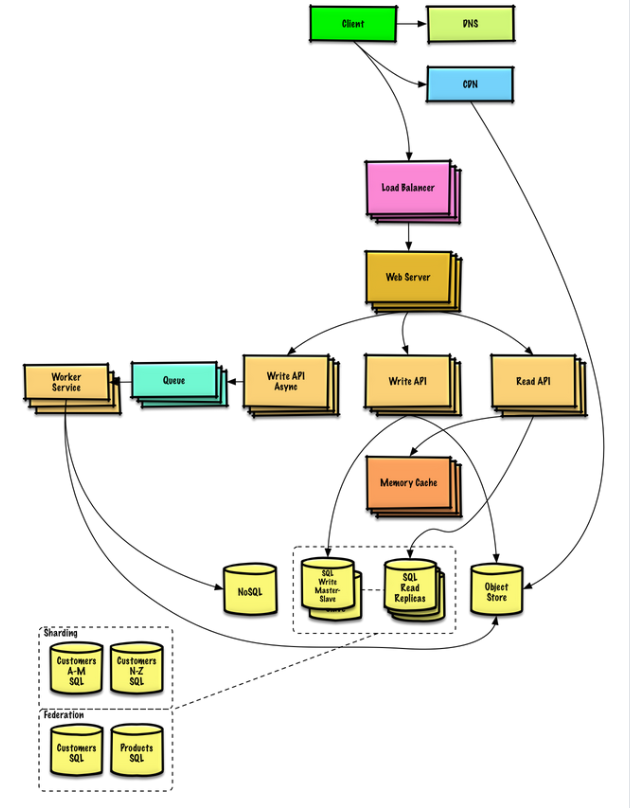
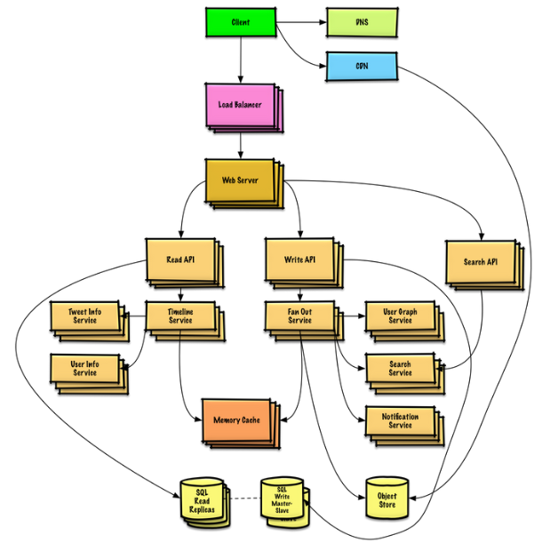

# System Design

> Learning how to design scalable systems will help you become a better engineer

System design is a broad topic. There is a vast amount of resources scattered throughout the web on system design principles.

> Everything is a trade-off.

## The getting started architecture

You should be familiar with the classic "getting started" architecture. This is what most applications get started with, a simple web server that communicates with a single database and is exposed via a public DNS.

This is more than enough to get an application working as fast as possible, but you'll start finding limitations soon.

## Examples

### System that scales to millions of users on AWS

### Twitter Timeline and Search (or Facebook feed and search)

