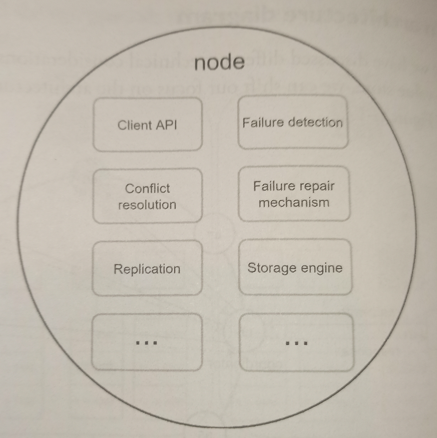
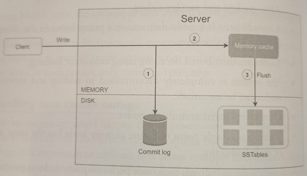
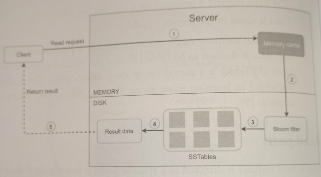

# Design a key-value store

* Overview
* Design scope
  * Single server key-value store
  * Distributed key-value store
  * System components
* Example architecture
  * Write Path
  * Read Path
* Common problems and solutions

## Overview

A key-value store, also referred to as a key-value database, is a non-relational database. Each unique identifier is stored as a key with its associated value.

In a key-value pair, the key must be unique, and a value can be accessed through it associated the key. Keys can be plain text or hashed values. For performance reasons, a short key works better. The value can be strings, lists, objects, etc; and it's usually treated as an opaaque object in key-value stores.

A basic key-value store would support the following operations:

* `put(key, value)`: inserts "value" associated with "key".

* `get(key)`: get "value" associated with "key".

## Design scope

Each design achieves a specific balance regarding the tradeoffs of the read, write, and memory usage. Another tradeoff has to be made between consistency and availability.

### Single server key-value store

An intuitive approach is to store key-value pairs in a hash table, which keeps everything in memory. Even though memory access is fast, fitting everything in memory may be impossible due to the space constraint.

Two optimizations can be done to fit more data in a single server:

* Data compression
* Store only frequently used data in memory and the rest on disk

Even with these optimizations, a single server can reach its capacity very quickly. A distributed key-value store is required to support big data.

### Distributed key-value store

A distributed key-value store distributes key-value pairs across many servers. It is important to understand [CAP theorem](../../../databases/cap). Choosing the right CAP guarantees that fit your use case is an important step in building the system.

### System components

There are a few core components and techniques used to build a key-value store:

* [Data partition](../../../databases/partitioning)
* [Data replication](../../../databases/replication)
* [Consistency](../../../databases/consistency-models)
* Inconsistency resolution
  * [Versioning](../../../databases/inconsistency-resolution/versioning)
* [Handling failures](../../../databases/handling-failures)

## Example architecture

Main features of the architecture are listed as follows:

* Clients communicate with the key-value store through simple APIs: `get(key)` and `put(key, value)`.

* A coordinator is a node that acts as a proxy between the client and the key-value store.

* Nodes are distributed on a ring using consistent hashing.

* The system is completely decentralized so adding and moving nodes can be automatic.

* Data is replicated at multiple nodes.

* There is no single point of failure as every node has the same set of responsibilities.

Every node performs the following tasks:

### Write path

> Primarily based on the architecture of Cassandra

1. The write request is persisted on a commit log file.

2. Data is saved in the memory cache.

3. When the memory cache is full or reaches a predefined threshold, data is flushed to SSTable on disk.

> SSTable (sorted-string table) is a sorted list of `<key, value>` pairs.

### Read path

1. System first checks if data is in memory. If not, proceed to next step.

2. If data is not in memory, the system checks the bloom filter which is used to figure out which SSTables might contain the key.

3. SSTables return the result of the data set.

4. The result of the data set is returned to the client.

For an efficient way to find out which SSTAble contains the key, *bloom filter* is commonly used.

## Common problems and solution

| Goal/Problems               | Technique                                             |
|-----------------------------|-------------------------------------------------------|
| Ability to store big data   | Use consistent hashing to spread load across server   |
| High availability reads     | Data replication / Multi-datacenter setup             |
| High available writes       | Versioning and conflict resolution with vector clocks |
| Dataset partition           | Consistent Hashing                                    |
| Incremental scalability     | Consistent Hashing                                    |
| Heterogeneity               | Consistent Hashing                                    |
| Tunable consistency         | Quorum consensus                                      |
| Handling temporary failures | Sloppy quorum and hinted handoff                      |
| Handling permanent failures | Merkle tree                                           |
| Handling data center outage | Cross-datacenter replication                          
