# Design a Search Autocomplete System

* Overview
* Step 1: Understand the problem and establish design scope
* Step 2: Propose high-level design and get buy-in
* Step 3: Design deep dive
* Step 4: Wrap up

## Overview

When searching on Google or shopping at Amazon, as you type in the search box, one or more matches for the search term are presented to you. This feature is referred to as autocomplete, typehead, search-as-you-type, or incremental search.

## Step 1: Understand the problem and establish design scope

### Q&A

**Candidate**: Is the matching only supported at the beginning of a search query or in the middle as well?
**Interviewer**: Only at the beginning of a search query.

**Candidate**: How many autocomplete suggestions should the system return?
**Interviewer**: 5.

**Candidate**: How does the system know which 5 suggestions to return?
**Interviewer**: This is determined by popularity, decided by the historical query frequency.

**Candidate**: Does the system support spell check?
**Interviewer**: No, spell check or autocorrect is not supported.

**Candidate**: Are search queries in English?
**Interviewer**: Yes. If time allows at the end, we can discuss multi-language support.

**Candidate**: Do we allow capitalization and special characters?
**Interviewer**: No, we assume all search queries have lowercase alphabetic characters.

**Candidate**: How many users use the product?
**Interviewer**: 10 million DAU.

### Requirements

* **Fast response time**: As a user types a search query, autocomplete suggestions must show up fast enough.

> An article about Facebook's autocomplete system reveals that the system needs to return results within 100 milliseconds. Otherwise it will cause stuttering.

* **Relevant**: Autocomplete suggestinos should be relevant to the search term.

* **Sorted**: Results returned by the system must be sorted by popularity or other ranking models.

* **Scalable**: The system can handle high traffic volume.

* **Highly available**: The system should remain available and accessible when part of the system is offline, slows down, or experiences unexpected network errors.

### Back of the envelope estimation

* Assume 10 million DAU.
* An average person performs 10 searches per day.
* 20 bytes of data per query string:
  * Assume we use ASCII character encoding (1 character = 1 byte).
  * Assume a query contains 4 words, and each word contains 5 characters on average (20 bytes per query).
* For every character entered into the search box, a client sends a request to the backed for autocomplete suggestions. On average, 20 requests are sent for each search query. 

> For example, the following 6 requests are sent to the backend by the time you finish typing "dinner":
> `search?q=d` `search?q=di` `search?q=din` `search?q=dinn` `search?q=dinne` `search?q=dinner`

* ~24,000 QPS = 10,000,000 DAU * 10 query/day * 20 characters / 24 hours / 3600 seconds.
* Peak QPS = QPS * 2 = ~48,000.
* Assume 20% of the daily queries are new. 10 million * 10 query/day * 20 byte/query * 20% = 0.4GB. This means 0.4GB of new data is added to storage daily.

## Step 2: Propose high-level design and get buy-in

At the high-level, the system is broken down into two:

* **Data gathering service**: It gathers user input queries and aggregates them in real-time. Real-time processing is not practical for large data sets; however, it is a good starting point. We will explore a more realistic solution in deep dive.

* **Query service**: Given a search query or prefix, return 5 most frequently searched terms.

### Data gathering service

Assume we have a frequency table that stores the query string and its frequency. In the beginning, the frequency table is empty. Later, users enter queries "twitch", "twitter", "twitter", "twillo" sequentially.

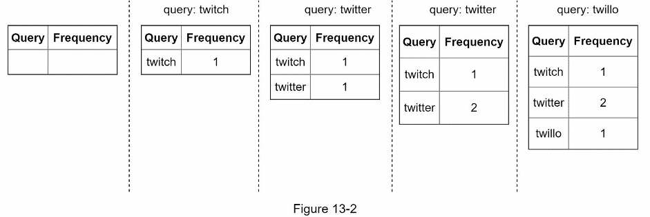

### Query service

Suppose we have the following frequency table:

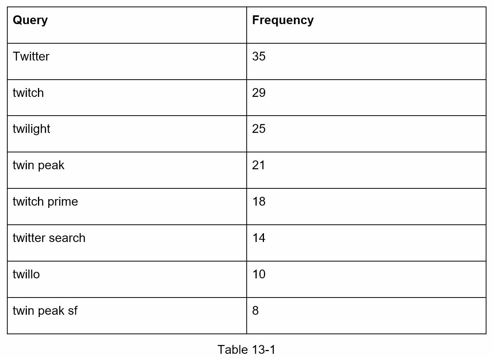

When a user types "tw" in the search box, the following top 5 search queries are displayed:

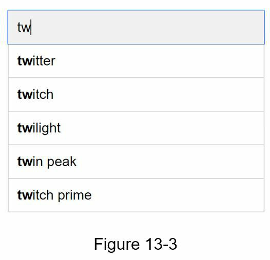

To get the top 5 frequently searched queries, execute the following SQL query:

```sql
SELECT * FROM frequency_table
WHERE query LIKE `prefix%`
ORDER BY frequency DESC
LIMIT 5
```

This is an acceptable solution when the data set is small. When it is large, accessing the database becomes a bottleneck. We will wexplore optimizations in deep dive.

## Step 3: Design deep dive

We will dive deep into a few components and explore optimizations:

* Trie data structure
* Trie algorithm proposal
* Data gathering service
* Query service
* Scale the storage
* Trie operations

### Trie data structure

Fetching the top 5 search queries from a relational database is inefficient. The data structure trie (*prefix tree*, pronunced *try*) is used to overcome the problem.

It is a tree-like data structure that can compactly store strings. The name comes from the world re**trie**val, which indicates it is designed for string retrieval operations.

The main idea of a trie consists of the following:

* Tree-like data structure.
* The root represents an empty string.
* Each node stores a character and has 26 children, one for each possible character. To save space, we do not draw empty links.
* Each tree node represents a single word or a prefix string.

Following image represents a trie with search queries "tree", "try", "true", "toy", "wish", "win". Search queries are highlighted with a ticker border.

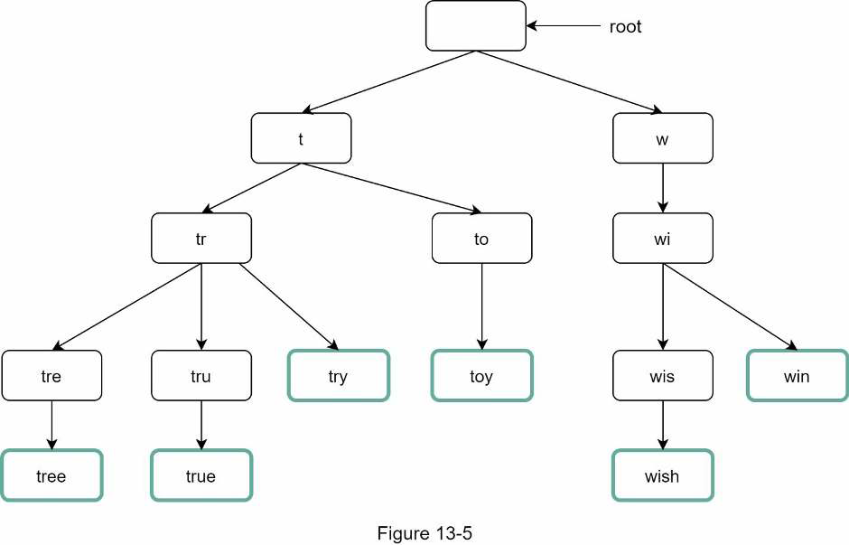

To support sorting in by frequency, frequency info needs to be included in nodes.

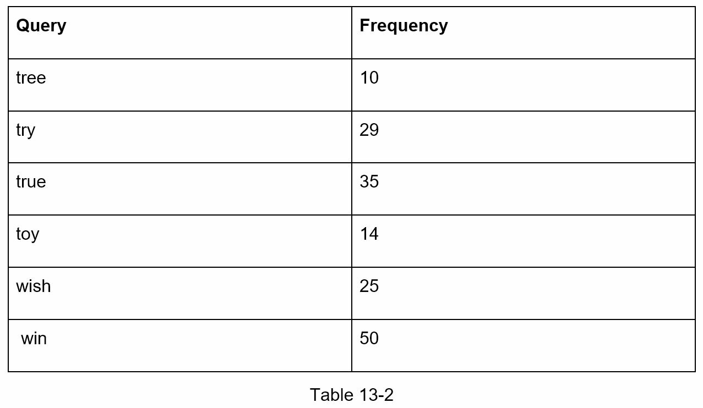


### Trie algorithm proposal

How does autocomplete work with trie? Given *p* length of a prefix, *n* total number of nodes, and *c* number of children of a given node, the steps to get top *k* most searched queries is the following:

1. Find the prefix. Time complexity *O(p)*.
2. Traverse the subtree from the prefix node to get all valid children. A child is valid if it can form a valid query string. Time complexity *O(c)*.
3. Sort the children and get top *k*. Time complexity *O(c log c)*.

The time complexity of this algorithm is the sum of time spent on each step: **_O(p) + O(c) + O(c log c)_**.

This algorithm is straightforward but too slow because we need to traverse the entire trie to get top *k* results in the worst case scenario. Two possible optimizations are:

* Limit the max length of a prefix.
* Cache top search queries at each node.

#### Algorithm example

Let's see this in the following example. Assume *k* equals to 2 and a user types *"tr"* in the search box:

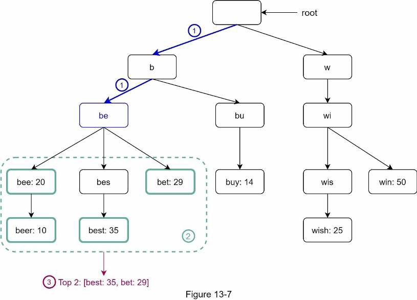

1. Find the prefix node "tr".
2. Traverse the subtree to get all valid children. In this case, nodes `(tree: 10)`, `(true: 35)`, and `(try: 29)` are valid.
3. Sort children and get top 2: `true` and `try`.

#### Limit the max length of a prefix

Users rarely type a long search query into the search box. Thus, it is safe to say *p* is a small integer number, say 50. If we limit the length of a prefix, the time complexity to "find the prefix" can be reduced from *O(p)* to *O(small constant)* = *O(1)*.

#### Cache top search queries at each node

To avoid traversing the whole trie, we store top *k* most frequently used queries at each node. Since 5 to 10 autocomplete suggestions are enough for users, *k* is a relatively small number.

This reduces the time complexity to retrieve the top 5 queries. However, this design requires a lot of space to store top queries at every node. Trading space for time is well worth it as fast response time is very important.


After applying optimizations, the time complexity of the algorithm changes:

1. Find prefix node. Time complexity *O(1)*.
2. Return top *k*. Since top *k* queries are cached, the time complexity for this step is *O(1)*.

Then, time complexity for the whole algorithm takes only *O(1)* to fetch top *k* queries.

### Data gathering service

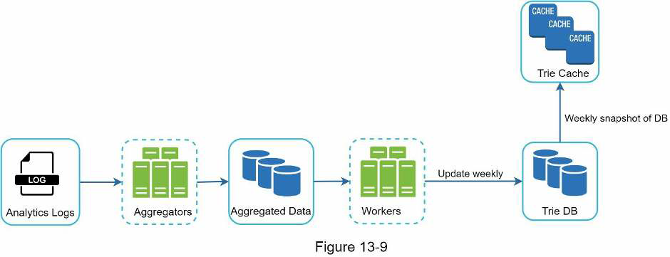

**Analytics Logs**: It stores raw data about search queries. Logs are append-only and are not indexed.

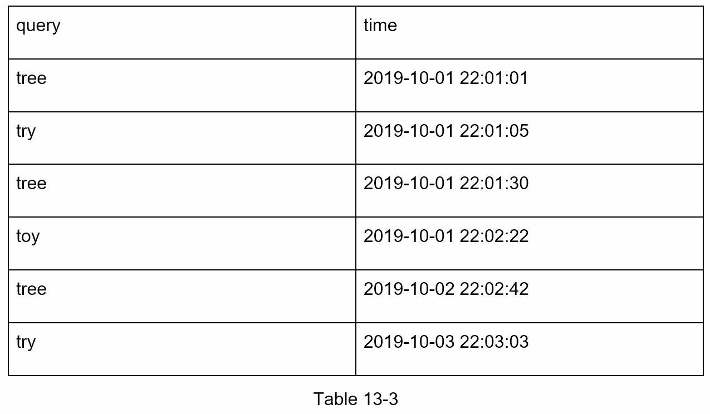

* **Aggregators**: The size of analytics logs is usually very large, and data is not in the right format. We need to aggregate data so it can be easily processed by our system. Depending on the use case, we may aggregate data differently.

> For real-time applications such as Twitter, we aggregate data in a shorter time interval as real-time results are important. On the other hand, aggregating data less frequently, say once per week, might be good enough for many use cases. For our example we assume trie is rebuilt weekly.

* **Workers**: Set of servers that perform asynchronous jobs at regular intervals. They build the trie data structure and store it in Trie DB.

* **Trie Cache**: Distributed cache system that keeps trie in memory for fast read. It takes weekly snapshot of the DB.

* **Trie DB**: The persistent storage. Two options are available to store the data:
  * *Document store*: Since a new trie is built weekly, we can periodically take a snapshot of it, serialize it, and store the serialized data in the database. Document stores like MongoDB are good fits for serialized data.
  * *Key-value store*: A trie can be represented in a hash table form if every prefix in the trie is mapped to a key in a hash table, and data on each trie node is mapped to a value in a hash table.

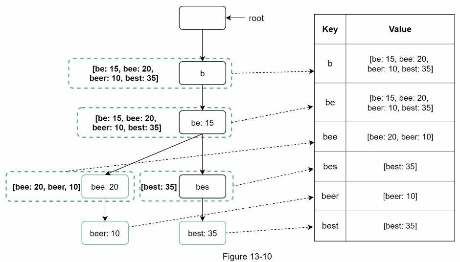

#### Aggregated Data

This is an example of aggregated weekly data. "time" field represents the start time of a week. "frequency" field is the sum of the ocurrences for the corresponding query in that week.

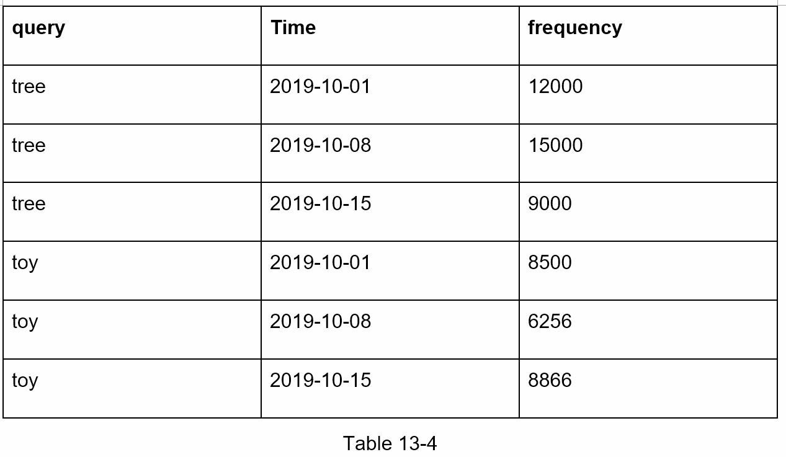

### Query service

This is the improved design:


1. A search query is sent to the load balancer.
2. The load balancer routes the request to API servers.
3. API servers get trie data from Trie Cache and construct autocomplete suggestions for the client.
4. In case the data is not in Trie Cache, we replenish data back to the cache. This way, all subsequent requests for the same prefix are returned from the cache. A cache miss can happen when a cache server is out of memory or offline.

Query service requires lightning-fast speed. We propose the following optimization:

* **AJAX request**. The main benefit is that sending/receiving a request/response does not refresh the whole web page.
* **Browser caching**. Autocomplete suggestions can be saved in browser cache to allow subsequent requests to get results from the cache directly. Google search engine uses the same cache mechanism.
* **Data sampling**. For a large-scale system, logging every search query requires a lot of processing power and storage. Data sampling is important. For instance, only 1 out of every N requests is logged by the system.

### Trie operations

#### Create

Trie is created by workers using aggregated data. The source of data is from Analytics Log/DB.

#### Update

There  are two ways to update the trie.

* *Option 1*: Update the trie weekly. Once a new trie is created, the new trie replaces the old one.

* *Option 2*: Update individual trie node directly. We try to avoid this operation because it is slow. However, if the size of trie is small, it is an acceptable solution. When we update a trie node, its ancestors all the way up to the root must be updated because ancestors store top queries of children.

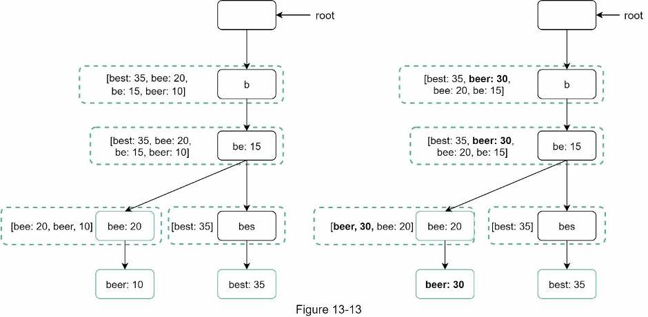

> On the left side, the search query "beer" has the original value of 10. On the right side, it is updated to 30. The node and its ancestors have the value updated.

#### Delete

We add a filter layer in front of the *Trie Cache* to filter out unwanted suggestions. This gives us the flexibility of removing results based on different filter rules. Unwanted suggestions are removed physically from the database asynchronically so the correct data set will be used to build trie in the next update cycle.

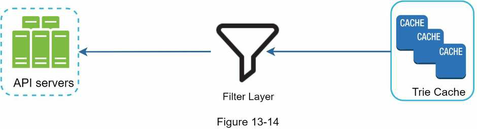

### Scale the storage

Since English is the only supported language, a naive way to shard is based on the first character:

* If we need two servers for storage, we can store queries starting with *a* to *m* on the first server, and *n* to *z* on the second server.

* If we need three servers, we can split queries into *a* to *i*, *j* to *r*, and *s* to *z*.

Following this logic, we can split queries up to 26 servers for each alphabetic character in English. To store data beyond 26 servers, we can shard on the second or even at the third level.

At the first glance this approach seems reasonable, until you realize that there are a lot more words that start with the letter *c* than *x*. This creates uneven distribution.

To mitigate the data imbalance problem, we analyze historical data distribution pattern and apply smarter sharding logic. The shard map manager maintains a lookup database for identifying where rows should be stored. For example, if there are a simlar number of historical queries for *s*, and for *u*, *v*, *w*, *y*, and *z* combined, we can maintain two shards: one for *s* and one for *u* to *z*.


## Step 4: Wrap up

### Q&A

#### How do you extend your design to support multiple languages?

To support other non-English queries, we store Unicode characters in trie nodes.

#### What if top search queries in one country are different from others?

In this case, we might build different tries for different countries. To improve the response time, we can store tries in CDNs.

#### How can we support the trending (real-time) search queries?

Assuming a news event breaks out, a search query suddenly becomes popular. Our original design will not work because:

* Offline workers are not scheduled to update the trie yet because this is scheduled to run on weekly basis.
* Even if it is scheduled, it takes too long to build the trie.

Building a real-time search autocomplete is complicated and out of scope but here are a few ideas:

* Reduce the working data set by sharding.
* Change the ranking model and assign more weight to recent search queries.
* Data may come as streams, so we do not have access to all the data at once. Streaming data mean data is generated continuously and stream processing requires a different set of systems (e.g., Apache Hadoop MapReduce, Apache Spark Streaming, Apache Storm, Apache Kafka, etc.)
