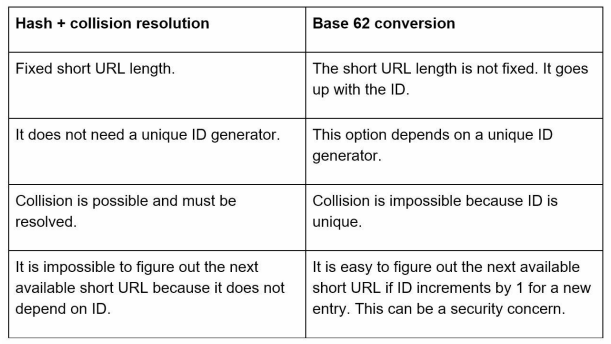
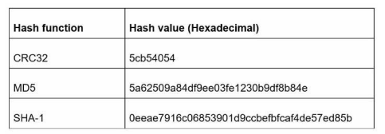
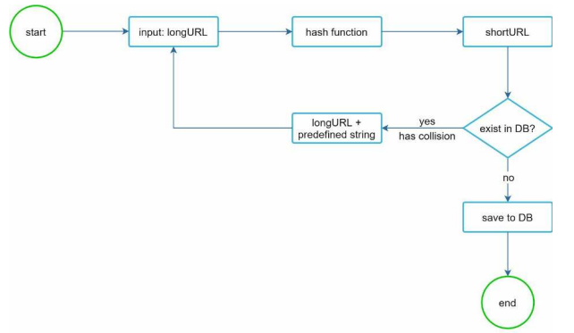

# URL Shortener

* Step 1: Understand the problem and establish design scope
* Step 2: Propose high-level design and get buy-in
  * API endpoints
  * URL redirecting
  * URL shortening
* Step 3: Design deep dive
  * Data model
  * Hash function
  * URL shortening
  * URL redirecting
4. Step 4: Wrap up

## Step 1: Understand the problem and establish design scope

### Q&A

**Candidate**: Can you givec an example of how a URL shortener work?
**Interviewer**: Assume URL https://www.systeminterview.com/q=chatsystem&c=loggedin&v=v3&l=long is the original URL. Your service creates an alias with shorter length: https://tinyurl.com/y7keocwj. If you click the alias, it redirects you to the original URL.

**Candidate**: What is the traffic volume?
**Interviewer**: 100 million URLs are generated per day.

**Candidate**: How long is the shortened URL?
**Interviewer**: As short as possible.

**Candidate**: What characters are allowed in the shortened URL?
**Interviewer**: Shortend URL can be a combination of numbers (0-9) and characters (a-z, A-Z).

**Candidate**: Can shortened URLs be deleted or updated?
**Interviewer**: For simplicty, let us assume shortened URLs cannot be deleted or updated.

### Use cases

* _URL shortening_: given a long URL, return a much shorter URL.
* _URL redirecting_: given a shorter URL, redirect to the original URL.
* High availability, scalability, and fault tolerance considerations.

### Back of the envelope estimation

* Write operation: 100 million URLs generated per day.
* Write operation per second: 100 million / 24 / 3600 = 1160.
* Read operation: Assumming ratio of read operation to write operation is 10:1, read operation per second: 1160 * 10 = 11600.
* Asssuming the URL shortener service will run for 10 years, this means we must support 100 million * 365 * 10 = 365 billion records.
* Asssume average URL length is 100.
* Storage requirement over 10 years: 365 billion * 100 bytes = 36.5 TB.

## Step 2: Propose high-level design and get buy-in

We shall discuss the API endpoints, URL redirecting, and URL shortening flows.

### API endpoints

We will design the APIs REST-style. A URL shortener primary needs two API endpoints:

1. *URL Shortening*. To create a new short URL, a client sends a POST request, which contains one parameter: the original long URL. The API looks like this: `POST api/v1/data/shorten`.
  * Reqeust parameter: `{ longUrl: longURLString } `
  * return `shortURL`.

2. *URL Redirecting*. To redirect a short URL to the corresponding long URL, a client sends a GET request: `GET api/v1/shortUrl`.
  * Return `longURL` for HTTP redirection.

### URL redirecting

Once the server receives a tinyurl request, it changes the short URL to the long URL with 301 redirect.

One thing worh discussing is 301 redirect vs 302 redirect:

* **301 redirect**: A 301 redirect shows that the requested URL is "permanently" moved to the long URL. Since it is permanently redirected, the browser caches the response, and subsequnt requests for the same URL will not be sent to the URL shortening service. Instead, requests are redirected to the long URL server directly. If the priority is to reduce the server load, using 301 makes sense.

* **302 redirect**: A 302 redirect means that the URL is "temporarily" moved to the long URL, meaning that subsequent requests for the same URL will be sent to the URL shortening service first. Then, they are redirected to the long URL server. If analytics is important, 302 redirect is a better choice as it can track click rate and source of the click more easily.

### URL Shortening

The most intuitive way to implement URL shortening is to use **hash tables**. Assuming the hash table stores `<shortURL, longURL>` pairs. Getting a long URL can be done by calling `hashTable.get(shortURL)`.

Let us assume the short URL looks like this: `www.tinyurl.com/{hashValue}`. To support the URL shortening case, we must find a hash function $f_x$ that maps a long URL to the *hashValue*.

The hash function must satisfy the following requirements:

* Each *longURL* must be hashed to one *hashValue*.
* Each *hashValue* can be mapped back to the *longURL*.

## Step 3: Design deep dive

We dive deep into the following: data model, hash function, URL shortening and URL redirecting.

### Data model

Storing everything in a hash table is not feasible for real-world systems as memory resources are limited and expensive. A better option is to store the mapping in a relational database.

### Hash function

#### Hash value length

The *hashValue* consists of characters from 0,9, a-z, A-Z, containing 10 + 26 + 26 = 62 possible characters. To figure out the length of *hashValue*, find the smallest *n* such that 62^n >= 365 billion. The system must support up to 365 billion URLs based on the back of the envelope estimation.

When n = 7, 62^n = ~3.5 trillion, which is more than enough to hold 365 billion URLs, so the length of *hashValue* is 7.

We will explore two types of hash functions for a URL shortener. The first one is *"hash + collision resolution"*, and the second one is *"base 62 conversion"*. 

#### Function 1: Hash + collision resolution

This hash function hashes a long URL to a 7-character string. A straightforward solution is to use well-known hash functions like CRC32, MD5, or SHA-1. The following table compares the hash results after applying different hash functions on this URL: https://en.wikipedia.org/wiki/Systems_design.

Even the shortest hash value (from CRC32) is more than 7 characters. How can we make it shorter?

The first approach is to collect the first 7 characters of a hash value; however, this method can lead to hash collisions. To resolve hash collisions, we can recursively append a new predefined string until no more collisions is discovered.

This method can eliminate collision; however, it is expensive to query the database to check if a shortURL exists for every request. A technique called **bloom filters** can improve performance. A bloom filter is a space-efficient probabilistic technique to test if an element is a member of a set.

#### Function 2: Base 62 conversion

Base conversion is another approach commonly used for URL shorteners. Base conversion helps to convert the same number between its different number repsentation systems. Base 62 conversion is used as there are 62 possible characters for *hashValue*. 

Let us use an example to explain how the conversion works: convert $11157_10$ to base 62 representation:

* We are using 62 characters for encoding, 0-0, ..., 9-9, 10-a, 11-b, ..., 35-z, 36-A, ..., 61-Z, where 'a' stands for 10, 'Z' stands for 61, etc.

* $11157_10 = 2 x 62^2 + 55 x 62^1 + 59 x 62^0 = [2, 55, 59] = [2, T, X]_{62}$

Thus, the short URL is https://tinyurl.com/2TX

#### URL shortening deep dive

As one of the core pieces of the system, we want the URL shortening flow to be logically simple and functional. Base 62 conversion is used in our design.

If the long URL is new, a new unique ID (primary key) is generated by the unique ID generator. Convert the ID to shortURL with base 62 conversion.

#### URL redirecting deep dive

As there are more reads than writes, `<shortURL, longURL>` mapping is stored in a cache to improve performance.

1. A user clicks a short URL link.
2. The load balancer forwards the request to web servers.
3. If a shortURL is already in the cache, return the longURL directly.
4. If a shortURL is not in the cache, fetch the longURL from the database. If it is not in th database, it is likely a user entered an invalid shortURL.
5. The longURL is returned to the user.

### Step 4: Wrap up

If there is extra time, here are a few additional talking points:

* **Rate limiter**: A potential security problem we could face is that malicious users send an overwhelmingly large number of URL shortening requests. Rate limiter helps to filter out requests based on IP address or other filtering rules.

* **Web server scaling**: Since the web tier is stateless, it is easy to scale it by adding or removing web servers.

* **Database scaling**: Database replication and sharding are common techniques.

* **Analytics**: Data is increasingly important for business success. Integrating an analytics solution to the URL shortener could help to answer important questions like how many people click on a link? When do they click the link? etc.

* **Availability, consistency, and reliability**: These concepts are at the core of any large system's success.
