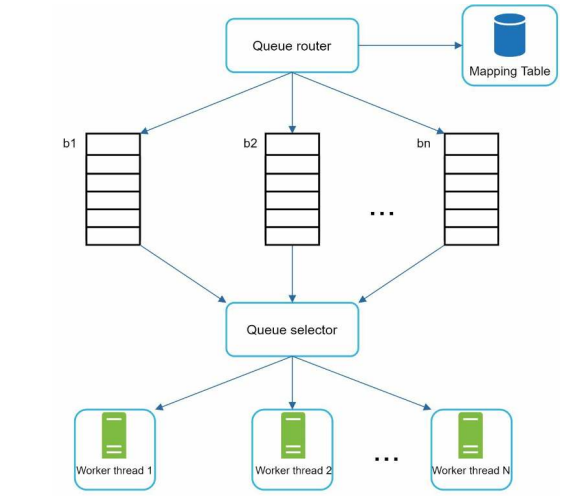
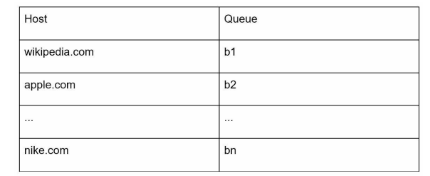
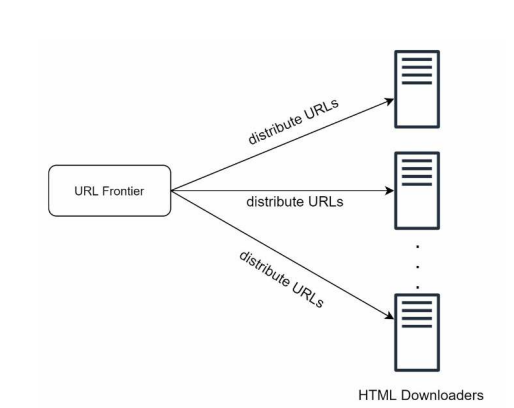
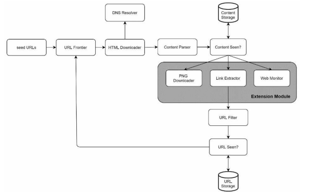

# Design a Web Crawley

* Overview
* Step 1: Understand the problem and establish design scope
* Step 2: Propose high-level design and get buy-in
* Step 3: Design deep dive
* Step 4: Wrap up

## Overview

A web crawler is known as a robot or spider. It is widely used by search engines to discover new or updated content on the web. Content can be a web page, an image, a video, a PDF file, etc.

A web crawler starts by collecting a few web pages and then follows links on those pages to collect new content.

A crawler is used for many purposes:

* **Search engine indexing**: A crawler collects web pages to create a local index for search engines. For example, *Googlebot* is the web crawler behind the Google search engine.

* **Web archiving**: This is the process of collecting information from the web to preserve data for future uses. For instance, many national libraries run crawlers to archive web sites (e.g., US Library of Congress, EU web archive).

* **Web mining**: Web mining helps to discover useful knowledge from the internet.  For example, top financial firms use crawlers to download shareholder meetings and annual reports to learn key company initiatives.

* **Web monitoring**: The crawlers help to monitor copyright and trademark infringements over the Internet (e.g., Digimarc utilizes crawlers to discover pirated works and reports).

## Step 1: Understand the problem and establish design scope

The basic algorithm is simple:

1. Given a set of URLs, download all the web pages addressed by the URLs.
2. Extract URLs from these web pages.
3. Add new URLs to the list of URLs to be downloaded. Repeat these 3 steps.

The complexity of developing a web crawler depends on the scale we intend to support.

### Q&A

**Candidate**: What is the main purpose of the crawler? It is used for search engine indexing, data mining, or something else?
**Interviewer**: Search engine indexing.

**Candidate**: How many web pages does the web crawler collect per month?
**Interviewer**: 1 billion pages.

**Candidate**: What content types are included? HTML only or other content types such as PDFs and images as well?
**Interviewer**: HTML only.

**Candidate**: Shall we consider newly added or edited web pages?
**Interviewer**: Yes, we should consder the newly added or edited web pages.

**Candidate**: Do we need to store HTML pages crawled from the web?
**Interviewer**: Yes, up to 5 years.

**Candidate**: How do we handle web pages with duplicate content?
**Interviewer**: Pages with duplicate content should be ignored.

### Common characteristics

Besides functionalities to clarify with your your interviewer, it is also important to note down the following characteristics of a good web crawler:

* **Scalability**: The web is very large. There are billions of web pages out there. Web crawling should be extremely efficient using parallelization.

* **Robustness**: The web is full of traps. Bad HTML, unresponsive servers, crashes, malicious links, etc. are all common. The crawler must handle all those edge cases.

* **Politeness**: The crawler should not make to omany requests to a website within a short time interval.

* **Extensibility**: The system is flexible so that minimal changes are needed to support few content types. For example, if we want to crawl image files in the future, we should not need to redesign the entire system.

### Back of the envelope estimation

The following estimations are based on many assumptions.

* Assume 1 billion web pages are downloaded every month.
* QPS: 1,000,000,000 / 30 days / 24 hours / 3600 seconds = ~400 pages per second.
* Peak QPS = 2 * QPS = 800.
* Assume the average web page size is 500k.
* 1-billion-page x 500k = 500 TB storage per month.
* Assuming data are stored for five years, 500 TB * 12 months * 5 years = 30 PB.

## Step 2: Propose high-level design and get buy-in

Once the requirements are clear, we propose a high-level design:

### Components overview

#### Seed URLs

A web crawler uses seed URLs as a starting point for the crawl process. To crawl the entire web, we need to be creative in selecting seed URLs.

> For example, to crawl all web pages from a university's website, an intuitive way to select seed URLs is to use the university's domain name.

A good seed URL serves as a good stargin point that a crawler can utilize to traverse as many links as possible. The general strategy is to divide the entire URL space into smaller ones. Seed URL selection is an open-ended question.

The first proposed approach is based on licality as different countries may have different popular websites.

Another way is to choose seed URLs based on topics; for example, we can divide URL space into shopping, sports, healthcare, etc.

#### URL Frontier

Most modern web crawlers split the crawl state into two: to be downloaded and already downloaded. The component that stores URLs to be downloaded is called the *URL Frontier*. You can refer to this as a *First-in-First-out (FIFO)* queue.

#### HTML Downloader

The *HTML downloader* handles downloads for web pages from the URLs provided by the *URL Frontier*.

#### DNS Resolver

To download a web page, a URL must be translated into an IP address. The *HTML Downloader* calls the *DNS Resolver* to get the corresponding IP address for the URL.

#### Content Parser

After a web page is downloaded, it must be parsed and validated because malformed web pages could provoke problems and waste storage space.

Implemting a content parser in a crawl server will slow down the crawling process. Thus, the content parser is a separate component.

#### Content Seen?

Nearly 30% of the web pages are duplicated contents, which may cause the same content to be stored multiple times.

This data structore eliminates data redundancy and shorten processing time. It helps to detect new content previously stored in the system.

To compare two HTML documents, we can compare them character by character. However, this method is slow and time-consuming, especially when billions of web pages are involved. An efficient way to accomplish this task is to compare the hash values of the two web pages.

#### Content Storage

It is a storage system for storing HTML content. The choice of storage system depends on factors such as data type, data size, access frequency, life span, etc. Both disk and memory are used.

* Most of the content is stored on disk because the data set is too big to fit in memory.

* Popular content is kept in memory to reduce latency.

#### URL Extractor

*URL Extractor* parses and extracts links from HTML pages. Relative paths are converted to absolute URLs.

#### URL Filter

The URL filter excludes certain content types, file extensions, error links, and URLs in "blacklisted" sites.

#### URL Seen?

This is a data structure that keeps track of URLs that are visited before or already in the Frontier. It helps avoid adding the same URL multiple times as this can increase server load and cause potential infinite loops.

**Bloom filter** and **hash table** are common techniques to implement this component.

#### URL Storage

*URL Storage* stores already visited URLs.

### Web Crawler Workflow

1. Add seed URLs to the *URL Frontier*.
2. *HTML Downloader* fetches a list of URLs from *URL Frontier*.
3. *HTML Downloader* gets IP addresses of URLs from *DNS resolver* and starts downloading.
4. *Content Parser* parses HTML pages and checks if pages are malformed.
5. After content is parsed and validated, it is passed to the *Content Seen* component.
6. *Content Seen* component checks if a HTML page is already in the storage.
  * If it is in the storage, this means the same content in a different URL has already been processed. In this case, the HTML page is discarded.
  * If it is not in the storage, the content is passed to *Link Extractor*.
7. *Link Extractor* extracts links from HTML pages.
8. Extracted links are passed to the *URL Filter*.
9. After links are filtered, they are passed to the *URL Seen* component.
10. *URL Seen* component checks if a URL is already in the storage, if yes, it is processed before, and nothing needs to be done.
11. If a URL has not been processed before, it is added to the *URL Frontier*. You

## Step 3: Design deep dive

* Depth-first search (DFS) vs Breadth-first search (BFS)
* URL Frontier
* HTML Downloader
* Robustness
* Extensibility
* Detect and avoid problematic content

### DFS vs BFS

You can think of the web as a directed graph where web pages serve as nodes and hyperlinks (URLs) as edges. The crawl process can be seen as traversing a direct graph from one web page to others.

Two common graph traversal algorithms are DFS and BFS. However, DFS is usually not a good choice because the depth of DFS can be very deep.

BFS is commonly used by web crawlers and is implemented by a *First-in-First-out* (FIFO) queue. In a FIFO queue, URLs are dequeued in the order they are enqueued. However, this implementation has two problems:

* Most links from the same web page are linked back to the same host. When the crawler tries to download web pages in parallel, the host servers will be flooded with requests. This is considered as *"impolite"*.

* Standard BFS does not take the priority of a URL into consideration. The web page is large and not every page has the same level of quality and importance. Therefore, we may want to prioritize URLs according to their page ranks, web traffic, update frequency, etc.

### URL Frontier

URL Frontier helps to address *DFS vs BFS* problems. It is a data structure that stores URLs to be downloaded and is an important component to ensure politeness, URL prioritization, and freshness.

The following URL Frontier design contains two modules: *Front queues* which manage prioritization and *Back queues* which manage politeness.

#### Politeness

Generally, a web server should avoid sending too many requests to the same hosting server within a short period. Not doing so is considered as *impolite* or even treated as *denial-of-service (DOS)* attack.

The general idea of enforcing politeness is to download one page at a time from the same host. A delay can be added between two download tasks. The politeness constraint is implemented by maintaining a mapping from website hostnames to download (worker) threads. Each downloader thread has a separate FIFO queue and only downloads URLs obtained from that queue.

A *Queue router* ensures each queue (b1, b2, ..., bn) only contains URLs from the same host; and a *Mapping Table* maps each host to a queue. A *Queue selector* maps each worker thread to a FIFO queue, which will only download from that queue one by one; a delay can be added between two download tasks.

#### Priority

> A random post from a discussion forum about Apple products carries very different weight than posts on the Apple home page. Even though they both have the "Apple" keyword, it is sensible for a crawler to crawl the Apple home page first.

We prioritize URLs based on usefulness, which can be measured by PageRank, website traffic, update frequency, etc. *Prioritizer* is the component that handles URL prioritization.

Each queue has an assigned priority. Queues with high priority are selected with higher probability. The *Queue Selector* randomly choose a queue with a bias towards queues with higher priority.1

#### Freshness

Web pages are constantly being added, deleted, and edited. A web crawler must periodically recrawl downloaded pages to keep our data set fresh. Recrawl all the URLs is time-consuming and resource intensive. Those are few strategies to ptimized freshness:

* Recrawl based on web pages' update history.
* Prioritize URLs and recrawl important pages first and more frequently.

#### Storage for URL Frontier

In real-world crawl for search engines, the number of URLs in the frontied could be hundres of millions. Putting everything in memory is neither durable nor scalable. Keeping everything in disk is undesirable because the disk is slow; and it can easily become a bottleneck for the crawl.

We adopted an hybrid approach. The majority of URLs are stored on disk. To reduce the cost of reading from and writing to the disk, we maintain buffers in memory for queue/dequeue operations. Data in the buffer is periodically written to the disk.

### HTML Downloader

The HTML Downloader downloads web pages from the internet using the HTTP protocol. We shall consider the *Robots Exclusion Protocol* first.

#### Robots.txt

*Robots Exclusion Protocol* is a standard used by websites to communicate with crawlers. It specifies what pages crawlers are allowed to download. Before attempting to crawl a web site, a crawler should check its corresponding *robots.txt* first and follow its rules.

To avoid repeat downloads of *robots.txt* file, we cache the results of the file.

#### Performance optimization

1. **Distributed crawl**: Crawl jobs are distributed into multiple servers, and each server runs multiple threads. The URL space is partitioned into smaller pieces; so, each downloader is responsible for a subset of the URLs.

2. **Cache DNS Resolver**: DNS requests might take time due to the synchronous nature of many DNS interfaces (response time ranges from 10ms to 200ms). Once a request to a DNS is carried out by a crawler thread, other threads are blocked until the first request is completed. Maintaining our DNS cache to avoid calling DNS frequently is an effective technique for speed optimization. Cache is updated periodically by cron jobs.

3. **Locality**: Distribute crawl servers geographically. Design locality applies to most of the system components: crawl servers, cache, queue, storage, etc.

4. **Short timeout**: Some web servers respond slowly or may not respond at all. To avoid long wait time, a maximal wait time is specified. If a host does not respond within a predefined time, the crawler will stop the job and crawl some other pages.

### Robustness

We present a few approaches to improve the system robustness:

* **Consistent hashing**: This helps to distribute loads among downloaders. A new downloader server can be added or removed using consistent hashing.

* **Save crawl states and data**: To guard against failures, crawl states and data are written to a storage system. A disrupted crawl can be restarted easily by loading saved states and data.

* **Exception handling**: Errors are inevitable and common in a large-scale system. The crawler must handle exceptions gracefully without crashing the system.

* **Data validation**: This is an important measure to prevent system errors.

### Extensibility

We want to make the system flexible enough to support new content types. The crawler can be extended by plugging in new modules.

* PNG Downloader module is plugged-in to download PNG files.

* WEB Monitor module is added to monitor the web and prevent copyright and trademark infringements.

### Detect and avoid problematic content

We shall consider the detection and prevention of redundant, meaningless, or harmful content.

1. **Redundant content**: Nearly 30% of the web pages are duplicated. Hashes or checksums help to detect duplication.

2. **Spider traps**: A spider trap is a web page that causes a crawler in an infinite loop. No one-size-fits-all solution exists to detect spider traps but websites containing such traps are easy to identify due to an unusually large number of web pages discovered on such websites. It is hard to develop automatic algorithms to avoid spider traps; however, a user can manually verify and identify a spider trap, and either exclude those websites from the crawler or apply some customized URL filters.

3. **Data noise**: Some of the contents have little or no value, such as advertisements, code snippets, spam URLs, etc. Those contents are not useful for crawlers and should be excluded if possible.

### Step 4: Wrap up

We still miss many relevant talking points:

* **Server-side rendering**: Numerous websites use scripts to generate links on the fly. If we download and parse web pages directly, we will not be able to retrieve dynamically generated link. To solve this problem, we perform server-side rendering first before parsing a page.

* **Filter out unwanted pages**: An anti-spam component is beneficial in filtering out low quality and spam pages.

* **Database replication and sharding**: Techniques like replication and sharding are used to improve the data layer availability, scalability, and reliability.

* **Horizontal scaling**: For large scale crawl, hundreds or even thousands of servers are needed to perform download tasks. The key is to keep servers stateless.

* **Availability, consistency, and reliability**: These concepts are at the core of any large system's success.

* **Analytics**: Collecting and analyzing data are important parts of any system because data is key ingredient for fine-tuning.
