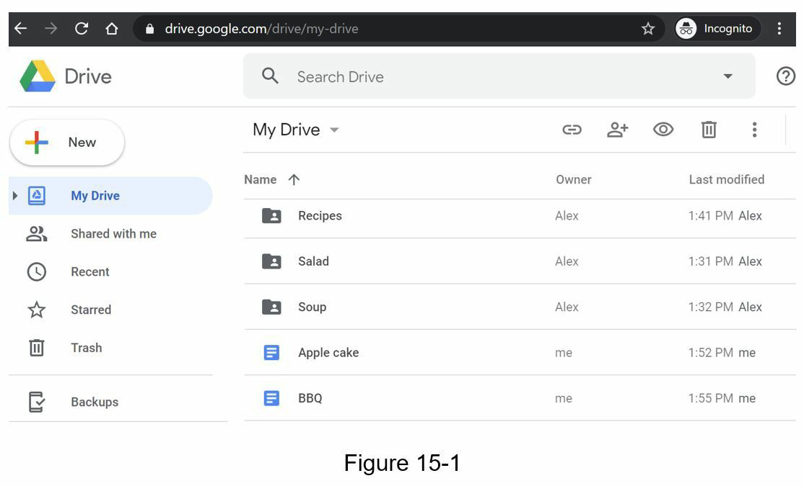
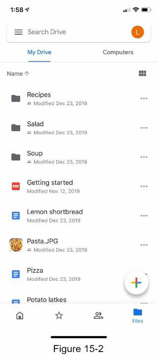
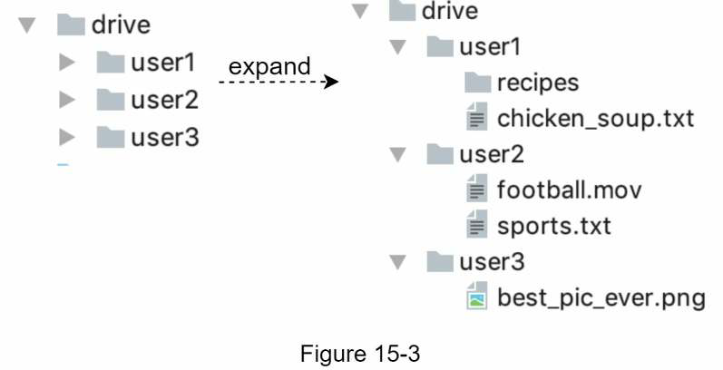
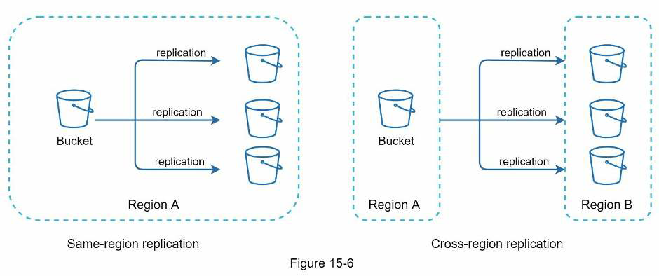
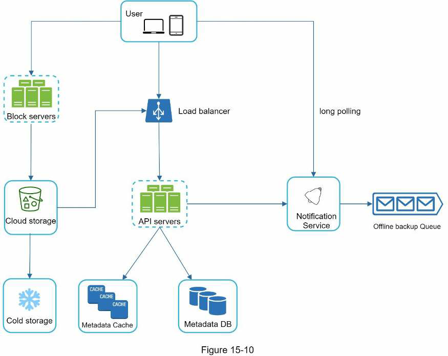
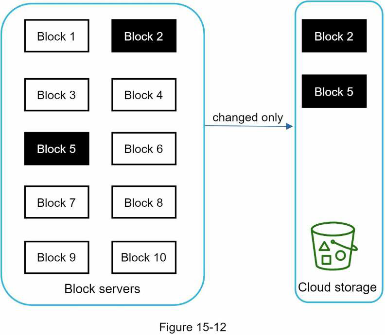
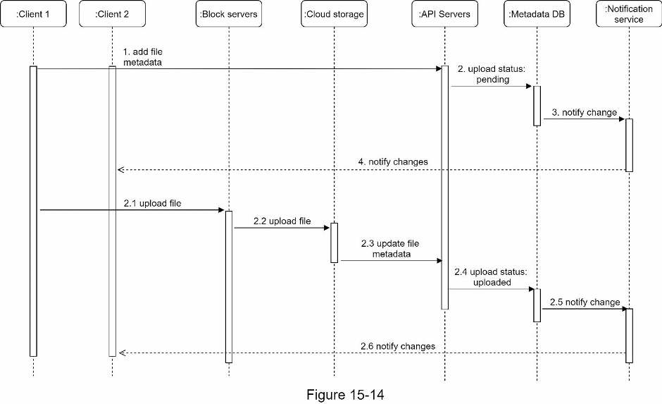
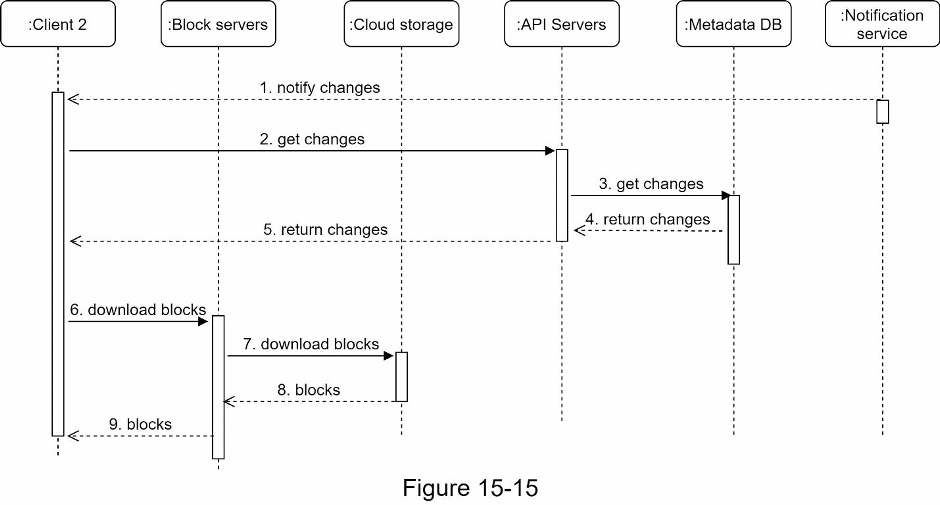

# Design Google Drive

## Overview

Google Drive is a file store and synchronization service that helps you store documents, photos, videos, and other files in the cloud. Tou can access your files from any computer, smartphone, and tablet. You can easily share those files with anyone you want.

## Step 1: Understand the problem and establish design scope

### Q&A

**Candidate**: What are the most important features?
**Interviewer**: Upload and download files, file sync, and notifications.

**Candidate**: Is this a mobile app, a web app, or both?
**Interviewer**: Both.

**Candidate**: What are the supported file formats?
**Interviewer**: Any file type.

**Candidate**: Do files need to be encrypted?
**Interviewer**: Yes, files in the storage must be encrypted.

**Candidate**: Is there a file size limit?
**Interviewer**: Yes, files must be 10GB or smaller.

**Candidate**: How many users does the product have?
**Interviewer**: 10M DAU

We will focus on the following features only:

* Add files. The easiest way to add a file is to drag and drop a file into Google drive.
* Download files.
* Sync files across multiple devices automatically.
* See file revisions.
* Share files with your friends, family, and coworkers.
* Send a notification when a file is edited, deleted, or shared with you.

Other than clarifying requirement, it is important to understand non-functional requirements:

* Reliability. Data loss is unacceptable for a storage system.
* Fast sync speed.
* Bandwidth usage.
* Scalability.
* High availability.

### Back of the envelope estimation

* Assume the application has 50 million signed up users and 10 million DAU.
* Users get 10 GB free space.
* Assume users upload 2 files per day. The average file size is 500 KB.
* 1:1 read to write ratio.
* Total space allocated: 50 million * 10 GB = 500 Petabyte
* QPS for upload API: 10 million * 2 uploads / 24 hours / 3600 seconds = ~240.
* Peak QPS = QPS * 2 = 480

## Step 2: Propose high-level design and get buy-in

Let's start with something simple: build everything in a single server. Then, gradually scale it up to support millions of users.

* A web server to upload and download files.
* A database to keep track of metadata like user data, login info, files info, etc.
* Storage system to store files. We allocate 1TB of storage space to store files.

We setup an Apache web server, a MySql database, and a directory called `drive/` as the root directory to store uploaded files. Under `drive/` directory, there is a list of directories, known as namespaces. Each namespace contains all the uploaded files for that user. The filename on the server is kept the same as the original file name. Each file or folder can be uniquely identified by joining the namespace and the relative path.

### APIs

We primary need 3 APIs: upload a file, download a file, and get file revisions. All the APIs require user authentication and use HTTPS.

#### 1. Upload a file

Two types of uploads are supported:

* *Simple upload*: Use this upload type when the file size is small.
* *Resumable upload*: Use this upload type when the file size is large and there is high chance of network interruption.

Example API is `https://api.example.com/files/upload?uploadType=resumable`

#### 2. Download a file

Example API is `https://api.example.com/files/download` that receives a `path` as a param.

#### 3. Get file revisions

Example API is `https://api.example.com/files/list_revisions` that receives `path` and `limit` as params.

### Move away from single server

When storage is running out of space, the first solution that comes to mind is to shard the data, so it is stored on multiple storage servers.

> This is an example if you were to shard the data based on `user_id`.

You would still be worried about potential data losses in case of storage server outage.

You decide to migrate to Amazon S3 that supports same-region and cross-region replication. Redundant files are stored in multiple regions to guard against data loss and ensure availability. A *bucket* is like a folder in file systems.

You still can improve in many areas, for examples:

* *Load balancer*: Ensure evenly distributed traffic and allows availability in case a server outage.
* *Web servers*: More web servers can be added/removed easily when a load balancer in place.
* *Metadata database*: Move the database out of the server to avoid a single point of failure. In the meantime, set up data replication and sharding to meet the availability and scalability requirements.
* *File storage*: Amazon S3 is used for file storage. To ensure availability and durability, files are replicated in two separated geographical regions.

### Sync conflicts

For a large storage system, sync conflcits happen from time to time. When two users modify the same file or folder at the same time, a conflict happens.

Our strategy to solve this is: the first version that gets processed winds, and the version that gets processed later receives a conflict.

> User 2 has the option to merge both files or override one version with the other.

### High-level design

* **Block servers**: Upload blocks to cloud storage. Block-level storage is a technology to store data files on cloud-based environments. A file can be split into several blocks, each with a unique hash value, stored in our metadata database. Each block is trated as an independent object and stored in our storage system (S3). To reconstruct a file, blocks are joined in a particular order.

* **Cloud storage**: A file is split into smaller blocks and stored in cloud storage.

* **Cold storage**: This is designed for storing inactive data, meaning files are not accessed for a long time.

* **Load balancer**: A load balancer evenly distributes requests among API servers.

* **API Servers**: These are responsible for almost everything other than the uploading flow. API servers are used for user authentication, managing user profile, updating file metdata, etc.

* **Metadata database**: It stores the metadata of users, files, blocks, versions, etc. Please note that files are stored in the cloud and the metadata database only contains metadata.

* **Metadata cache**: Some of the metadata are cached for fast retrieval.

* **Notification service**: It is a publisher/subscriber system that allows data to be transferred from notification service to clients as certain events happen. In our specific case, notification service notifies relevant clients when a file is added/edited/removed elsewhere so they can pull the latest changes.

* **Offline backup queue**: If a client is offline and cannot pull the latest file changes, the offline backup queue stores the info so changes will be synced when the client is online.

## Step 3: Design deep dive

We'll take a closer look at the following: block servers, metadata database, upload flow, download flow, notification service, save storage space and failure handling.

### Block servefrs

In our system, block servers do the heavy lifting work for uploading files. For large files that are updated regularly, two optimizations are proposed to minimize the amount of network traffic:

* **Delta sync**: When a file is modified, only modified blocks are synced instead of the whole file using a sync algorithm.

* **Compression**: Blocks are compressed using compression algorithms depending on file types. For example, gzip and bzip2 are used to compress text files.

1. A file is split into smaller blocks.
2. Each block is compressed using compression algorithm.
3. To ensure security, each block is encrypted before it is sent to cloud storage.
4. Blocks are uploaded to the cloud st orage.

### High consistency requirement

It is unacceptable for a file to be shown differently by different clients at the same time. The system needs to provide **strong consistency** for metadata cache and database layers.

Memory caches adopt an eventual consistency model by default, which means different replicas might have different data. To achieve strong consistency, we must ensure the following:

* Data in cache replicas and the master is consistent.
* invalidate caches on database write to ensure cache and database hold the same value.

In our design, we choose relational databases because the ACID is natively supported.

### Metadata database

This is a simplified version as it only includes the most important tables and interesting fields.

### Upload flow

Suppose two requests are sent in parallel: add file metadata and upload the file to cloud storage. Both requests original from client 1:

* Add file metadata:
  1. Client 1 sends a request to add the metadata of the new file.
  2. Store the new file metadata in Metadata DB and change file upload status to "pending".
  3. Notify the notification service that a new file is being added.
  4. The notification servicen notifies relevant clients (client 2) that a file is being uploaded.
* Upload files to cloud storage:
  1. Client 1 uploads the content of the file to block servers.
  2. Block servers chunk the files into blocks, compress, encrypt the blocks, and upload them to cloud storage.
  3. Once the file is uploaded, cloud storage triggers upload completion callback. The request is sent to API servers.
  4. File status changed to "uploaded" in Metadata DB.
  5. Notify the Notification Service that a file status is changed.
  6. The Notification Service notifies relevant clients (client 2) that a file is fully uploaded.

When a file is edited, the flow is similar.

### Download flow

This is triggered when a file is added or edited elsewhere. There are two ways a client can know a file is added or edited by another client:

* If client A is online while a file is changed by another client, notification service will inform client A that it needs to pull the latest data.
* If client A is offline while a file is changed by another client, data will be saved to the cache. When the client is online again, it pulls the latest changes.

Once a client knows a file is changed, it first requests metadata via API servers, then downloads blocks to construct the file.

1. Notification service informs client 2 that a file is changed somewhere else.
2. Client 2 sends a request to fetch metadata.
3. API servers call Metadata DB to fetch metadata of the changes.
4. Metadata is returned to the API servers.
5. Client 2 gets the metedata.
6. Client 2 sends requests to block servers to download blocks.
7. Block servers first download blocks from cloud storage.
8. Cloud storage returns blocks to the block servers.
9. Client 2 downloads all the new blocks to reconstruct the file.

### Notification Service

To maintain file consistency, any mutation of a file performed locally needs to be informed to other clients to reduce conflicts. At a high-level, Notification Service allows data to be transferred to clients as events happen.

* *Long polling*: Dropbox uses long polling.
* *WebSocket*: Provides a persistent connection between the client and the server. Communication is bi-directional.

Even thought both options work well, we opt for long polling for the following two reasons:

* Communication for notification service is not bi-directional. The server sends information about file changes to the client, but not vice versa.
* WebSocket is suited for real-time bi-directional communication such as a chat app. For Google Drive, notifications are sent infrequently with no burst of data.

With long polling, each client establishes a long poll connection to the notification service. If changes to a file are detected, the client will close the long poll connection. Closing the connection means a client must connect to the Metadata Server to download the latest changes. After a response is received or connection timeout is reached, a client immediately sends a new request to keep the connection open.

### Save storage space

* **De-duplicate data blocks**: Eliminating redundant blocks at the account level is an easy way to save space. Two blocks are identical if they have the same hash value.

* Adopt an **intelligent data backup strategy**. Two optimizations strategies can be applied:
  * *Set a limt* for the number of versions to store. If the limit is reached, the oldest version will be replaced with the new version.
  * *Keep valuable versions only*. Some files might be edited frequently. To avoid unnecessary copies, we could limit the number of saved versions. We give more weight to recent versions.

* Moving infrequently used data to cold storage (e.g., Amazon S3 Glacier).

> Experimentation is helpful to figure out the optimal strategies.

### Failure handling

* **Load balancer failure**: A secondary load balancer would become active and pick up the traffic. Load balancers usually monitor each other using a heartbeat.

* **Block server failure**: If a block server fails, other servers pick up unfinished or pending jobs.

* **Cloud storage failure**: S3 buckets are replicated multiple times in different regions. If files are not available in one region, they can be fetched from different regions.

* **API server failure**: It is a stateless service. If an API server fails, the traffic is redirected to other API serrvers by a load balancer.

* **Metadata cache failure**: Metadata cache servers are replicated multiple times. If one node goes down, you can still access other nodes to fetch data.

* **Metadata DB failure**: If master is down, promote one of the slaves to act as a new master and bring up a new slave mode. If a slave is down, you can use another slave for read operations and bring another slave up.

* **Notification service failure**: If a server goes down, all the long poll connections are lost so clients must reconnect to a different server. Even though one server can keep many open connections, it cannot reconnect all the lost connections at once, so this would be a relatively slow process.

* **Offline backup queue failure**: Queues are replicated multiple times. If one queue fails, consumers of the queue may need to re-subscribe to the backup queue.

## Step 4: Wrap up

The combination of strong consistency, low network bandwidth and fast sync make the design interesting. Our design contains two flows: manage file metadata and file sync. Notification service is another important component of the system. It uses long polling to keep clients up to data with file change.

If there is enough time, here a few topics to discuss:

* Upload files directly to cloud storage from the client instead of going through block servers. The advantage of this approach is that it makes file upload faster because a file only needs to be transferred once to the cloud storage. However, this approach also has a few drawbacks:
  * Same chunking, compression, and encryption logic muist be implemented in different platforms (iOS, Android, Web). It is error-prone and requires a lot of engineering effort instead of just having all those logics implemented in a centralized place such as block servers.
  * A client can easily be hacked or manipulated, implementing encrypting logic on the client side is not ideal.

* Moving online/offline logic to a separate service. Let us call it presence service. By moving presence service out of notification servers, online/offline functionality can easily be integrated by other services.
