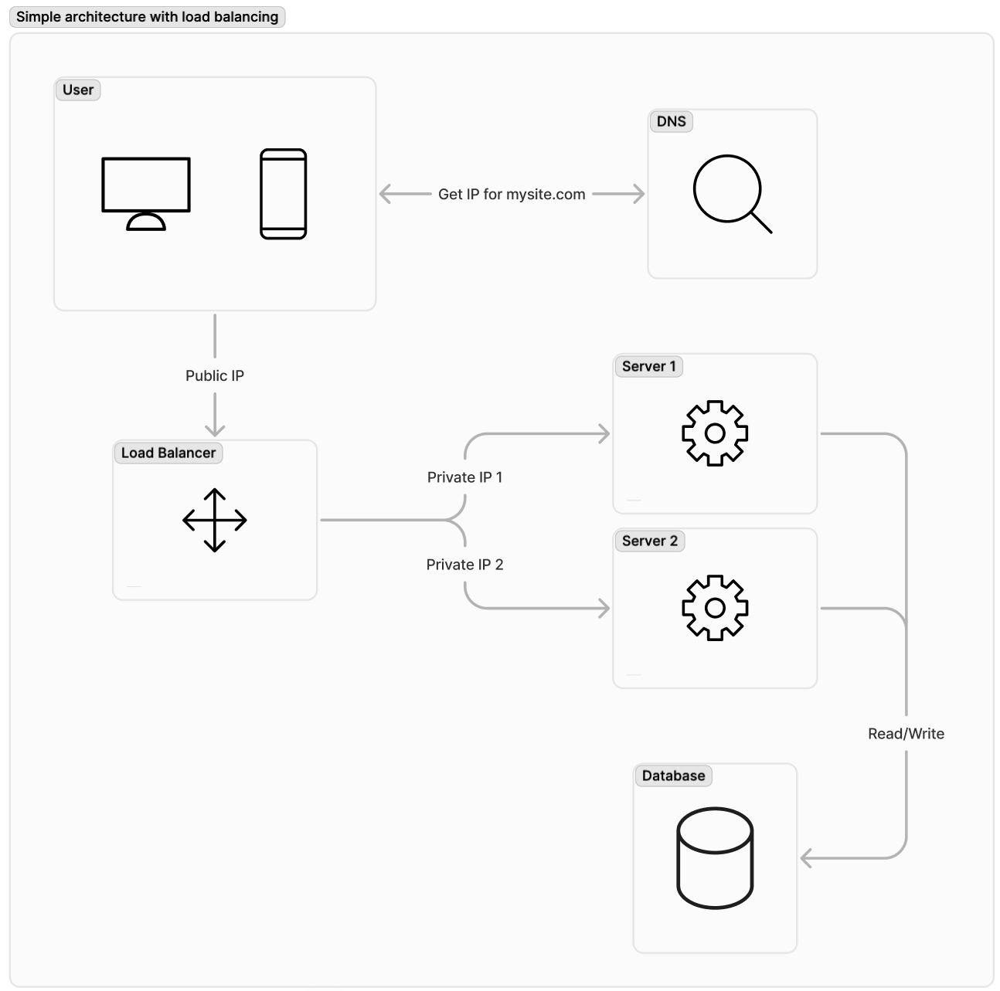

# Load Balancing

## Overview

* *Load Balancing* refers to the process of **distributing a set of tasks over a set of resources** (computing units), with aim of making their overall processing more efficient.

* *Load Balancing* can optimize the response time and **avoid unevenly overloading** some compute nodes while other compute nodes are left idle.

* Allows for **failover** mechanisms in case of nodes failure.

## Algorithms

> A load balancing algorithm always tries to answer a specific problem. Among other things, the nature of the tasks, the algorithmic complexity, the hardware architecture on which the algorithms will run as well as required error tolerance, must be taken into account. Therefore **compromise must be found to best meet application-specific requirements**.

Two main approaches exist:

* **Static Algorithms**: Don't take into account the state of the different machines.
  
* **Dynamic algorithms**: Usually more general and more efficient, but require exchanges of information between the different computing units, at the risk of a loss of efficiency.
