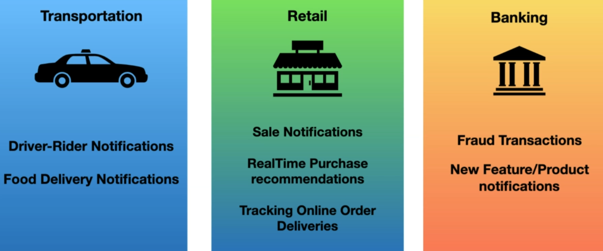

# Apache Kafka

## Ecosystem

## Kafka vs Traditional message System

| Traditional Messaging System                               | Kafka Streaming Platform                                       |
|------------------------------------------------------------|----------------------------------------------------------------|
| Transient message persistance                              | Stores events based on a retention time. Events are immutable. |
| Brokers responsibility to keep track of consumed messages. | Consumers responsiblity to keep track of consumed messages.    |
| Target a specific Consumer.                                | Any Consumer can access a message from the Broker.             |
| Not a distributed system.                                  | Distributed streaming system.                                  |

## Use Cases

* To process payments and financial transactions in real-time, such as in stock exchanges, banks, and insurances.

* To track and monitor cars, trucks, fleets, and shipments in real-time, such as in logistics and the automotive industry.

* To continuously capture and analyze sensor data from IoT devices or other equipment, such as in factories and wind parks.

* To collect and immediately react to customer interactions and orders, such as in retail, the hotel and travel industry, and mobile applications.

* To monitor patients in hospital care and predict changes in condition to ensure timely treatment in emergencies.

* To connect, store, and make available data produced by different divisions of a company.

* To serve as the foundation for data platforms, event-driven architectures, and microservices.

