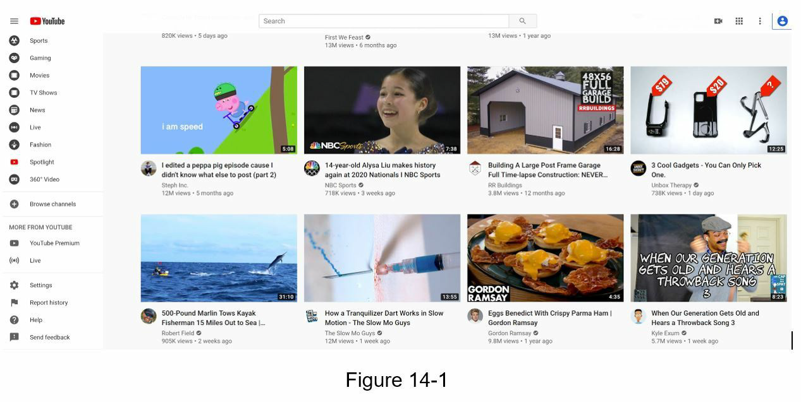
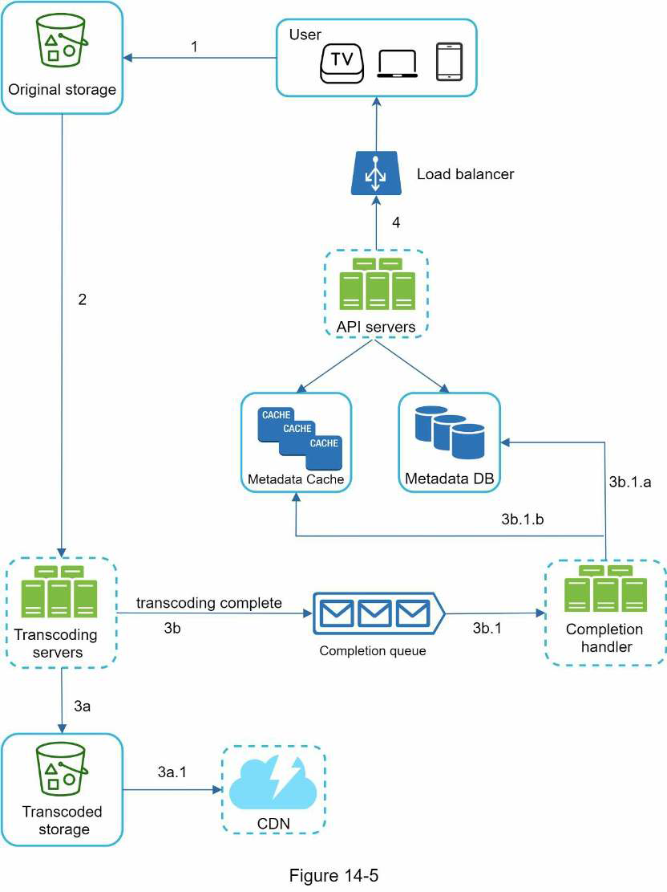
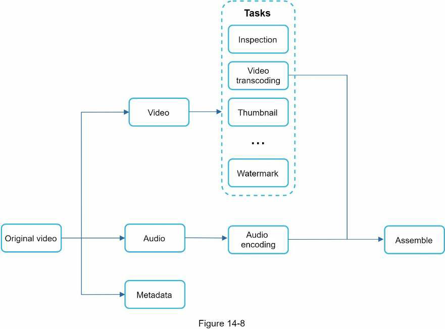
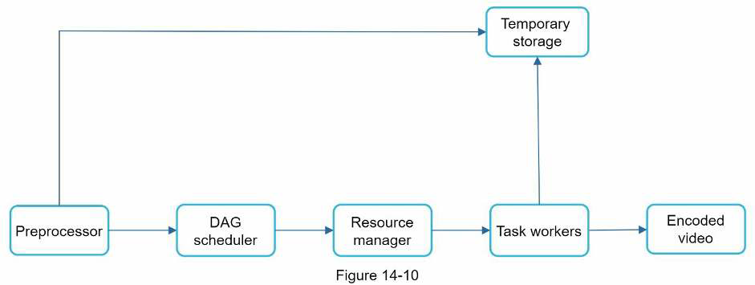
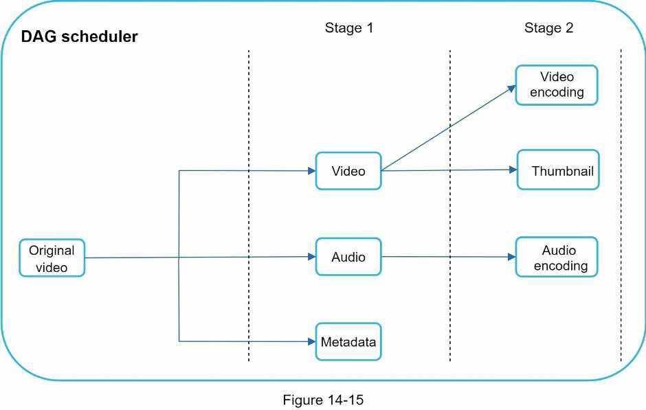
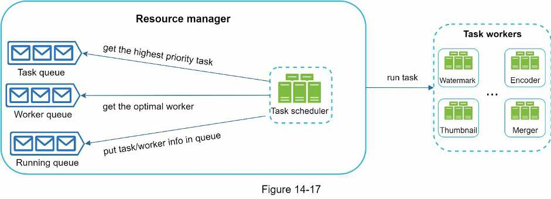
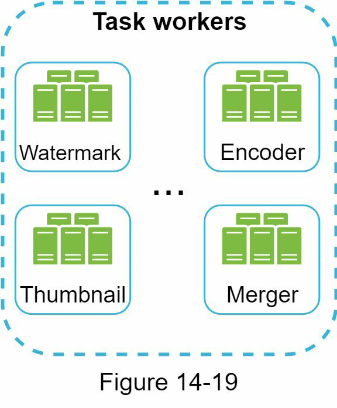
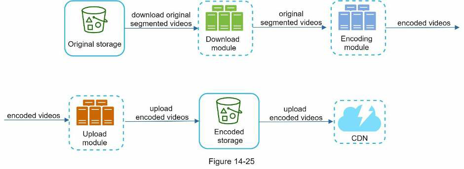

# Design Youtube

* Overview
* Step 1: Understand the problem and establish design scope
* Step 2: Propose high-level design and get buy-in
* Step 3: Design deep dive
* Step 4: Wrap up

## Overview

> The solution to this question can be applied to other interview questions like designing a video sharing platform such as Netflix and Hulu.

Let us look at some statistics, demographics, and fun facts of YouTube in 2020:

* Total number of monthly active users: 2 billion.
* Number of videos watched per day: 5 billion.
* 73% of US adults use YouTube.
* 50 million creators on YouTube.
* YouTube's Ad revenue was $15.1 billion for the full year 2019, up 36% from 2018.
* YouTube is responsible for 37% of all mobile internet traffic.
* YouTube is available in 80 different languages.

## Step 1: Understand the problem and establish design scope

### Q&A

Besides watching a video, you can do a lot more on YouTube. For example, comment, share, or like a video, save a video to playlists, subscribe to a channel, etc. It is impossible to design everything within a 45- or 6-minute interview. Thus, it is important to ask questions to narrow down the scope.

**Candidate**: What features are important?
**Interviewer**: Ability to upload a video and watch a video.

**Candidate**: What clients do we need to support?
**Interviewer**: Mobile apps, web browsers, and smart TV.

**Candidate**: How many daily active users do we have?
**Interviewer**: 5 million.

**Candidate**: What is the average daily time spent on the product?
**Interviewer**: 30 minutes.

**Candidate**: Do we need to support international users?
**Interviewer**: Yes, a large percentage of users are international users.

**Candidate**: What are the supported video resolutions?
**Interviewer**: The system accepts most of the video resolutions and formats.

**Candidate**: Is encryption required?
**Interviewer**: Yes.

**Candidate**: Any file size requirement for videos?
**Interviewer**: Our platform focuses on small and medium-sized videos. The maximum allowed video size is 1GB.

**Candidate**: Can we leverage some kind of existing cloud infrastructure provided by Amazon, Google, or Microsoft?
**Interviewer**: That is a great question. Building everything from scratch is unrealistic for most companies, it is recommended to leverage some of the existing cloud leverage.

We will focus on designing a video streaming service with the following features:

* Ability to upload videos fast.
* Smooth video streaming.
* Ability to change video quality.
* Low infrastructure cost.
* High availability, scalability, and reliability requirements.
* Clients supported: mobile apps, web browser, and smart TV.

### Back of the envelope estimation

The following estimations are based on many assumptions, so it is important to communicate with the interviewer to make sure you are on the same page.

* Assume the product has 5 million DAU.
* Users watch 5 videos per day.
* 10% of users upload 1 video per day.
* Assume the average video size is 300 MB.
* Total daily storage space needed: 5 million * 10% * 300 MB = 150TB.
* CDN cost:
  * When cloud CDN serves a video, you are charged for data transferred out of the CDN.
  * Let us use Amazon's CDN CloudFront for cost estimation. Assume 100% of traffic is served from the United States. The average cost per GB is $0.02. Fir simplicity, we only calculate the cost of video streaming.
  * 5 million * 5 videos * 0.3GB * $0.02 = $150,000 per day.

Even though cloud providers are willing to lower the CDN costs significantly for big customers, the cost is still substantial. We will discuss ways to reduce CDN costs in deep dive.

## Step 2: Propose high-level design and get buy-in

CDN and blob storage are the cloud services we will leverage. System design interviews are not about building everything from scracth. Within the limited time frame, choosing the right technology to do a job right is more important than explaining how the technology works in detail.

**Client**: You can watch YouTube on your computer, mobile phone, and smart TV.

**CDN**: Videos are stored in CDN. When you press play, a video is streamed from the CDN.

**API servers**: Everything else except video streaming goes through API servers. This includes feed recommendation, generating video upload URL, updating metadata database and cache, user signup, etc.

In the question/answer session, the interview showed interests in two flows:

* Video uploading flow
* Video streaming flow

We will explore the high-level design for each of them:

### Video uploading flow

#### Relevant components

* **Metadata DB**: Video metedata are stored in Metadata DB. It is sharded and replicated to meet performance and high availability requirements.

* **Metadata cache**: For better performance, video metadata and user objects are cached.

* **Original storage**: A blob storage system is used to store original videos.

* **Transcoding servers**: Video transcoding is also called video encoding. It is the process of converting a video format to other formats (MPEG, HLS, etc), which provide the best video streams possible for different devices and bandwith capabilities.

* **Transcoded storage**: It is a blob storage that stores transcoded video files.

* **Completion queue**: It is a emssage queue that stores information about video transcoding completion events.

* **Completion handler**: List of workers that pull event data from the completion queue and update metadata cache and database.

#### Upload an actual video

1. Videos are uploaded to the *Original storage*.
2. *Transcoding servers* fetch videos from the *Original storage* and start transcoding.
3. Once transcoding is complete, the following two steps are executed in parallel:
  a. Transcoded videos are sent to the *Transcoded storage*.
  b. Transcoding completion events are queued in the *Completion queue*.
  a.1. Transcoded videos are distributed to *CDN*.
  b.1. *Completion handler* contains a bunch of workers that continously pull event data from the queue.
  b.1.a and b.1.b *Completion handler* updates the *Metadata database* and *Metadata cache* when video transcoding is complete.
4. *API servers* inform the client that the video is successfully uploaded and is ready for streaming.

#### Update the video metadata

While a file is being uploaded to the *Original storage*, the client in parallel sends a request to update the video metadata. The request contains video metadata, including file name, size, format, etc. API servers update the *Medatada Cache* and *Metadata DB*.

### Video streaming flow

Whenever you watch a video on YouTube, it usually starts streaming immediately and you do not wait until the whole video is downloaded. Streaming means your device continuously receives video streams from remote source videos. When you watch streaming videos, your client loads a little bit of data at a time so you can watch videos immediately and continuously.

Popular *streaming protocols* are: *Streaming Protocol

* MPEG-DASH, MPEG stands for *Moving Picture Experts Group*, and DASH stands for *Dynamic Adaptive Streaming over HTTP*.
* Apple HLS (*HTTP Live Streaming*).
* Microsoft Smooth Streaming.
* Adobe HDS (*HTTP Dynamic Streaming*).

The important thing here is to understand that different streaming protocols support different video encodings and playback players. When we design a video streaming service, we have to choose the right streaming protocol to support our use cases.

Videos are streamed from *CDN* directly. The edge server closest to you will deliver the video. Thus, there is very little latency.

## Step 3: Design deep dive

We will refine both flows, *video uploading flow* and *video streaming flow* with important optimizations and introduce error handling mechanisms.

* Video transcoding
* Directed acyclic graph (DAG) model
* Video transcoding architecture
* System optimizations
* Error handling

### Video transcoding

When you record a video, the device (usually a phone or camera) gives the video file a certain format. If you want the video to be played smoothly on other devices, the video must be encoded into compatible bitrates and formats.

> Bitrate is the rate at which bits are processed over time. A higher bitrate generally means higher video quality. High bitrate streams need more processing power and fast internet speed.

Video encoding is important for the following reasons:

* Raw video consumes large amounts of storage spac. An hour-long high definition video recorded at 60 FPS can take up a few hundred GB of space.

* Many devices and browsers only support certain types of video formats. Thus, it is important to encode a video to different formats for compatibility reasons.

* To ensure users watch high-quality videos while maintaining smooth playback, it is a good idea to deliver higher resolution video to users who have high network bandwidth and lower resolution video to users who have low bandwidth.

* Network conditions can change, especially on mobile devices. To ensure a video is played continuously, switching video quality automatically or manually based on network conditions is essential for smooth user experience.

Many types of encoding formats are available; however, most of them contain two parts:

* *Container*: This is like a basket that contains the video file, audio, and metadata. You can tell the container format by the file extension, such as `.avi`, `.mov`, or `.mp4`.

* *Codecs*. These are compression and decompression algorithms aim to reduce the video size while preserving the video quality. The most used video codecs are H.264, VP9, and HEVC.

### Directed acyclic graph (DAG) model

Transcoding a video is computationally expensive and time-consuming. Besides, different content creators may have different video processing requirements. For instance, some content creators require watermarks on top of their videos, some provide thumbnail images themselves, and some upload high definition videos, whereas others do not.

To **support different video processing pipelines and maintain high parallelism**, it is important to add some level of abstraction and let client programmers define what tasks to execute.

> For example, Facebook's streaming video engine uses a *DAG* programming model, which defines tasks in stages so they can be executed sequentially or parallely.

The original video is split into video, audio, and metadata. Here are some of the tasks that can be applied on a video file:

* *Inspect*: Make sure videos have good quality and are not malformed.

* *Video encodings*: Videos are converted to support different resolutions, codecs, bitrates, etc.

* *Thumbnail*: Thumbnails can either be uploaded by a user or automatically generated by the system.

* *Watermark*: An image overlay on top of your video contains identifying information about your video.

> Example of video encoded files.

### Video transcoding architecture

The following is the proposed video transcoding architecture that leverages the cloud services.

The architecture has six main components:

#### Preprocessor

The preprocessor has 4 responsibilities:

1. **Video splitting**. Video stream is split or further split into into smaller *Group of Pictures* (GOP) alignment. GOP is a group/chunk of frames arranged in a specific order. Each chunk is an independently playable unit, usually a few seconds in length.

2. Some old mobile devices or browsers might not support video splitting. Preprocessor plit videos by GOP alignment for old clients.

3. **DAG generation**. Preprocessor generates DAG based on configuration files client programmers write.

4. **Cache data**. The preprocessor is a cache for segmented videos. For better relaibility, the preprocessor stores GOPs and metadata in temporary storage. If video encoding fails, the system could use persisted data for retry operations.

#### DAG Scheduler
The DAG scheduler **splits a DAG graph into stages of tasks** and puts them in the task queue in the resource manager.

> In this example, the original video is split into 2 stages.

#### Resource Manager

The resource manager is responsible for **managing the efficiency of resource allocation**.

* *Task queue*: It is a priority queue that contains tasks to be executed.

* *Worker queue*: It is a priority queue that contains worker utilization info.

* *Running queue*: It contains info about the currently running tasks and workers running the tasks.

* *Task scheduler*: It picks the optimal task/worker, and instructs the chosen task worker to execute the job.

The resource manager works as follows:

1. The task scheduler gets the highest priority task from the task queue.
2. The task scheduler gets the optimal task worker to run the task from the worker queue.
3. The task scheduler instructs the chosen task worker to run the task.
4. The task scheduler binds the task/worker info and puts it in the running queue.
5. The task scheduler removes the job from the running queue once the job is done.

#### Task workers

Task workers **run the tasks which are defined in the DAG**. Different task workers may run different tasks.

#### Temporary storage

Multiple storage systems are used here. The choice of storage system depends on factors like data type, data size, access frequency, data life span, etc.

For instance, metadata is frequently accessed by workers, and the data size is usually small. Thus, caching metadata in memory is a good idea. For video or audio data, we put them in blob storage. Data in temporary storage is freed up once the corresponding video processing is complete.

#### Encoded video

Encoded video is the final output of the encoding pipeline.

### System optimizations

* Speed optimizations
* Safety optimizations
* Cost-saving optimizations

#### Speed optimization: Parallelize video uploading

We can split a video into smaller chunks by GOP alignment. This allows fast resumable uploads when the previous upload failed.

The job of splitting a video file by GOP can be implemented by the client to improve the upload speed.

#### Speed optimization: Place upload centers close to users

Set up multiple load centers across the globe. People in the United States can upload videos to the North America upload center, and people in China can upload videos to the Asian upload center. To achieve this, we use CDN as upload centers.

#### Speed optimization: Parallelism everywhere

Build a loosely coupled system and enable high parallelism. We need to avoid the output of a step depending on receiving the input from the previous step.

To make the system more loosely coupled, we introduced message queues:

* Before the message queue is introduced, the encoding module must wait for the output of the download module.
* After the message queue is introduced, the encoding module does not need to wait for the outpuit of the download module anymore. If there are events in the message queue, the encoding module can execute those jobs in parallel.

#### Safety optimization: pre-signed upload URL

To ensure only authorized users upload videos to the right location, we introduce pre-signed URLs:

1. The client makes a HTTP request to API servers to fetch the presigned URL, which gives the access permission to the object identified in the URL. The term *pre-signed URL* is used by uploading files to Amazon S3 while other cloud service providers might use a different name. For instance, Microsoft Azure blob storage supports the same feature as *Shared Access Signature*

2. API servers respond with a pre-signed URL.

3. Once the client receives the response, it uploads the video using the pre-signed URL.

#### Safety optimization: protect your videos

To protect copyrighted videos, we can adopt one of the following three safety options:

* *Digital rights management* (DRM) systems: Three major DRM systems are Apple FairPlay, Google Widevine, and Microsoft PlayReady.

* *AES Encryption*: You can encrypt a video and configure an authorization policy. The encrypted video will be decrypted upon playback. This ensures that only authorized users can watch an encrypted video.

* *Visual watermarking*: This is an image overlay on top of your video that contains identifying information for your video.

#### Cost saving optimization

From the back of the envelope calculation, we know CDN is expensive, especially when the data size is large.

> Previous research shows that YouTuve video streams follow long-tail distribution. It means a few ppopular videos are accessed frequently but many others have few or no viewers. Based on this observation, we implement a few optimizations:

1. Only serve the most popular videos from CDN and other videos from our high capacity storage video servers.
2. For less popular content, we may not need to store many encoded video versions. Short videos can be encoded on-demand.
3. Some videos are popular only in certain regions. There is no need to distribute these videos to other regions.
4. Build your own CDL like Netflix and partner with *Internet Service Providers* (ISPs). This could make sense for large streaming companies.

All those optimizations **are based on content popularity, user access pattern, video size, etc**. It is improtant to analyze historical viewing patterns before doing any optimization.

### Error handling

For a large-scale system, system errors are unavoidable.

* **Recoverable error**. For recoverable errors such as video segment fails to transcode, the general idea is to retry the operation a few times. If the task continues to fail and the system believes it is not recoverable, it returns the proper error code to the client.

* **Non-recoverable error**. For non-recoverable errors such as malformed video format, the system stops running ttasks associated with the video and returns the proper error code to the client.

Typical errors for each system component are covered by the following playbook:

* *Upload error*: Retry a few times.

* *Split video error*: If older versions of clients cannot split videos by GOP alignment, the entire video is passed to the server. The job of splitting videos is done on the server-side.

* *Transcoding error*: Retry.

* *Preprocessor error*: Regenerate DAG diagram.

* *DAG scheduler error*: Reschedule a task.

* *Resource manager queue down*: Use a replica.

* *Task worker down*: Retry the task on a new worker.

* *API server down*: API servers are stateless so requests will be directed to a different API server.

* *Metadata cache server down*: Data is replicated multiple times. If one node goes down, you can still access other nodes to fetch data. We can bring up a new cache server to replace the dead one.

* *Metadata DB server down*:
  * Master is down. If the master is down, promote one of the slaves to act as the new master.
  * Slave is down. If a slave goes down, you can use another slave for reads and bring up another database server to replace the dead one.

## Step 4: Wrap up

If there is extra time, here are a few additional points:

* **Scale the API tier**: Because API servers are stateless, it is easy to scale API tier horizontally.

* **Scale the database**: You can talk about database replication and sharding.

* **Live streaming**: It refers to the process of how a video is recorded and broadcasted in real time. Although our system is not designed specifically for live streaming, it has some similarities with non-live streaming: both require uploading, encoding, and streaming. The notable differences are:
  * Live streaming has a higher latency requirement, so it might need a different streaming protocol.
  * Live streaming has a lower requirement for parallelism because small chaunks of data are already processed in real-time.
  * Live streaming requires different sets of error handling. Any error handling that takes too much time is not acceptable.

* **Video takedowns**: Videos that violate copyrights, pornography, or other illegal acts shall be removed. Some can be discovered by the system during the upload process, while others might be discovered through user flagging.
