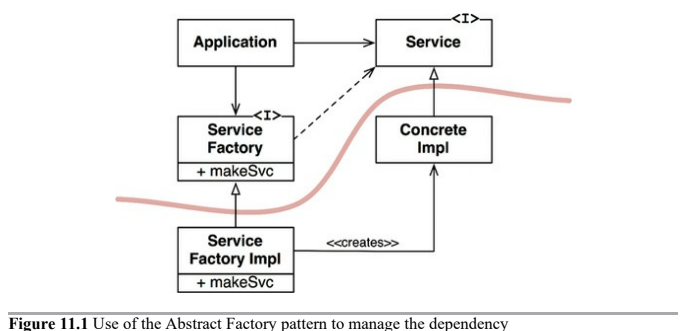

# Dependency Inversion Principle

Most flexible systems are those in which __source code dependencies refer only to abstractions__, not to concretions.

In statically typed languages, this means that import/include statements should refer only to source modules containing interfaces/abstract classes.

In dynamically typed languages, source code dependencies should not refer to concrete modules (functions being called are implemented).

We tend to ignore the stable background of operating system and platform facilities when it comes to DIP, because __we know we can rely on them not to change___.

It is the volatile concrete elements of our system that we want to avoid depending on. Those are the modules that we are actively developing, and that are undergoing frequent change.

## Stable Abstractions

Changes to concrete implementations do not always, or even usually, require changes to the interfaces they implement. Therefore __interfaces are less volatile than implementations__.

Indeed, good software designers and architects work hard to reduce the volatility of interfaces. They try to find ways to add functionality to implementations without making changes to the interfaces. This is Software Design 101.

* Don't refer to volatile concrete classes, refer to abstract interfaces instead.
* Don't derive from volatile concrete classes.
* Don't override concrete functions (you inherit its dependencies)
* Never mention the name of anything concrete and volatile

## Factories

To comply with these rules, the creation of volatile concrete objects requires special handling (_
Abstract Factories_).

The curved line is an architectural boundary, it divides the system into two components, abstract and concrete.

Abstract components contain all the high-level business rules of the application.

Concrete components contain all the implementation details that those business rules manipulate.

## Conclusion

DIP will be the most visible organizing principle in our achitecture diagrams. The curved line will become the architectural boundaries. The way the dependencies cross that curved line in one direction, and toward more abstract entities, will become a new rule that we will call the Dependency Rule.
