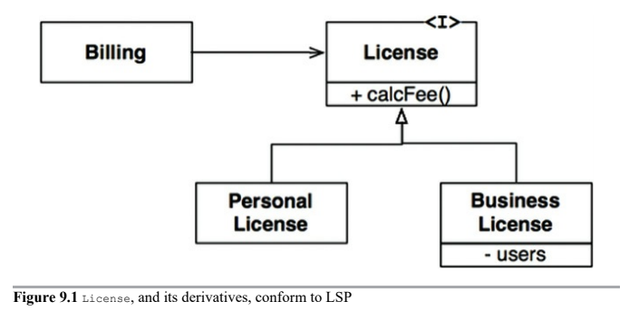
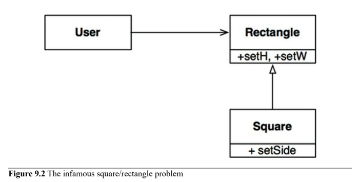

# Liskov Substitution Principle

* Definition
* Guiding the Use of Inheritance
* Square/Rectangle Problem
* LSP and Architecture
    * LSP Architecture Violation

## Definition

> If for each object `o_1` of type `S` there is an object `o_2` of type `T` such that for all programs `P` defined in terms of `T`, the behavior of `P` is unchanged when `o_1` is sustituted for `o_2` then `S` is a subtype of `T`.

> The LSP can, and should, be extended to the level of architecture. A simple violation of substitutability, can cause a system's architecture to be polluted with a significant amount of extra mechanisms.

## Guiding the Use of Inheritance

Suppose we have a class named `License`, that has a method named `calcFee()`, which is called by the `Billing` application. There are two "subtyes" of `Licence` that use different algorithms to calculate the license fee.



This design conforms to the LSP because the behavior of the `Billing` application does not depend, in any way, on which of the two subtypes it uses.

## Square/Reactangle Problem

Canonical example of a violation of the LSP is the famed square/rectangle problem.



In this example, `Square` is not a proper subtype of `Reactangle` because the height and width of the `Rectangle` are independently mutable, where as the ones from `Square` must change together. Since the `User` believes it is communicating with a `Rectangle`, it could easily get confused.

The only way to defend against this kind of LSP violation is to add mechanisms to the `User` that detects whether the `Rectangle` is, in fact, a `Square`. Since the behavior of the `User` depends on the types it uses, those types are not substitutable.

## LSP and Architecture

LSP has morphed into a broader principle of software design that pertains to interfaces and implementations. __Users depend on well-defined interfaces, and on the substitutability of the implementations of those interfaces__.

### LSP Architecture Violation

Suppose we are building an aggregator for many taxi dispatch services, customers use our website to find the most appropriate taxi to use, regardless of taxi company. Our system dispatches the chosen taxi by using a restful service.

Now assume that the URI for the RESTful dispatch service is part of the information contained in the driver database.

Suppose Driver Bob has a dispatch URI that looks like this: `purplecab.com/driver/Bob`. Our system will append the dispatch information onto this URI and send it with a PUT, as follows:

```text
purplecab.com/driver/Bob
/pickupAddress/24 Maple St.
/pickupTime/153
/destination/ORD
```

Clearly this means that all the dispatch services, for all the different companies, must conform to the same REST interface. They must treat the `pickupAddress`, `pickupTime`, and `destination` fields identically.

Now suppose the Acme taxi company didn't read the spec very carefully and abbreviated the destination field to just `dest`. We would need to add a special case. The dispatch request for any Acme driver would have to be constructed using a different set of rules.

The simplest way to accomplish this goal would be to add an if statement before constructing the dispatch command...

```text
if (driver.getDispatchUri().startsWith("acme.com)) ...
```

No architect would allow such a construction to exist in the system. Putting the world "acme" into the code itself creates an opportunity for all kinds of horrible and mysterious errors, not to mention security breaches.

> We need then to add significant and complex mechanism to deal with the fact that the interfaces of the restful services are not all substitutable.
