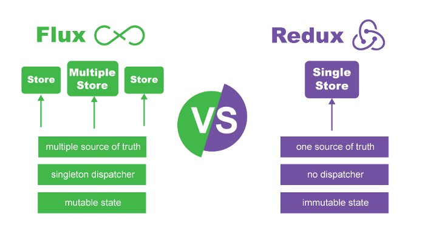
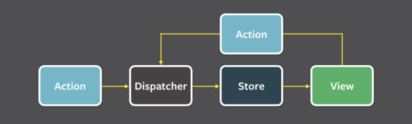

# Flux Comparison

> Resources:
> * https://medium.com/@dakota.lillie/flux-vs-redux-a-comparison-bbd5000d5111
> * https://www.clariontech.com/blog/mvc-vs-flux-vs-redux-the-real-differences

* The Need for Flux
* How Flux Works
* Redux and Differences
  * No Dispatcher
  * Single, Less Convoluted Store
  * Reducers

## The Need for Flux

In 2011, Facebook engineers had a problem, __the zombie notification__: users would see they had a chat notification, but when they clicked on it there would be no new message waiting for them. Each solution would only address some particular edge case.

The problem was that at that time, Facebook was using the MVC architecture, which was becoming increasingly unstable as the application grew more and more complicated.

The number of models and views had compunded, and the the relationships between them had become unmanageably difficult to keep track of. Likewise, the code which dictated their interactions was largely imperative and easily prone to breaking.

Unveiled in 2014, Flux an entirely new approach to state management. It's __goal was to make changes in state predictable__ (and thus more easily manageable, especially in complex applications) by imposing certain _restrictions_ on how and when could happen.

## How Flux Works

> Flux is a generalized pattern, not a specific library.

__Unidirectional data flow__ is one of the integral concepts of Flux: __All data must flow in only one direction__, and is a significant part of what keeps everything so predictable.

Consider MVC, the views and models have arrows running in both directions, in other words, __data flow in MVC is bidirectional__. Bidirectional data flow becomes harder to maintain as complexity grows, because it gets increasingly difficult to pinpoint exactly where a particular change originates. Since the models and views are so complexly interconnected, effects can cascade in unanticipated ways, increasing the likelihood of unwanted bugs.

> The unidirectional data flow enforced by Flux helps avoiding cascading effects.

* __Actions__: Representations of the ways users can interact with the application.

* __Dispatcher__: Receives an action and forwards it to each of the application's store.
  * Flux only has _one_ dispatcher.
  * _Every_ action is sent to _every_ store.

* __Stores__: Structures which hold the application's state, as well as the logic around how to update that state.

* __Views__: What the user sees and interacts with. They are the interface for displaying the data from the stores, as well as for sending actions back to the stores through the dispatcher.

## Redux and Differences

> There are multiple frameworks/libraries that can be used to implement Flux. But Redux has distinguished itself as the one of the most populars.

Co-authored by _dan Abramov_ and _Andrew Clark_ in 2015, Redux aims to __simplify and streamline many of the concepts introduced by Flux__.

Redux and Flux are __similar in that they both emphasize the importance of unidirectional data flow, and they both adjust state through actions__ with a similar interface (such as having a `type` field). However, they have some differences to note:

* __No Dispatcher__: Redux has a single store, so there is only a single destination to broadcast new actions to, thus eliminating the need for a dispatcher.

* __A Single, Less Convoluted Store__: All application's state is located within a centralized store which acts as the application's single source of truth. Additionally, the store's responsibilities have been reduced, it is now only responsible for containing the state, and is no longer in charge of determining how to adjust its state in response to actions. That logic has been delegated to _reducers_.

* __Reducers__: _Pure functions_ which accept the current state and a given action as arguments, and which output either the unmodified state or a new, edited copy of the state. Redux considers _state to be immutable_.
