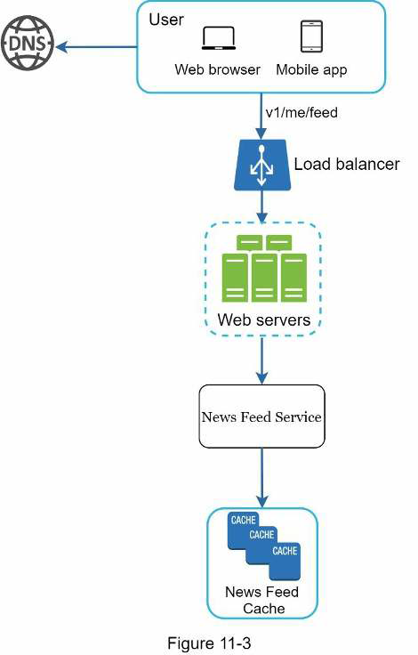
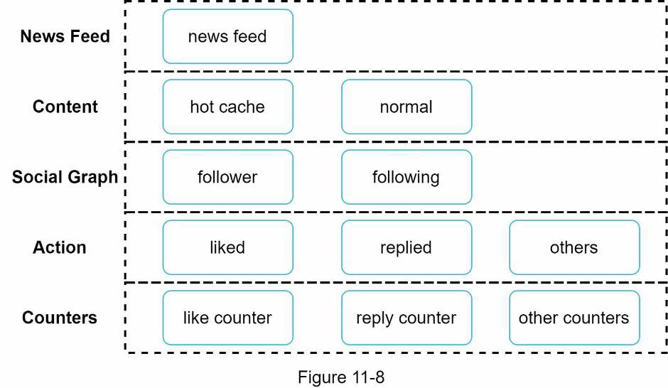

# Design a News Feed System

* Overview
* Step 1: Understand the problem and establish design scope
* Step 2: Propose high-level design and get buy-in
* Step 3: Design deep dive

## Overview

> Facebook: "News feed is the constantly updating list of stories in the middle of your home page. News Feed includes status updates, photos, videos, links, app activity, and likes from people, pages, and groups that you follow on Facebook."

## Step 1: Understand the problem and establish design scope

**Candidate**: Is this a mobile app? Or a web app? Or both?
**Interviewer**: Both.

**Candidate**: What are the important features?
**Interviewer**: A user can publish a post and see her friends' posts on the news feed page.

**Candidate**: Is the news feed sorted by reverse chronological order or any particular order such as topic scores? For instance, posts from your close friends have higher scores.
**Interviewer**: To keep things simple, let us assume the feed is sorted by reverse chronological order.

**Candidate**: How many friends can a user have?
**Interviewer**: 5000

**Candidate**: What is the traffic volume?
**Interview**: 10 million DAU

**Candidate**: Can feed contain images, videos, or just text?
**Interviewer**: It can contain media files, including both images and videos.

## Step 2: Propose high-level design and get buy-in

The design is divided into two flos: *feed publishing* and *news feed building*.

* **Feed publishing**: When a user publishes a post corresponding data is written into cache and database. A post is populated to his friends' new feed.

* **Newsfeed building**: We assume the news feed is built by aggregating friends' posts in reverse chronological order.

### Newsfeed APIs

The news feed APIs are the primary ways for clients to communicate with servers. Those APIs are HTTP based and allow clients to perform actions, which include posting a status, retrieving news feed, adding friends, etc.

#### Feed publishing API

To publish a post, a HTTP POST request will be sent to the server: `POST /v1/me/feed`.

Params:

* `content`: Text of the post.
* `auth_token`: Used to authenticate API requests.

#### Newsfeed retrieval API

The API to retrieve news feed is `GET /v1/me/feed` and receives as param `auth_token` for to authenticate API requests.

### Feed publishing flow

* **User**: A user can view news feeds on a browser or mobile app. A user makes a post with content *"Hello"* through API: `POST /v1/me/feed?content=Hello&auth_token={auth_token}`.

* **Load balancer**: Distribute traffic to web servers.

* **Web servers**: Web servers redirect traffic to different internal services.

* **Post service**: Persist post in the database and cache.

* **Fanout service**: Push new content to friends' news feed. Newsfeed data is stored in the cache for fast retrieval.

* **Notification service**: Inform friends that new content is available and send out push notifications.

### Newsfeed building

* **User**: A user sends a request to retrieve his news feed: `GET /v1/me/feed`.

* **Newsfeed service**: Fetches news feed from the cache.

* **Newsfeed cache**: Store news feed IDs needed to render the news feed.

## Step 3: Design deep dive

### Feed publishing deep dive

We will focus on two components: *web servers* and *fanout service*.

#### Web servers

Besides communicating with clients, web servers enforce authentication and rate-limiting. Only users signed in with valid *auth_token* are allowed to make posts. The system limits the number of posts a user can make within a certain period, vital to prevent spam and abusive content.

#### Fanout service

Fanout is the process of delivering a post to all friends. Two types of fanout models are: **fanout on write** (also called **push model**) and **fanout on read** (also called **pull model**). Both models have pros and cons.

* **Fanout on write**: News feed is pre-computed during write time. A new post is delivered to friends' cache immediately after it is published.
    * (+) News feed is generated in real-time and can be pushed to friends immediately.
    * (+) Fetching news feed is fast because the news feed is pre-computed during write time.
    * (-) If a user has many friends, fetching the friend list and generating news feeds for all of them are slow and time consuming. It is called *hotkey problem*.
    * (-) For inactive users or those rarely log in, pre-computing news feeds waste computing resources.

* **Fanout on read**: The news feed is generated during read time. This is an on-demand model. Recent posts are pulled when a user loads her home page.
  * (+) For inactive users or those who rarely log in, fanout on read works better because it will not waste computing resources on them.
  * (+) Data is not pushed to friends so there is no *hotkey problem*.
  * (-) Fetching the news feed is slow as the news feed is not pre-computed.

We adopt a **hybrid approach**: Since fetching the news feed fast is crucial, we use a push model for the majority of users. For celebrities or users who have many friends/followers, we let followers pull news content on-demand to avoid system overload. *Consistent hashing* is a useful technique to mitigate the *hoyket problem* as it helps to distribute requests/data more evenly.

The fanout service works as follows:

1. Fetch friend IDs from the graph database. Graph databases are suited for managing friend relationship and friend recommendations.

2. Get friends info from the user cache. The system then filters out friends based on user settings. For example, if you mute someone, his posts will not show up on your news feed even though you are still friends. Also, a user could selectively share information with specific friends or hide it from other people.

3. Send friends list and new post ID to the message queue.

4. Fanout workers fetch data from the message queue and store news feed data in the news feed cache (`<post_id, user_id>` mapping table). To keep the memory size small, we set a configurable limit. The chance of a user scrolling through thousands of posts in news feed is slim, so the cache miss rate is low.

5. Write `<post_id, user_id>` to cache. 

### Newsfeed retrieval deep dive

> Media content are stored in CDN for fast retrieval.

1. A user sends a request to retrieve his news feed. The request looks like `GET /v1/me/feed`.

2. The load balancer redistributes requests to web servers.

3. Web servers call the news feed service to fetch news feed.

4. News feed service gets a list of post IDs from the news feed cache.

5. A user's news feed also contains username, profile picture, post content, post image, etc. Thus, the news feed service fetches the complete user and post objects from caches (user cache and post cache) to construct the fully hydrated news feed.

6. The fully hydrated news feed is returned in JSON format back to the client for rendering.

#### Cache architecture

Cache is extremely important for a news feed system. We device the cache tier into 5 layers:

* **News feed**: Stores IDs of news feed.
* **Content**: Every post data. Popular content is stored in hot cache.
* **Social Graph**: User relationship data.
* **Action**: Info about whether a user liked a post, replied a post, or took other actions on a post.
* **Counters**: Counters for like, reply, followers, following, etc.

## Step 4: Wrap up

To avoid duplicated discussion, only high-level talking points are listed below:

* Scaling the database:
  * Vertical scaling vs Horizontal scaling
  * SQL vs NoSQL
  * Master-slave replication
  * Read replicas
  * Consistency models
  * Database sharding
* Keep web tier stateless
* Cache data as much as you can
* Support multiple data centers
* Lose couple components with message queues
* Monitor key metrics. For instance, QPS during peak hours and latency while users refreshing their news feed are interesting to monitor.
