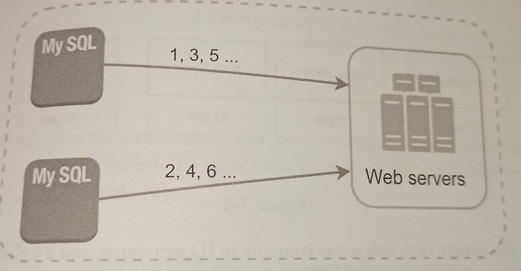
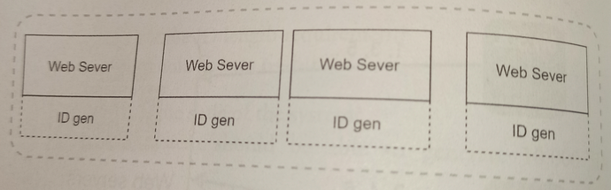
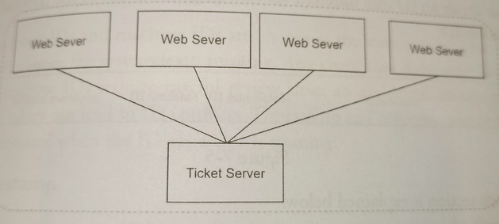

# Design a unique ID generator in distributed systems

* Overview
* Step 1: Understand the problem and establish design scope
* Step 2: Propose high-level design and get buy-in

## Overview

Your first thought might be to use a primary key with the *auto_increment* attribute in a traditional database. However, *auto_increment* does not work in a distributed environment because a single database server is not large enough and generating unique IDs across multiple databases with minimal delay is challenging.

## Step 1: Understand the problem and establish design scope

**Candidate**: What are the characteristics of unique IDs?
**Interviewer**: IDs must be unique and sortable.

**Candidate**: For each new record, does ID increment by 1?
**Interviewer**: The ID increments by time but not necessarily only increments by 1. IDs created in the evening are larger than those created in the morning on the same day.

**Candidate**: Do IDs only contain numerical values?
**Interviewer**: Yes, that is correct.

**Candidate**: What is the ID length requirement?
**Interviewer**: IDs should fit into 64-bit.

**Candidate**: What is the scale of the system?
**Interviewer**: The system should be able to generate 10,000 IDs per second.

For this interview question, the requirements are listed as follows:

* IDs must be unique.
* IDs are numerical values only.
* IDs fit into 64-bit.
* IDs are ordered by date.
* Ability to generate over 10,000 unique IDs per second.

## Step 2: Propose high-level design and get buy-in

We consider the following options:

* Multi-master replication
* UUID: Universally unique identifier
* Ticket server
* Twitter snowflake approach

### Multi-master replication

This approach uses the databases' *auto_increment* feature. Instead of increasing the next ID by 1, we increase it by *k*, where *k* is te number of database servers in use. 

> Next ID to be generated is equal to the previous ID in the same server plus 2.

This solve some scalability issues because IDs can scale with the number of database servers. However, this strategy has some major drawbacks:

* Hard to scale with multiple data centers.

* IDs do not go up with time across multiple servers.

* It does not scale well when a server is added or removed.

### UUID: Universally unique identifier

A UUID is another easy way to obtain unique IDs. UUID is a 128-bit number used to identify information in computer systems. UUID has a very low probability of getting collusion. UUIDs can be generated independently without coordination between servers.

> Wikipedia: "after generating 1 billion UUIDs every second for approximately 100 years, would the probability of creating creating a single duplicate reach 50%".

Pros:

* Genearting UUID is simple. No coordination between servers is needed so there will not be any synchronization issues.
* The system is easy to scale because each web server is responsible for generating IDs they consume. ID generator can easily scale with web servers.

Cons:

* IDs are 128 bit long, but our requirement is 64 bits.
* IDs do not go up with time.
* IDs could be non-numeric.

### Ticket server

*Flicker* developed ticket servers to generate distributed primary keys.

The idea is to use a centralized *auto_increment* feature in a single database server (*Ticket Server*).

Pros:

* Numeric IDs.
* Works for small to medium-scale applications.
* Easy to implement.

Cons:

* Single point of failure.
* We could set up multiple ticket servers but that would introduce new challenges such as data synchronization.

### Twitter snowflake approach

Twitter's unique ID generation system called *snowflake* works with a divide and conquer approach. Instead of generating an ID directly, we divide an ID into different sections:

> Layout of a 64-bit ID.

* **Sing bit**: 1 bit. It will always be 0 in our case. This is reserved for future uses.
* **Timestamp**: 41 bits. Milliseconds since the epoch or custom epoch. Twitter snowflake has its own default spoch (Nov 04, 2010, 01:42:54 UTC).
* **Datacenter ID**: 5 bits, which gives us 2^5 = 32 datacenters.
* **Machine ID**: 5 bits, which gives us 32 machines per datacenter.
* **Sequence number**: 12 bits. For every ID generated on that machine/process, the sequence number is incremented by 1. The number is reset to 0 every millisecond.

## Step 3: Design deep dive

Datacenter IDs and machine IDs are chosen at the startup time, generally fixed once the system is up running. Any changes in datacenter IDs and machine IDs require careful review since an accidental change in those values can lead to ID conflicts. Timestamp and sequence numbers are generated when the ID generator is running.

### Timestamp

The most important 41 bits make up the timestamp section. As timestamps grow with time, IDs are sortable by time.

The maximum timestamp that can be represented in 41 bits is ~69 years using an epoch time close to today's date. After 69 years, we will need a new epoch time or adopt other techniques to migrate IDs.

### Sequence number

Sequence number is 12 bits, which give us 2^12 = 4096 combinations. This field is 0 unless more than one ID is generated in a millisecond on the same server. In theory, a machine can support a maximum of 4096 new IDs per millisecond.

## Step 4: Wrap up

We settle on snowflake as it supports all our use cases and is scalable in a distributed environment.

* **Clock synchronization**: In our design, we assume ID generation servers have the same clock. This assumption might not be true when a server is running on multiple cores. The same challenges exists in multi-machine scenarios. *network Time Protocol* is the most popular solution to this problem.

* **Section length tuning**: For example, fewer sequence numbers but more timestamp bits are effective for low concurrency and long-term applications.

* **High availability**: Since an ID generator is a mission-critical system, it must be highly available.
