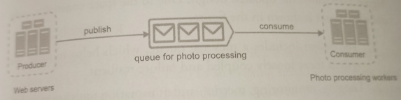

# Message Queue

A message queue is a durable component, stored in memory, that supports asynchronous communication. It serves as a **buffer** and **distributes asynchronous requests**.

Input services, called *producers/publishers*, create messages, and publish them a message queue. Other services or servers, called *consumers/subscribers*, connect to the queue, and performs actions defined by the messages.

Message queue makes possible **decoupling producers from consumers**, thus making it a preferred architecture for building scalable, reliable, and distributed applications. With them essage queue, the producer can post a message to the queue when the consumer is unavailable to process it. The consumer can read messages from the queue even when the producer is unavailable.

**The producer and the consumer can be scaled independently**. When the size of the queue becomes larghe, more workers are added to reduce the processing time. However, if the queue is empty most of the time, the number of workers can be reduced.

